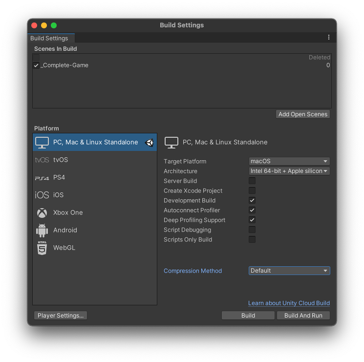

## Profiler

The Unity Profiler is a tool you can **use to get performance information about your application**. You can connect it to devices on your network or devices connected to your machine to test how your application runs on your intended release platform. You can also run it in the Editor to get an overview of resource allocation while you’re developing your application.

To access the Profiler window go to menu: **Window > Analysis > Profiler**. 

The Profiler window is laid out as follows: 

- **Profiler modules**. This is a list of all the modules you can profile in your application. Use the drop-down menu at the top of this area to add and remove modules from the window.
- **Profiler control**s. Use these controls to set which device to profile from and what kind of profiling Unity should perform, navigate between frames, and start recording data.
- **Frame charts**. This area contains charts of each module the Profiler profiles. This area is blank when you open the Profiler for the first time, and fills with information when you start profiling your application.
- **Module details panel**. The information in this area of the window changes based on the module you have selected. For instance, when you select the CPU Usage Profiler module, it contains a detailed timeline and the option to switch to a Hierarchy view. When you select the Rendering Profiler module, this area displays a list of debugging information. This area is blank when you open the Profiler for the first time, and fills with information when you start profiling your application.

### Profiling your application

When you use the Unity Profiler to profile your application, there are three main ways to record data:

-   Profile your application in a player on your target platform
-   Profile your application in Play mode in the Unity Editor
-   Profile the Unity Editor

#### Profile your application on a target platform

To profile your application on its target release platform, connect the target device to your network or directly to your computer via cable. You can also connect to a device via IP address. You can only profile your application as a **Development Build**. To set this up, go to **Build Settings** (menu: **File** > **Build Settings**) and select your application’s target platform. Enable the **Development Build** setting. When you enable this setting, two settings related to the Profiler become available: **Autoconnect Profiler** and **Deep Profiling Support**.



When you enable the **Autoconnect Profiler** setting, the Unity Editor bakes its IP address into the built Player during the build process. When you start the Player, it **attempts to connect to the Profiler in the Editor located at the baked IP address**.

If you additionally enable the **Deep Profiling Support** setting, Unity performs Deep Profiling when the built Player starts, which means that the Profiler profiles every part of your code, and not just code timings explicitly wrapped in ProfilerMarkers. This is useful to get Deep Profiling information on your application’s start up times, however, this adds a small amount of overhead to your build.


### Profiler controls
The Profiler controls are in the toolbar at the top of the Profiler window. Use these to start or stop recording profiler data, and to navigate through profiled frames.

| Control | Function |
| --- | --- |
| Attach to Player | Select which target to profile your application on. By default, this is set to Playmode. You can also select Editor to profile the Unity Editor and display the resources that the Editor is currently using.Unity also automatically detects any devices that are running on your network or connected via USB, and displays them in the drop-down. Click Enter IP in the drop-down to manually enter the IP address of the device you want to profile your application on. For more information, see Profiling your application. |
| Record | Enable this setting to **record profiling information for the active modules when you run your application**. If you **don’t have this button enabled, the Profiler doesn’t collect any data when you run your application**. |
| Back arrow | Navigate one frame back. |
| Forward arrow | Navigate one frame forward. |
| Current Frame | When you click the Current Frame button, the frame indicator line jumps to the last recorded frame, and the Profiler enters Current Frame mode. While the Profiler collects data in this mode, it stays on the current frame and displays the data it collects in real-time. Click the button again to exit Current Frame mode. |
| Frame number | Indicates the frame number you are currently looking at in the Profiler. The number on the left is the current frame selected, and the number on the right is the total number of frames combined that the Profiler collected during your entire Profiling session. |
| Clear | Erase all data from the Profiler window. |
| Clear on Play | Enable this setting to erase all data from the Profiler window next time you click Play in the Player window, or when you connect to a new target device. |
| Deep Profile | Enable this setting to profile all C# methods. When you enable this setting, Unity adds instrumentation to all mono calls, which then allows for a more detailed investigation of your scripts. See Deep Profiling. |
| Call Stacks | To record call stacks for scripting memory allocations, click this toggle. Frames that the Profiler records when you enable this option have information about the selected samples on the full call stack that lead to a managed scripting allocation, even when Deep Profile is not active. By default, the Profiler records the full call stack information for GC.Alloc samples when you enable this setting, but you can change this to a different sample from the dropdown menu (UnsafeUtility.Malloc, JobHandle.Complete, or Native Allocations). For more information, see the Allocation call stacks section of the CPU Usage Profiler module page. |
| Load | Load saved Profiler data into the Profiler window. You can also load binary profile data that the Player has written out to file via the Profiler.logFile API.Hold down the Shift button and click the Load button to append the file contents to the current profile frames. |
| Save | Save the Profiler data into a .data file in your Project folder. |


#### Deep Profiling
Usually the Profiler only profiles code timings that are explicitly wrapped in ProfilerMarkers. This **includes the first call stack depth of invocations from the engine’s native code into your scripting code**, such as a **MonoBehaviour’s Start, Update, or similar methods**

When you enable the Deep Profile setting, the Profiler profiles every part of your script code and records all function calls, including at least the first call stack depth into any Unity API. This is useful information to help you work out where your code impacts on your application’s performance, but it comes with a large overhead.

When you deep profile your application, Unity injects profiler instrumentation into all of your script methods to record all function calls. This is useful to understand where your application code spends the most time.

Deep Profiling is resource-intensive and uses a lot of memory. As a result, your application runs significantly slower while it is profiling. Deep Profiling is better suited for small games with simple scripting. If you are using complex script code, your application might not be able to use Deep Profiling at all, and for many larger applications, Deep Profiling might make Unity run out of memory.


### Profiler modules
The top part of the Profiler window is divided into Profiler modules that profile specific areas of your game. When you profile your application, Unity displays the data related to each module in corresponding charts.

| Profiler module | Function |
| --- | --- |
| CPU Usage | Displays an overview of where your application spends the most time, in areas such as physics, scripts, animation, and garbage collection. This module contains broad profiling information about your application, and you can use it to decide which further modules to use to investigate more specific issues in your application. This module is always active, even if you close it. See CPU Usage Profiler module |
| GPU Usage | Displays information related to graphics processing. By default this module is not active, because it has a high overhead. See GPU Usage Profiler module. |
| Rendering | Displays information on how Unity renders graphics in your application, including information on static and dynamic batching, SetPass and Draw calls, triangles, and vertices. See Rendering Profiler module. |
| Memory | Displays information on how Unity allocates memory in your application. This is particularly useful for seeing how scripting allocations (GC.Alloc) lead up to garbage collection, or how your application’s Asset memory usage trends over time. See Memory Profiler module. |
| Audio | Displays information related to the audio in your application, such as when and how many audio sources play, how much CPU usage the Audio system requires, and how much memory Unity allocates to it. See Audio Profiler module. |
| Video | Displays information related to video in your application. See Video Profiler module. |
| Physics | Displays information about the physics in your application that the physics engine has processed. See Physics Profiler module. |
| Physics (2D) | Similar to the Physics Profiler module, this module displays information about where the physics engine has processed 2D physics in your application. See 2D Physics Profiler module. |
| UI | Displays information about how Unity handles UI batching for your application, including why and how Unity batches items. See UI and UI Details Profiler module. |
| UI Details | Similar to the UI Module, this module’s chart adds data about batch and vertices count, as well as markers which include information about user input events that trigger UI changes. See UI and UI Details Profiler module |
| Global Illumination | Displays information on how much CPU resource Unity spends on the Global Illumination lighting subsystem in your application. See Global Illumination Profiler window. |
| Virtual Texturing | Displays statistics about Streaming Virtual Texturing in your application. See the Virtual Texturing Profiler module. |
| Asset Loading | Displays information about how your application loads assets. See the Asset Loading Profiler module. |
| File Access | Displays information about file accesses in your application. See the File Access Profiler module. |


### CPU Usage Profiler module

| Category | Description |
| --- | --- |
| Rendering | How much time your application spends on rendering graphics. |
| Scripts | How much time your application spends on running scripts. |
| Physics | How much time your application spends on the physics engine. |
| Animation | How much time your application spends on animating Skinned Mesh Renderers, GameObjects and other components in your application. This also includes the time spent on calculations for systems the Animation and Animator components use. |
| GarbageCollector | **How much time your application spends on running the Garbage Collector**. |
| VSync | How much time your application spends per frame waiting for the targetFrameRate or the next VBlank to sync with. This is according to the **`QualitySettings.vSyncCount` value**, the target framerate, or the VSync setting that is the default or enforced maximum of the platform your application is running on. For more information about VSync, see the section in this documentation on Rendering and VSync samples. |
| Global Illumination | How much time your application spends on lighting. |
| UI | How much time your application spends on displaying its UI. |
| Others | How much time your application spends on code that does not fall into any of the other categories. This includes areas like the entire EditorLoop, or the Profiling overhead when you profile Play Mode in the Editor. |


#### Module details pane

| View | Function |
| --- | --- |
| Timeline | Displays a breakdown of the timings for a particular frame, alongside a time axis of the frame’s length. This is the only view mode that you can use to see timings on all threads at once and at the times within the frame at which they happened, so that you can correlate timings across threads (for example, Job System worker threads starting up after a system on the main thread schedules them). |
| Hierarchy | Groups the timing data by its internal hierarchical structure. This option displays the elements that your application called in a descending list format, ordered by the time spent by default. You can also order the information by the amount of scripting memory allocated (GC Alloc), or the number of calls. To change the column that orders the table, click the table column’s header. |
| Raw Hierarchy | Displays the timing data in a hierarchical structure that is similar to the call stacks where the timing occurred. Unity lists each call stack separately in this mode instead of merging them, as it does in Hierarchy view. |


#### The Hierarchy view lists

| Property | Function |
| --- | --- |
| Total | The total amount of time Unity spent on a particular function, as a percentage. |
| Self | The total amount of time Unity spent on a particular function as a percentage, excluding the time Unity spends calling sub-functions.For example, in the screenshot, 16.7% of time is spent in the Camera.Render function. This is because it calls a lot of drawing and culling functions. However, when you exclude the functions it calls, only 0.2% of time is spent on the Camera.Render function itself. |
| Calls | The number of calls made to this function in this frame. In the Raw Hierarchy view the values in this column are always 1 because the Profiler does not merge the hierarchy of samples. |
| GC Alloc | **How much scripting heap memory Unity has allocated in the current frame**. The garbage collector manages the scripting heap memory.Whenever Unity calls **`GC.Collect()`** or there is a scripting **heap allocation** that does not fit within the heap’s current size, the garbage collector triggers. It marks all allocations that have no more references to them and collects them. This process appears as GC.Collect samples in the Profiler.Unity runs the garbage collector more frequently as your application allocates more on the heap. As the managed heap grows, it takes Unity longer to mark and collect the memory. As such, you should keep the GC Alloc value at zero while your application runs, to prevent the garbage collector from affecting your application’s framerate, and to keep the overall heap size small.For more details about the managed heap see the documentation on Understanding Automatic Memory Management. |
| Time ms | The total amount of time Unity spent on a particular function, in milliseconds. If your application uses the Job System or multithreaded rendering, this information might be misleading, because it only contains the time Unity spent on the currently selected thread. To change the thread, select the Thread dropdown at the top of the Hierarchy pane. |
| Self ms | The total amount of time Unity spent on a particular function, in milliseconds, excluding the time Unity spends calling sub-functions. |
| Warning | Indicated by a warning icon, this displays how many times the application has triggered a warning during the current frame. For more information, see the Performance warnings section of this documentation. |


### Begaining profiling sample & ending profiling sample through scripting

```cs
using UnityEngine;
using System.Collections;
using UnityEngine.Profiling;

public class ExampleClass : MonoBehaviour
{
    void Example()
    {
        Profiler.BeginSample("MyPieceOfCode");
        // Code to measure...
        Profiler.EndSample();
    }
}
```


### ref 
https://www.chunfuchao.com/posts/unity-profiling-tools/ 

https://docs.unity3d.com/Manual/Profiler.html \
https://docs.unity3d.com/Manual/profiler-profiling-applications.html \
https://docs.unity3d.com/Manual/ProfilerWindow.html

**CPU Usage Profiler module** \
https://docs.unity3d.com/Manual/ProfilerCPU.html

**`Profiler`** \
https://docs.unity3d.com/ScriptReference/Profiling.Profiler.html

**`Profiler.BeginSample`** \
https://docs.unity3d.com/ScriptReference/Profiling.Profiler.BeginSample.html

**`Profiler.EndSample`** \
https://docs.unity3d.com/ScriptReference/Profiling.Profiler.EndSample.html


