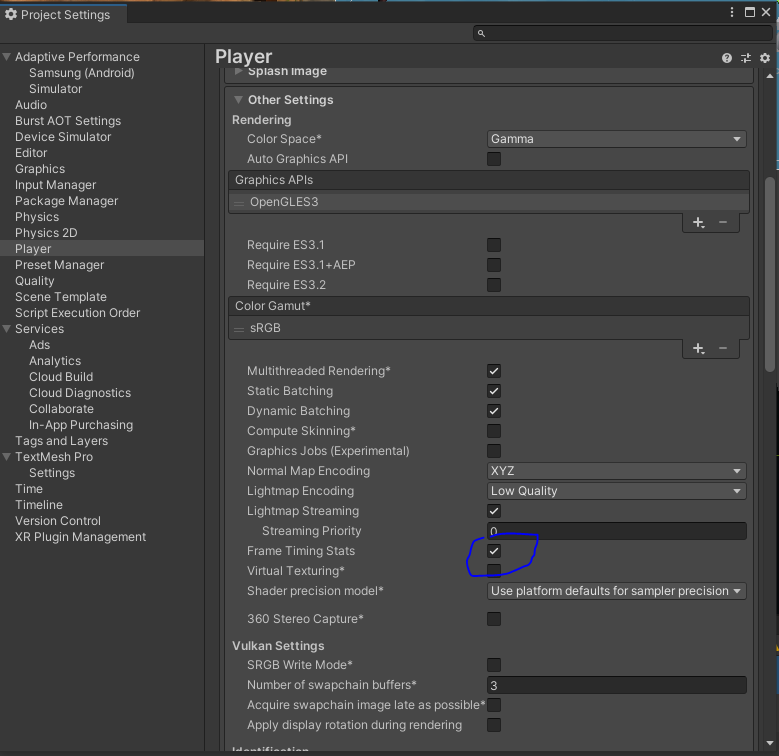

## Frame Rate(FPS) & Resolution for Gaming 

- **Frame Rate or FPS** dictates **how smooth a game runs**, improving playability and frame speed. Frame rate is **how often the video updates with a new frame** and this gets measured in frames per second (FPS).
- **Resolution** determines the number of pixels on screen, making a game more visually appealing.

> A higher FPS is better for competitive multiplayer games as they require faster reactions, players who want their game to look as beautiful as possible may prioritize a higher resolution and works better for solo games.

>  Frame rate is **dependent on your CPU and the capabilities of your graphics card** and processor. Modern games have a standard frame rate of 30 FPS and can run up to 240 FPS but when it comes to competitive first person shooters or e-sports most players aim for 60 FPS.

### Does Higher Resolution Lower FPS?
Playing games at a higher resolution does come at a tradeoff with lower frames per second. The lowering of frames per second occurs due to the additional generated pixels on screen. This additional need to draw more pixels requires more processing power & memory, thus lowering your frame rate. The alternative is also true, **the lower resolution you choose to run, a greater amount of frames can run in the same time frame**.

### Eable FPS stat in unity
**Edit > Project Setting**s, then select the **Player** category, under **Other setting** check the Enable **Frame Timing Stats** checkbox.

### ref
https://apexgamingpcs.com/blogs/apex-support/fps-vs-resolution

