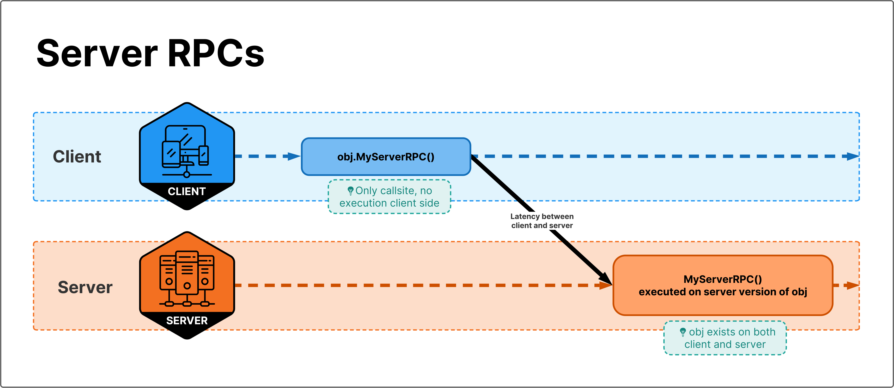
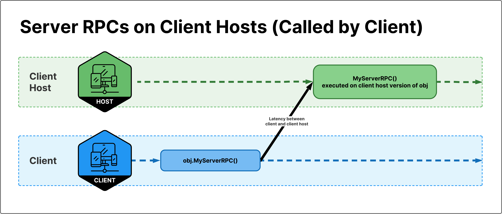
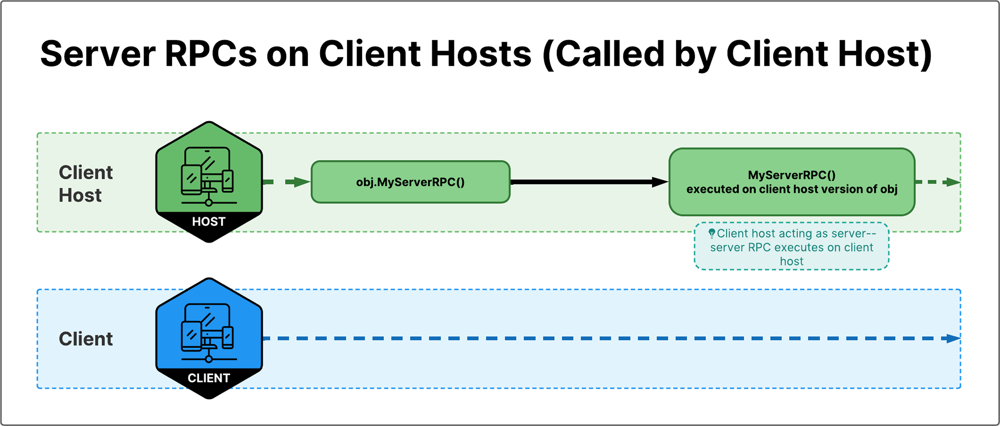
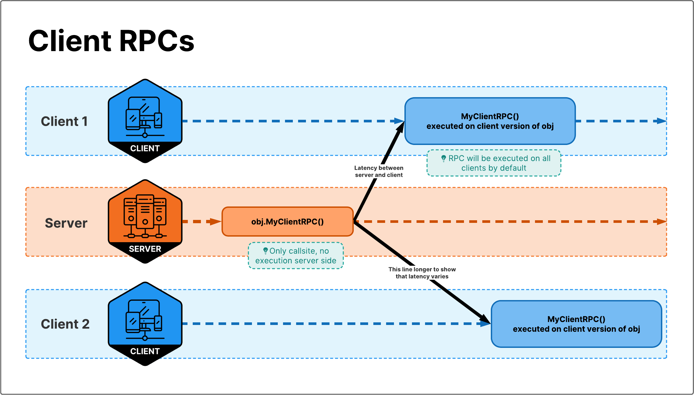
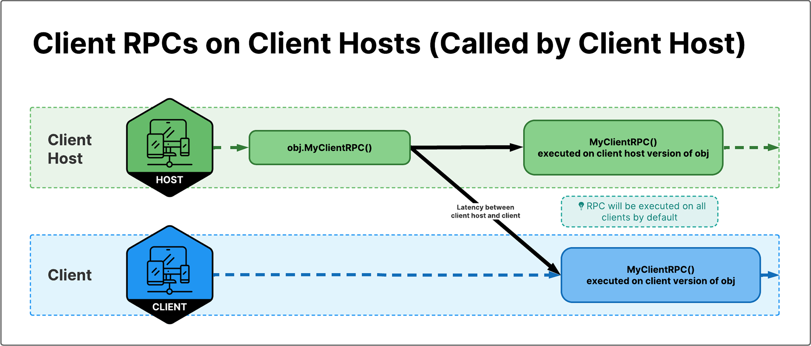
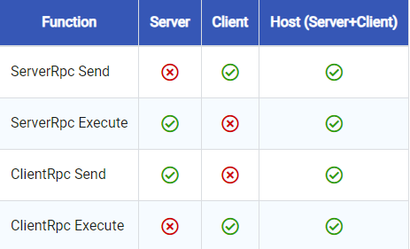

## Netcode
**Netcode for GameObjects (Netcode)** is a **high-level networking library** built for Unity for you to **abstract networking logic**. It enables you to **send GameObjects and world data across a networking session to many players at once**. With Netcode, you can focus on building your game instead of **low-level protocols and networking frameworks.**


The **Netcode for Entities**, part of the Unity's **Data Oriented Technology Stack (DOTS)**, provides a **server authoritive with client prediction framewor**k that you can use to create multiplayer games.

-   [Netcode for Entities](https://docs.unity3d.com/Packages/com.unity.netcode@latest) - Unity's official netcode SDK for Entities workflows.
-   [Netcode for GameObjects](https://github.com/Unity-Technologies/com.unity.netcode.gameobjects) - Unity's official netcode SDK for GameObject workflows. \
    https://docs-multiplayer.unity3d.com/netcode/current/tutorials/get-started-ngo/


### Installing NGO with the Package Manager

Install the Netcode for GameObjects package:

1.  From the Unity Editor, select **Window** > **Package Manager**.
2.  From the Package Manager, select **Add (+)** > **Add package by name…**
3.  Type (or copy and paste) `com.unity.netcode.gameobjects` into the package name field, then select **Add**.


> **Note**: \
> If you're using Unity Editor version 2020.3 LTS or earlier, there's no option to add a package by name. In this case, use Add package from git URL instead:
> - From the Unity Editor, select **Window > Package Manager**.
> - From the Package Manager, select **Add (+) > Add package by git URL…**
> - Type (or copy and paste) **https://github.com/Unity-Technologies/com.unity.netcode.gameobjects** into the git URL field, then select **Add**.


### Starting NGO guide

- Install Netcode for GameObjects follow above installation guide
- Add the basic components
   - A NetworkManager component
   - A player object
   - A scene
- Create an object to spawn for each connected player
- Add simple RPCs use
- Add a NetworkTransform
- Extend the functionality with scripts
- Add your scene to the build


#### Create the NetworkManager component

First, create the NetworkManager component:

1.  Right-click in the **Hierarchy** tab, then select **Create Empty** to create an empty GameObject.
2.  Rename the empty GameObject **NetworkManager**.
3.  Select **NetworkManager**, then select Add Component from the Inspector tab.
4.  In the Inspector tab, locate the Unity Transport section, then select UnityTransport as the Protocol type.
5.  Save the scene by pressing **Ctrl/Cmd + S** (or by selecting File > Save).


#### Create an object to spawn for each connected player

> When you drop the prefab into the **PlayerPrefab** slot, you're telling the library that when a client connects to the game, it automatically spawns this prefab as the character for the connecting client. NGO won’t spawn a player object if you don't have any prefab set as the **PlayerPrefab**. Refer to Player Objects.

-   In the Unity Editor, right-click within the **Hierarchy** tab, then select **3D Object** > **Capsule**.
-   Name the Capsule Object **Player**.
-   With Player selected, add a NetworkObject component in the **Inspector** tab by selecting **Add Component** > **Netcode** > **NetworkObject**.
-   Right-click within the **Assets** folder under the **Project** tab, then select **Create** > **Folder**.
-   Name the folder **Prefabs**.
-   Make the **Player** object you created earlier into a prefab by dragging it from the **Hierarchy** tab into the **Prefabs** folder.
-   Delete the Player from the scene by selecting the Player capsule within the **Scene** tab, then pressing the **Delete** key (or **Cmd** + **Delete** for macOS).


> You can remove the Player GameObject from the scene because you assign this network prefab to the Player prefab property in the NetworkManager component. The library doesn't support defining a player object as an in-scene placed NetworkObject.

-   Select **NetworkManager**.
-   With NetworkManager selected, locate the **PlayerPrefab** field in the **Inspector** tab.
-   Drag the **Player** prefab from the **Project** tab into the **PlayerPrefab** slot you created in the **Inspector** tab.
-   Add a 3D Plane (centered at 0,0,0) to the scene by right-clicking in the **Hierarchy** tab, then selecting **3D Object** > **Plane**.
-   Save the scene by pressing **Ctrl/Cmd** + **S** (selecting **File** > **Save**).

#### Add a NetworkTransform

Add a NetworkTransform component to the Player prefab:

1.  Select the **Player** prefab in Assets > Prefabs.
2.  In the **Inspector** tab (with the Player prefab selected), select **Add Component**.
3.  Select **Netcode** > **NetworkTransform**.

https://docs-multiplayer.unity3d.com/netcode/current/tutorials/get-started-ngo/

### Create a command line helper
Shows how to create a command line helper that launches the project outside the Unity Editor to make testing builds easier.

https://docs-multiplayer.unity3d.com/netcode/current/tutorials/command-line-helper/

### Test & Debugging

**Testing multiplayer games locally** \
https://docs-multiplayer.unity3d.com/netcode/current/tutorials/testing/testing_locally/

**Testing multiplayer games with artificial network conditions** \
https://docs-multiplayer.unity3d.com/netcode/current/tutorials/testing/testing_with_artificial_conditions/#system-wide-network-conditioners


#### Local multiplayer setup
First, build an executable by selecting **File > Build Settings > Build**.

After you have the build, you can **launch several instances of the build executable to host or join a game**.

#### Multiplayer over Internet
First, build an executable and distribute it to all players.
Next, you need to set up Uunity **relay**. 

Alternatively you can use Port Forwarding. The [https://portforward.com/](https://portforward.com/) site has guides on how to enable port forwarding on a huge number of routers.

### Network Synchronizing
https://docs-multiplayer.unity3d.com/netcode/current/advanced-topics/ways-synchronize/

#### Remote Procedure Calls
At a high level, when calling an **`RPC`** client side, the SDK will take a note of the object, component, method and any parameters for that **`RPC`** and send that information over the network. The server will receive that information, find the specified object, find the specified method and call it on the specified object with the received parameters.

When calling an **`RPC`**, you call a method remotely on an object that can be anywhere in the world. They're **"events"** you can trigger when needed.

If you call an **`RPC`** method on your side, it will execute on a different machine.

Netcode has two variations of RPCs to execute logic on either server-side or client-side: [`ServerRpc`](https://docs-multiplayer.unity3d.com/netcode/current/advanced-topics/message-system/serverrpc/) and [`ClientRpc`](https://docs-multiplayer.unity3d.com/netcode/current/advanced-topics/message-system/clientrpc/).











https://docs-multiplayer.unity3d.com/netcode/current/advanced-topics/messaging-system/

#### ClientRpc
https://docs-multiplayer.unity3d.com/netcode/current/advanced-topics/message-system/clientrpc/

#### ServerRpc
https://docs-multiplayer.unity3d.com/netcode/current/advanced-topics/message-system/serverrpc/

#### RPC Params

https://docs-multiplayer.unity3d.com/netcode/current/advanced-topics/message-system/rpc-params/

#### RPC usage checklist:
To use RPCs, make sure
​
-   **`[ClientRpc]`** or **`[ServerRpc]`** attributes are on your method
-   Your method name ends with **`ClientRpc`** or **`ServerRpc`** (ex: **`DoSomethingServerRpc()`**)
    > You must mark client RPC methods with the **[ClientRpc]** attribute and use the **ClientRpc** method suffix; failing to do so results in an error message.
    > 
-   your method is declared in a class that inherits from **`NetworkBehaviour`**
    -   your GameObject has a **NetworkObject component** attached
-   Make sure to call your RPC method server side or client side (using **`isClient`** or **`isServer`**)
-   **Only accept value types as parameters**

#### Serialization Types and RPCs

[](https://docs-multiplayer.unity3d.com/netcode/current/advanced-topics/messaging-system//#serialization-types-and-rpcs "Direct link to Serialization Types and RPCs")

Instances of Serializable Types are passed into an RPC as parameters and are serialized and replicated to the remote side.

See [Serialization](https://docs-multiplayer.unity3d.com/netcode/current/advanced-topics/serialization/serialization-intro/) for more information.


### NetworkTime and Ticks

#### LocalTime and ServerTime
Messages take time to transmit over the network. That's why `RPCs` and `NetworkVariable` won't happen immediately on other machines. `NetworkTime` allows to use time while considering those transmission delays.

-   `LocalTime` on a client is ahead of the server. If a server RPC is sent at `LocalTime` from a client it will roughly arrive at `ServerTime` on the server.
-   `ServerTime` on clients is behind the server. If a client RPC is sent at `ServerTime` from the server to clients it will roughly arrive at `ServerTime` on the clients.

`LocalTime`

-   Use for player objects with client authority.
-   Use if just a general time value is needed.

`ServerTime`:

-   For player objects with server authority (For example, by sending inputs to the server via RPCs)
-   In sync with position updates of `NetworkTransform` for all `NetworkObjects` where the client isn't authoritative over the transform.
-   For everything on non client controlled `NetworkObjects`.


#### Network Ticks
Latency is unavoidable in online games, and the quality of the player's experience is strictly tied to this (the more latency there is between players, the greater the feeling that the game is not responsive to their inputs).

**Network ticks** are run at a fixed rate. The **'Tick Rate'** field on the `NetworkManager` can be used to set the tick rate.

What does changing the network tick affect? Changes to `NetworkVariables` aren't sent immediately. Instead during each network tick changes to `NetworkVariables` are collected and sent out to other peers.

To run custom code once per network tick (before `NetworkVariable` changes are collected) the `Tick` event on the `NetworkTickSystem` can be used.


> When using `FixedUpdate` or physics in your game, set the network tick rate to the same rate as the fixed update rate. The `FixedUpdate` rate can be changed in `Edit > Project Settings > Time > Fixed Timestep`


The **tick rate** is the frequency with which the server updates the game state.

**A single update of a game simulation is known as a tick**. The rate at which the simulation is run on a server is referred often to as the server's tickrate; this is essentially the server equivalent of a client's frame rate, absent any rendering system.


> When using **FixedUpdate** or physics in your game, set the network tick rate to the same rate as the fixed update rate. The **FixedUpdate** rate can be changed in **Edit > Project Settings > Time > Fixed Timestep**


https://daposto.medium.com/game-networking-1-interval-and-ticks-b39bb51ccca9


#### Network FixedTime
`Network FixedTime` can be used to get a time value representing the time during a network tick. This works similar to `FixedUpdate` where `Time.fixedTime` represents the time during the `FixedUpdate`.


```cs
public void Update()
{
    double time = NetworkManager.Singleton.LocalTime.Time; // time during this Update
    double fixedTime = NetworkManager.Singleton.LocalTime.FixedTime; // time during the previous network tick
}
```

#### NetworkTime Precision
Network time values are calculated using double precisions. This allows time to stay accurate on long running servers. For game servers which run sessions for a long time (multiple hours or days) don't convert this value in a float and always use doubles for time related calculations.

For games with short play sessions casting the time to float is safe or `TimeAsFloat` can be used.

https://docs-multiplayer.unity3d.com/netcode/current/advanced-topics/networktime-ticks/#network-ticks

### Synchronizing States & Events

- **Messaging System**
  The Netcode messaging system provides you with the ability to handle sending and receiving messages or events. The entire messaging system supports the serialization of most primitive value types as well as any classes and/or structures that implement the  `INetworkSerializable` interface.
  - Remote Procedure Calls (RPCs): 
  - Custom Messages:
    Custom messages provide you with the ability to create your own "netcode message type" to handle scenarios where you might just need to create your own custom message. \
    https://docs-multiplayer.unity3d.com/netcode/current/advanced-topics/message-system/custom-messages/
    
    
- **NetworkVariables system** \
  A **`NetworkVariable`** is most commonly used to **synchronize state between both connected and late joining clients**. The **`NetworkVariable`** system only supports non-nullable value `type`s, but also provides support for **`INetworkSerializable`** implementations as well you can create your own `NetworkVariable` class by deriving from the **`NetworkVariableBase`** abstract class.
  - Handled by the "internal" messaging system and categorized under "Networking".

> While each of the above options can be used for the same thing, synchronizing states or events, they all have specific use cases and limitations.


https://docs-multiplayer.unity3d.com/netcode/current/advanced-topics/ways-synchronize/


### Connection Approval
To ensures the NetworkConfig on the client matches the server's NetworkConfig. You can enable ConnectionApproval in the NetworkManager or via code by setting `NetworkManager.NetworkConfig.ConnectionApproval` to `true`.

**Server side connection approval example**
```cs

using Unity.Netcode;

private void Setup() 
{
    NetworkManager.Singleton.ConnectionApprovalCallback = ApprovalCheck;
    NetworkManager.Singleton.StartHost();
}

private void ApprovalCheck(NetworkManager.ConnectionApprovalRequest request, NetworkManager.ConnectionApprovalResponse response)
{
    // The client identifier to be authenticated
    var clientId = request.ClientNetworkId;

    // Additional connection data defined by user code
    var connectionData = request.Payload;

    // Your approval logic determines the following values
    response.Approved = true;
    response.CreatePlayerObject = true;

    // The Prefab hash value of the NetworkPrefab, if null the default NetworkManager player Prefab is used
    response.PlayerPrefabHash = null;

    // Position to spawn the player object (if null it uses default of Vector3.zero)
    response.Position = Vector3.zero;

    // Rotation to spawn the player object (if null it uses the default of Quaternion.identity)
    response.Rotation = Quaternion.identity;
    
    // If response.Approved is false, you can provide a message that explains the reason why via ConnectionApprovalResponse.Reason
    // On the client-side, NetworkManager.DisconnectReason will be populated with this message via DisconnectReasonMessage
    response.Reason = "Some reason for not approving the client";

    // If additional approval steps are needed, set this to true until the additional steps are complete
    // once it transitions from true to false the connection approval response will be processed.
    response.Pending = false;
}
```
**Connection Management example code on github** 

https://github.com/Unity-Technologies/com.unity.multiplayer.samples.coop/blob/v2.1.0/Assets/Scripts/ConnectionManagement/ConnectionState/HostingState.cs

#### Changing the player Prefab
There might be times when you want to specify an alternate player Prefab to use for a player connecting. For example, allow client to choose a player or game character before starting game.

https://docs-multiplayer.unity3d.com/netcode/current/basics/connection-approval/

### Limiting the maximum number of players

eg:
```cs
if( m_Portal.NetManager.ConnectedClientsIds.Count >= CharSelectData.k_MaxLobbyPlayers )
{
    return ConnectStatus.ServerFull;
}
```

### Sample project better understanding Netcode

#### Boss Room
https://unity.com/demos/small-scale-coop-sample?_ga=2.100857537.1177058850.1686617745-1095169982.1671075740&_gac=1.221831914.1686617745.CjwKCAjwhJukBhBPEiwAniIcNT_ODysZ3wmhZlXGoXup3iC7aEHgtkcVtYcP2gLPMuESHpxH-IR4qhoCnroQAvD_BwE

https://docs-multiplayer.unity3d.com/netcode/current/learn/bossroom/bossroom/

https://github.com/Unity-Technologies/com.unity.multiplayer.samples.coop

#### Bitesize Samples
https://docs-multiplayer.unity3d.com/netcode/current/learn/bitesize/bitesize-introduction/


#### Galactic Kittens (2D cooperative game)

https://unity.com/demos/galactic-kittens

https://github.com/UnityTechnologies/GalacticKittens

https://github.com/UnityTechnologies/GalacticKittens/wiki/Setup-Instructions

### Netcode tutorial

https://www.youtube.com/watch?v=3yuBOB3VrCk

https://www.youtube.com/watch?v=7glCsF9fv3s

https://unitycodemonkey.com/kitchenchaosmultiplayercourse.php

https://www.youtube.com/watch?v=dKrdrPjJG04

https://www.youtube.com/watch?v=swIM2z6Foxk

https://www.youtube.com/watch?v=Kzmq0O06y-I

https://greenbeansplay.com/unity-netcode-relay-unitytransport/

https://blog.csdn.net/qq_46044366/article/details/125138735

https://www.youtube.com/watch?v=eymqAMmnqPg

https://youtu.be/d1FpS5hYlVE

https://youtu.be/rFCFMkzFaog

https://youtu.be/GOtE96OKyVA

https://youtu.be/82Lbho7S0OA

### ref 
https://en.wikipedia.org/wiki/Netcode

https://docs.unity3d.com/Packages/com.unity.netcode@1.0/manual/index.html?_ga=2.162961848.561805926.1686181003-1095169982.1671075740&_gac=1.155129034.1686003811.Cj0KCQjwj_ajBhCqARIsAA37s0zIin1gt0fr6pQ7Ni-iXQAS4JhPYDqcq8wDPFa5kR40YMdFCtAKbM8aAiltEALw_wcB

https://docs-multiplayer.unity3d.com/netcode/current/installation/index.html?_ga=2.25615289.561805926.1686181003-1095169982.1671075740&_gac=1.217903332.1686003811.Cj0KCQjwj_ajBhCqARIsAA37s0zIin1gt0fr6pQ7Ni-iXQAS4JhPYDqcq8wDPFa5kR40YMdFCtAKbM8aAiltEALw_wcB

**Github** \
https://github.com/Unity-Technologies/com.unity.netcode.gameobjects/tree/release/1.0.0

**Document reference** \
https://docs-multiplayer.unity3d.com/netcode/current/about/

**API reference** \
https://docs.unity3d.com/Packages/com.unity.netcode.gameobjects@1.4/api/index.html

https://docs-multiplayer.unity3d.com/netcode/current/api/introduction/

