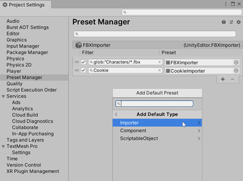

## Preset Manager
The Preset Manager is a window in Project Settings (menu: **Edit > Project Settings > Preset Manager**) that allows you to **manage custom Presets** you **create to specify default properties** when you add a component to a GameObject or a new Asset to your project. 

> **Note**: The default Presets you define override Unity’s default settings.

| Property | Description |
| --- | --- |
| **Filter** | Use the **Filter** field to define which components or importers the Preset is applied to. |
| **Preset** | Use the **Preset** field to set the Preset you want to use. By default, a Preset applies to all components or asset importers of that Preset type once you create it. If you want to only apply it to specific components or asset types, use the **Filter** field to **define when to apply the Preset**. |
| **Add Default Preset** | Select this button to choose the **Importer**, **Component** or **ScriptableObject** to add a Preset to. If you choose **Importer** or **Component**, select the type of asset importer or component you want to create a Preset for. |

### Assigning a Preset for default settings

To specify a Preset to use for default settings in the Preset Manager:

1.  If you don’t already have a Preset in your project to use for default settings, create one.
2.  Open the Preset Manager by choosing **Edit > Project Settings**, and selecting the **Preset Manager**.
3.  Select **Add Default Preset** and select a default type. \
    The Preset type you choose appears in the **Preset Manager** list.
4.  In the Preset field, click the **Preset selector** (circle icon).
5.  From the **Select Preset** window, choose a Preset for this Preset type. \
    Alternatively, you can also drag and drop a Preset from the **Project** window into the Preset field.  
6.  If you want to add another Preset field to the list, click the **Add** (**+**) tab.  

> **Note**: If you set a default Preset for Transform components, Unity does not use the Position values when you create a new GameObject. Instead, it sets the default Position values to the center of the Scene view. To set the Position values to those of the default Preset, select the Transform component’s More items button (⋮) and select Reset.

### Assigning Presets via the Inspector window

You can also add and remove Presets to use for default settings via the **Inspector** window.

To add a default Preset:

1.  Select a Preset in the **Project** window.
2.  In the **Inspector** window, click **Add to default**.  \
    Unity adds your default Preset to the **Preset Manager**.
3.  Open the **Preset Manager** to add filters to the Preset or reorder your Preset list.

To remove a default Preset:

1.  Select a Preset in the **Project** window.
2.  In the **Inspector** window, click **Remove from**.

### Adding filters

**By default, a Preset applies to all components or asset importers of that Preset type once it is created**. If you want to only apply it to **specific components or asset types**, you can **use the Filter field to define** when to apply the Preset.

Filters allow you to **create multiple Presets for a given type**, and **apply them to specific components or importers based on whether those components and importers meet the filter criteria**. You can filter by **file names**, **directories**, and **file extensions**.

> You can also apply partial Presets that affect only properties you specify in your components or assets.

> **Note:** Default Presets in a Preset Type are applied in order from top to bottom. This means that filters at the bottom of the list can override previous filters if not logically ordered.

1.  Open the Preset Manager by choosing **Edit > Project Settings**, then selecting the **Preset Manager** category.
2.  Find the default Preset you want to filter, and enter the search string in the **Filter** field.

#### Advanced filter search

Presets can use glob search, which is a way to use symbols in your filters to allow for more inclusive import filters. See the table below for a list of symbols you can use. A glob search filter is case-sensitive.  
To create a glob search filter, the syntax is `glob:"yoursearchpatternhere"`. Your filter field must begin `glob:`, and the search term must be in quotation mark characters. For example, `glob:"example-folder/*.fbx"` filters for any .fbx file in a folder called example-folder.

Supported symbols:

  
| Symbol | Description | Example |
| --- | --- | --- |
| \* | Matches 0 or more characters in a single path portion (a single path portion is defined as any suite of characters excluding / ) | `glob:"foldername/*.fbx"`searches for any .fbx file located in a folder named _foldername_. |
| ? | Matches 1 character | `glob:"foldername/filename-?.fbx"`searches for any .fbx file located in a folder named _foldername_ that has the name _filename-_ followed by one single character (for example, this would include _filename–1.fbx_, _filename–2.fbx_, but not _filename–01.fbx_). |
| \[…\] | Matches a range of characters, similar to a RegExp range. If the first character of the range is ! or ^ then it matches any character not in the range. | `glob:"foldername/file[...]1.fbx"`searches for any .fbx file located in a folder named _foldername_ that has a name that begins file and ends with _1_ (for example, this would include _file–1.fbx_, _file–01.fbx_, but not _file–2.fbx_). |
| (pattern\|pat\*\|pat?erN) | Use searches inside parentheses, separated by a vertical pipe character (meaning “or”), to indicate that filter results can match one of the search patterns. | `glob:("foldername/*.fbx"\|"foldername/filename-?.fbx")` searches for any .fbx file located in a folder named _foldername_, or any .fbx file located in a folder named _foldername_ that has the name _filename-_ followed by one single character. |
| \*\* | Matches zero or more directories and subdirectories searching for matches. | `glob:"foldername/**.fbx"`searches for any .fbx file located in a folder named _foldername_. or its subfolders. |

### ref
https://docs.unity3d.com/Manual/class-PresetManager.html
