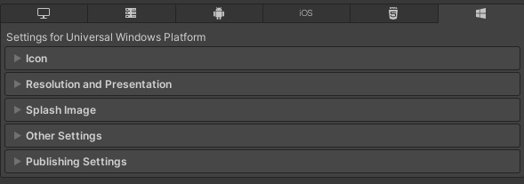
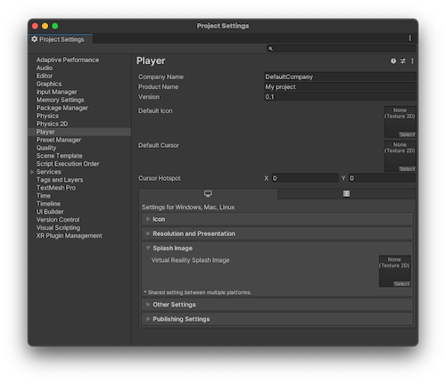

## Player setting 
The **Player** settings window (menu: **Edit > Project Settings > Player**) contain settings that determine **how Unity builds and displays your final application**.  You can also use the **`PlayerSettings`** API to control most of the settings available in this window.

| **Property** | **Function** |
| --- | --- |
| **Company Name** | Enter the name of your company. Unity uses this to locate the preferences file. |
| **Product Name** | Enter the name that appears on the menu bar when your application is running. Unity also uses this to locate the preferences file. |
| **Version** | Enter the version number of your application. |
| **Default Icon** | Pick the Texture 2D file that you want to use as a default icon for the application on every platform. You can override this for specific platforms. |
| **Default Cursor** | Pick the Texture 2D file that you want to use as a default cursor for the application on every supported platform. |
| **Cursor Hotspot** | Set the **pixel** offset value from the top left of the default cursor to the location of the cursor hotspot. The cursor hotspot is the point in the cursor image that Unity uses to trigger events based on cursor position. |

###  Platform-specific settings

The platform-specific settings are divided into the following sections:

-   **Icon**: the game icon(s) as shown on the desktop. You can choose icons from 2D image assets in the Project, such as **sprites**A 2D graphic objects. If you are used to working in 3D, Sprites are essentially just standard textures but there are special techniques for combining and managing sprite textures for efficiency and convenience during development. 
-   **Resolution and Presentation**: settings for screen resolution and other presentation details such as whether the game should default to **fullscreen mode**.
-   **Splash Image**: the image shown while the game is launching. This section also includes common settings for creating a **Splash Screen**. 
-   **Other Settings**: any remaining settings specific to the platform.
-   **Publishing Settings**: details of how the built application is prepared for delivery from the **app store** or **host webpage**.
-   **XR Settings**: settings specific to **Virtual Reality (VR)**, **Augmented Reality (AR)** and **Mixed Reality (MR) applications**.

### ref 
https://docs.unity3d.com/2021.3/Documentation/Manual/class-PlayerSettings.html
