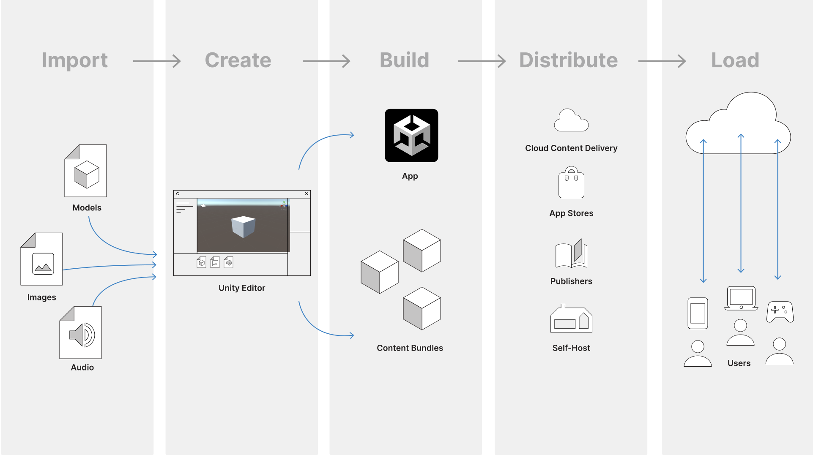

## Unity
This is notes about unity C# base on version 2021.3.0(LTS)

### workflow
- **Import** assets into the Unity Editor
- **Create** content using the Unity Editor with those assets.
- **Build** your app or game file, and optionally its accompanying content bundles
- **Distribute** the built files so that your users can access them, via a publisher, or an app store
- **Load** futher updates as neccessary at runtime, depending on your user’s behavior, and how you have grouped and bundled your content.

### ➡️ Package doc
**https://docs.unity3d.com/Manual/pack-safe.html**

### ➡️ Manual
**https://docs.unity.com/**

### ➡️ Scripting reference
**https://docs.unity3d.com/ScriptReference/index.html**

### ➡️ Learning pathway
**https://learn.unity.com/pathways**

### ➡️ Unity learn
**https://learn.unity.com/**

✒️ **BEST Unity Tutorials of 2022**

https://www.youtube.com/watch?v=AoAzOFSuvg4

✒️ **Unity official video**

**https://www.youtube.com/user/Unity3D**

✒️ **freeCodeCamp**

**https://youtu.be/gB1F9G0JXOo**

✒️ **Brackeys**

**https://www.youtube.com/c/Brackeys**

✒️ **DitzelGames**

**https://www.youtube.com/c/DitzelGames**

✒️ **CodeMonkey**

**https://www.youtube.com/channel/UCFK6NCbuCIVzA6Yj1G_ZqCg**

✒️ **lanHubery**

**https://www.youtube.com/user/mrdodobird**

✒️ **Dani**

**https://www.youtube.com/channel/UCIabPXjvT5BVTxRDPCBBOOQ**

✒️ **Tarodev**

**https://www.youtube.com/@Tarodev**

✒️ **Ketra Games**

**https://www.youtube.com/@KetraGames**

✒️ **KChris' Tutorials**

**https://www.youtube.com/@ChrisTutorialsYT**

✒️ **Sakura Rabbit**

**https://www.youtube.com/@sakurarabbit6708/videos**

✒️ **Roundbeargames**

**https://www.youtube.com/@Roundbeargames/videos**

✒️ **Bliz Studio**

**https://www.youtube.com/@BlizStudio**

✒️ **阿空的遊戲部屋**

https://www.youtube.com/@RemptyGame/videos

✒️ **Unity 筆記文章**

**https://dev.twsiyuan.com/p/unity.html**

**https://gamedevbeginner.com/**

✒️ **Live streaming from other expert**

**https://learn.unity.com/live-calendar/?tab=previous**

✒️ **Scripting tutorial**

**https://learn.unity.com/course/beginner-scripting**

**https://learn.unity.com/project/beginner-gameplay-scripting**

**https://learn.unity.com/project/creator-kit-beginner-code**

**https://learn.unity.com/project/intermediate-gameplay-scripting**

**https://learn.unity.com/tutorial/introduction-to-editor-scripting#**

**https://learn.unity.com/tutorial/sound-effects-scripting**

**https://learn.unity.com/project/introduction-to-visual-scripting**

**https://learn.unity.com/tutorial/april-20-intro-to-visual-scripting#**

✒️ **3D game dev tutorial**

**https://learn.unity.com/course/beginning-3d-game-development**

**https://learn.unity.com/project/john-lemon-s-haunted-jaunt-3d-beginner**

**https://learn.unity.com/course/create-with-code**

✒️ **Publish your first mobile runner game**

**https://learn.unity.com/tutorial/publish-your-first-mobile-runner-game**

✒️ **Audio tutorial**

**https://learn.unity.com/tutorial/working-with-audio-components-2019-3**

**https://learn.unity.com/project/creative-core-audio**

**https://learn.unity.com/project/beginning-audio-in-unity**

✒️ **Animation tutorial**

**https://learn.unity.com/search?k=%5B%22q%3AAnimation%22%5D**

**https://learn.unity.com/project/creative-core-animation**

**https://learn.unity.com/tutorial/character-animation#**

**https://learn.unity.com/tutorial/may-18-animation**

✒️ **Physics tutorial**

**https://learn.unity.com/tutorial/physics-challenges**

**https://learn.unity.com/tutorial/ecs-physics-havok-physics-for-unity-and-unity-physics**

✒️ **Advanced best practice guides**

**https://docs.unity3d.com/Manual/best-practice-guides.html**

### ➡️ Project setup processes
**https://learn.unity.com/tutorial/project-setup-processes#60ed7ae4edbc2a138163c120**

### ➡️ Version control in unity
**https://learn.unity.com/tutorial/set-up-version-control#633b052bedbc2a714d775b33**

### ➡️ Unity forum
**https://forum.unity.com/**

### ➡️ Unity community
**https://unity.com/community/user-groups**

**https://unity.com/community?_ga=2.97488735.1162429466.1670037712-902083007.1669854015**

**https://www.linkedin.com/groups/4565934/**

► **Join Discord: https://discord.gg/brackeys**

► **Follow on Twitter: https://twitter.com/BrackeysTweet/**

● **Brackeys Forum: https://forum.brackeys.com/**

● **Dev Assets: https://devassets.com/**

● **Line of Code: https://lineofcode.io/**

● **Website: http://brackeys.com/**

✒️ **遊戲社群**

**https://indie-guider.games/resources/community/**

**https://guild.gamer.com.tw/about.php?gsn=7229**

### ➡️ Project and community management tool for game dev
**https://www.codecks.io/**

### ➡️ Organize your unity project and folder structure
**https://unity.com/how-to/organizing-your-project**

### ➡️ Unity release
LTS is the release for creators who value maximum stability and support for their next project. This is our default release, and it’s primarily recommended for creators past the preproduction phase of development who are about to lock in production on a specific version of Unity.

**https://unity.com/releases/editor/qa/lts-releases**

#### Tech Stream releases
Tech Stream releases are for creators who value exploring in-progress features to stay on the cutting edge for their next project. This version is primarily recommended for the preproduction, discovery, and prototyping phases of development, but it can be used for production projects as well.

**https://unity.com/releases/lts-vs-tech-stream**

### ➡️ Roadmap
**https://unity.com/roadmap**

**2923 roadmap** \
**[Understanding Unity's 2023 roadmap for games | Unite 2022](https://youtu.be/a4spnCpE0RE)**

**https://medium.datadriveninvestor.com/roadmap-to-becoming-a-game-developer-in-2022-128fed2df6c5**

### ➡️ Unity certificate
**https://unity.com/products/unity-certifications**

**Unity Certified Associate:Game developer** \
https://unity.com/products/unity-certifications/associate-game-developer

**Unity Certified Associate: Programmer** \
https://unity.com/products/unity-certifications/associate-programmer

**Unity Certified User: Programmer** \
https://unity.com/products/unity-certifications/user-programmer

**Unity Certified Professional: Programmer** \
https://unity.com/products/unity-certifications/professional-programmer

**Unity Certification Vouchers** \
**https://unityedustore-global3.pearsonvue.com/unity-vouchers/c/13102**

**https://unityedustore-global3.pearsonvue.com/**

**https://www.credly.com/organizations/unity/badges**

**https://unityedustore-global3.pearsonvue.com/unity-bundles/c/13133**

**Special offer** \
https://unityedustore-global3.pearsonvue.com/unity-bundles/c/13133

**Practice Tests** \
**https://unityedustore-global3.pearsonvue.com/unity-practice-tests/c/13109**

**Practice Tests Exam** \
**https://practicetestgeeks.com/unity-practice-test-exam/**

**Prepare for unity certificate** \
**https://www.linkedin.com/learning/paths/prepare-for-unity-certification**

**https://www.circuitstream.com/blog/unity-certification-exam#z2**

**Cert Prep: Unity Certified Associate Game Developer Fundamentals** \
**https://www.linkedin.com/learning/cert-prep-unity-certified-associate-game-developer-fundamentals**

https://www.youtube.com/watch?v=s6-bZwXS-KI&t=33s

**Game dev is hard** \
https://www.youtube.com/watch?v=WH4ccUV2VCU

**Prepare for Unity Certification** \
https://www.linkedin.com/learning/paths/prepare-for-unity-certification

**Cert Prep: Unity Certified Associate Game Developer Fundamentals** \
https://www.linkedin.com/learning/cert-prep-unity-certified-associate-game-developer-fundamentals

**Cert Prep: Unity Certified Associate Game Developer Scripting with C#** \
https://www.linkedin.com/learning/cert-prep-unity-certified-associate-game-developer-scripting-with-c-sharp

**Save up to 40% by purchasing a combination of certification materials** \
https://unityedustore-global3.pearsonvue.com/unity-bundles/c/13133

**How to Pass the Unity Certification Exam and Earn Your Unity Badge** \
https://circuitstream.com/blog/unity-certification-exam

**The Beginner’s Simple Guide to Unity Certification** \
https://gamedevacademy.org/unity-certifications-tutorial/#Unity_Certification_Helps_With_Job_Hunting

**Online exam** \
https://forum.unity.com/threads/how-to-take-the-online-version.1105105/ \
https://home.pearsonvue.com/Test-owners/Deliver/Online-proctored.aspx

Unity Certified Programmer 檢定心得 \
https://featherchung.wordpress.com/2020/06/21/2897/

**Pearson VUE™ Authorized Test Centers** \
https://home.pearsonvue.com/unity

Unity professional programmer examsharing 
https://www.youtube.com/watch?v=FUP01QP99T4

### ➡️ Unity DEMOS
https://unity.com/demos

### ➡️ Unity How-to & E-Books
https://unity.com/how-to

### Unity racing game tutorial
https://www.youtube.com/watch?v=6Y1bAvRYqbU&list=PLhWBaV_gmpGXxscZr8PIcreyYkw8VlnKn&index=1

https://www.youtube.com/watch?v=SPMdChcRqHY&list=PLqMHVlo2BjjDsNHLOqWT4klt_mNzhTlJX

https://www.youtube.com/watch?v=vEu51oYWnRQ&list=PLA-xaldQ72ryy6vHEj5tfLUnufcNXV9sM

https://www.youtube.com/watch?v=hIBW7e0nQNM&t=140s
