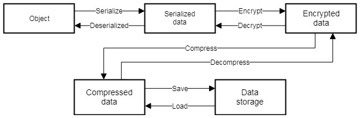

## Save & Load System in Unity - How to save your game states and settings?

Saving data is critical for any game. Whether you need to save high scores, preferences, or a game state, Unity offers a variety of methods – from PlayerPrefs to serializing data, encrypting it, and writing to a file.


**Game data access & saving workflow:**



**Simple game data access & saving workflow**:


### PlayerPrefs

**PlayerPrefs** are not made to save game states. However, they’re useful, so we’ll discuss them. You can use PlayerPrefs to store a player’s preferences between sessions, such as quality settings, audio volume or other non-essential data. PlayerPrefs are stored somewhere on your device, separate from your project. The exact location varies depending on your operating system, but it’s usually somewhere that’s globally accessible and managed by your OS. The stored data is in simple key-value pairs. Because of their ease of access, they aren’t safe from users who wish to open and modify them, and they can be deleted by accident since they’re saved outside of the project and managed by your OS.


PlayerPrefs are relatively easy to implement and require only a few lines of code, but they only support Float, Int and String-type values, making it challenging to serialize large, complex objects. A determined user can overcome this limitation by converting their saved data into some format represented by one of these basic types


eg:
```cs
public void SavePrefs()
{
    PlayerPrefs.SetInt("Volume", 50);
    PlayerPrefs.Save();
}
 
public void LoadPrefs()
{
    int volume = PlayerPrefs.GetInt("Volume", 0); 
}


```

> Since each Unity application stores all its PlayerPrefs **in a single file**, it’s **not well-suited for handling multiple save files or cloud saves**, both of which require you to store and receive save data from a **different location**.

> Not recommend player prefs. They are only useful for **small amount of data** that's not complicated.

### JSON
**JSON** is standardized and widely used in many different applications. As a result, all platforms support it strongly, which is helpful when building cross-platform games.

JSON is excellent for sending and receiving data from a **server backend**.


### JsonUtility

**JsonUtility** is Unity’s built-in API for **serializing and deserializing JSON data**.

Use the JsonUtility class to convert Unity objects to and from the JSON format.

For example, you can use JSON Serialization to interact with web services, or to easily pack and unpack data to a text-based format.


> **Note**: You **must save the JSON data yourself**, either in a **file or over a network**. Handling the data storage yourself makes it easy to **manage multiple save files** because you can store each file in a different location.


JSON Serialization uses a notion of "structured" JSON: you create a class or structure to describe what variables you want to store in your JSON data. For example:

```cs
[Serializable]
public class MyClass
{
    public int level;
    public float timeElapsed;
    public string playerName;
}
```
This defines a plain C# class containing three variables (**level**, **timeElapsed**, and **playerName**) and marks it with the `Serializable` attribute, in order to work with the JSON serializer. To create an instance of your class, you can use something like this:

```cs
MyClass myObject = new MyClass();
myObject.level = 1;
myObject.timeElapsed = 47.5f;
myObject.playerName = "Dr Charles Francis";
```
use the `JsonUtility.ToJson` method to serialize it (convert it) to the JSON format:
```cs
string json = JsonUtility.ToJson(myObject);
// json now contains: '{"level":1,"timeElapsed":47.5,"playerName":"Dr Charles Francis"}'
```

To convert the JSON back into an object, use `JsonUtility.FromJson`:

```cs
myObject = JsonUtility.FromJson<MyClass>(json);
```
This creates a new instance of `MyClass` and sets the values on it using the JSON data. If the JSON data contains values that do not map to fields in `MyClass`, then the serializer ignores those values. If the JSON data is missing values for fields in `MyClass`, then the serializer leaves the constructed values for those fields in the returned object.

Overwriting objects with JSON, you can also deserialize JSON data over an existing object, which overwrites any existing data:
```cs
JsonUtility.FromJsonOverwrite(json, myObject);
```
> If the JSON data does not contain a value for a field, the serializer does not change that field’s value.


### Using Cloud to save data

#### Unity Cloud Save

You can use Unity's Cloud Save service to save player data, such as game progress, inventories, or metadata. Because it's cloud based, players can access their data anywhere and across devices, which can mitigate data loss when a player changes devices or re-installs a game

https://unity.com/products/cloud-save \
https://docs.unity.com/ugs/en-us/manual/cloud-save/manual 

https://www.youtube.com/watch?v=WRKsmnmNpb4 \
https://www.youtube.com/watch?v=STuIobcdKzk

#### Firebase
https://www.youtube.com/watch?v=lLZ6tXKTLaQ


### Supported types
The JSON Serializer API supports any **`MonoBehaviour` subclass**, **`ScriptableObject` subclass**, or **plain class** or **struct with the `[Serializable]` attribute**. When you pass in an object to the standard Unity serializer for processing, the same rules and limitations apply as they do in the Inspector: Unity serializes fields only; and types like **`Dictionary<>` are not supported**.

Unity does not support passing other types directly to the API, such as **primitive types or arrays**. If you need to convert those, wrap them in a `class` or `struct` of some sort.

https://docs.unity3d.com/2021.2/Documentation/Manual/JSONSerialization.html

### Other libraries
Aside from the built-in serialization options, there are other external libraries for serialization.

it’s best to go with a **binary-based serializer**.

- **MessagePack** \
  An efficient binary serializer \
  https://msgpack.org/index.html \
  https://github.com/MessagePack-CSharp/MessagePack-CSharp
- **ProtoBuf** \
  https://github.com/protocolbuffers/protobuf/tree/main/csharp
- **protobuf-net** \
  https://github.com/protobuf-net/protobuf-net
- **BinaryFormatter** \
  .Net library to store your objects in a binary format directly. 
  > The BinaryFormatter type is dangerous and is not recommended for data processing. Applications should stop using BinaryFormatter as soon as possible, even if they believe the data they're processing to be trustworthy. BinaryFormatter is insecure and can't be made secure.
  
  https://learn.microsoft.com/en-us/dotnet/api/system.runtime.serialization.formatters.binary.binaryformatter?view=net-5.0
- **Unity EasySave - Asset store** \
  a well-supported and popular plug-in available on the Unity Asset Store. \
  https://moodkie.com/easy-save-unity/ \
  https://assetstore.unity.com/packages/tools/utilities/easy-save-the-complete-save-data-serializer-system-768 \
  https://www.cg.com.tw/EasySave/ \
  https://www.cg.com.tw/EasySave-AutoSave/ \
  https://www.cg.com.tw/EasySave/Content/EasySave_06.php \
  https://www.cg.com.tw/EasySave/Content/EasySave_10.php \
  https://www.cg.com.tw/EasySave/ES3Cloud.php \
  https://www.cg.com.tw/EasySave-ES3Cloud/
- **.NET System.Xml** \
  an alternative data format. Like JSON, it’s relatively human-readable and has some features that may be useful for your specific application, such as namespaces. DotNet has built-in support for XML.
  https://learn.microsoft.com/en-us/dotnet/api/system.xml?view=net-5.0


### `Application.persistentDataPath`

This method Contains the path to a persistent data directory (Read Only).

Windows Store Apps: `Application.persistentDataPath` points to `C:\Users\<user>\AppData\LocalLow\<company name>`.

WebGL: `Application.persistentDataPath` points to `/idbfs/<md5 hash of data path>` where the data path is the URL stripped of everything including and after the last `'/'` before any `'?'` components.

https://docs.unity3d.com/ScriptReference/Application-persistentDataPath.html

Linux: `Application.persistentDataPath` points to `$XDG_CONFIG_HOME/unity3d or $HOME/.config/unity3d`.

iOS: `Application.persistentDataPath` points to `/var/mobile/Containers/Data/Application/<guid>/Documents`.

tvOS: `Application.persistentDataPath` is not supported and returns an empty string.

Android: `Application.persistentDataPath` points to `/storage/emulated/<userid>/Android/data/<packagename>/files` on most devices

Mac: `Application.persistentDataPath` points to the user Library folder. (This folder is often hidden.) In recent Unity releases user data is written into `~/Library/Application Support/company name/product name`.

### Security
Security means **encryption of data**. 

when it comes to storing data locally on a player’s device, encryption is relatively easy to manipulate.

Without breaking the encryption, users can manipulate the data directly in memory with freely available tools.

If security of player data is high concern, the best option is to keep your data on a server where users can’t modify it. 

The application **shouldn’t send any data directly to the server** because users could still manipulate it. Instead, the **application can only send commands to the server**, **let the server change the data**, and then **send the results back to the application**.


### ref 
https://dev.twsiyuan.com/2018/06/how-to-save-and-load-gamesaves-in-unity.html \
https://dev.twsiyuan.com/2018/06/how-to-encrypt-and-decrypt-gamesaves-in-unity.html \
https://dev.twsiyuan.com/2018/06/how-to-compress-and-decompress-gamesaves-in-unity.html


https://www.youtube.com/watch?v=XOjd_qU2Ido

https://www.youtube.com/watch?v=gZ3wtNGB3nU

https://www.youtube.com/watch?v=aUi9aijvpgs

**Persistent data: How to save your game states and settings** \
https://blog.unity.com/games/persistent-data-how-to-save-your-game-states-and-settings 

**Persistent Data – How to save your game states and settings | Unite Now 2020** \
https://www.youtube.com/watch?v=uD7y4T4PVk0


https://github.com/UnityTechnologies/UniteNow20-Persistent-Data/tree/main

Saving and Loading Data using JSON in Unity \
https://ponderingpixel.com/tutorials/unity/save-and-load-games-using-json-in-unity/ \
https://videlais.com/2021/02/25/using-jsonutility-in-unity-to-save-and-load-game-data/ \
https://prasetion.medium.com/saving-data-as-json-in-unity-4419042d1334 \
https://www.youtube.com/watch?v=pVXEUtMy_Hc \
https://www.youtube.com/watch?v=aSNj2nvSyD4

Save data to server \
https://www.youtube.com/watch?v=5cl_Ppu9S-M \
https://stackoverflow.com/questions/72704203/how-do-large-games-save-data


