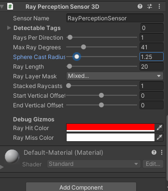

## Observations & Sensors

In order for an agent to learn, the observations should include all the information an agent needs to accomplish its task. 
Without sufficient and relevant information, an agent may learn poorly or may not learn at all. 
A reasonable approach for determining what information should be included is to consider what you would need to calculate an analytical solution to the problem, 
or what you would expect a human to be able to use to solve the problem.


> ML-Agents provides multiple ways for an Agent to make observations

### Overriding the `Agent.CollectObservations()` method

Overriding the `Agent.CollectObservations()` method and passing the observations to the provided `VectorSensor`. 
Adding the `[Observable]` attribute to fields and properties on the Agent. Implementing the `ISensor` interface, 
using a `SensorComponent` attached to the Agent to create the `ISensor`.


`Agent.CollectObservations()` is best used for aspects of the environment which are numerical and non-visual. The Policy class calls the `CollectObservations(VectorSensor sensor)` method of each Agent. Your implementation of this function must call `VectorSensor.AddObservation` to add vector observations.

The `VectorSensor.AddObservation` method provides a number of overloads for adding common types of data to your observation vector. You can add Integers and booleans directly to the observation vector, as well as some common Unity data types such as `Vector2`, `Vector3`, and `Quaternion`.


The observations passed to `VectorSensor.AddObservation()` must always contain the same number of elements must always be in the same order. If the number of observed entities in an environment can vary, you can pad the calls with zeros for any missing entities in a specific observation, or you can limit an agent's observations to a fixed subset. For example, instead of observing every enemy in an environment, you could only observe the closest five.

Additionally, when you set up an Agent's `Behavior Parameters` in the Unity Editor, you must set the **Vector Observations > Space Size** to equal the number of floats that are written by `CollectObservations()`.

eg:
```cs
public GameObject ball;

public override void CollectObservations(VectorSensor sensor)
{
    // Orientation of the cube (2 floats)
    sensor.AddObservation(gameObject.transform.rotation.z);
    sensor.AddObservation(gameObject.transform.rotation.x);
    // Relative position of the ball to the cube (3 floats)
    sensor.AddObservation(ball.transform.position - gameObject.transform.position);
    // Velocity of the ball (3 floats)
    sensor.AddObservation(m_BallRb.velocity);
    // 8 floats total
}
```


#### Observable Fields and Properties

Another approach is to define the relevant observations as fields or properties on your Agent class, and annotate them with an `ObservableAttribute`. For example, in the Ball3DHardAgent, the difference between positions could be observed by adding a property to the Agent:

```
using Unity.MLAgents.Sensors.Reflection;

public class Ball3DHardAgent : Agent {

    [Observable(numStackedObservations: 9)]
    Vector3 PositionDelta
    {
        get
        {
            return ball.transform.position - gameObject.transform.position;
        }
    }
}
```

`ObservableAttribute` currently supports most basic types (e.g. floats, ints, bools), as well as `Vector2`, `Vector3`, `Vector4`, `Quaternion`, and enums.


> **NOTE**: you do not need to adjust the Space Size in the Agent's `Behavior Parameters` when you add `[Observable]` fields or properties to an Agent, since their size can be computed before they are used.


> Both `Agent.CollectObservations()` and `ObservableAttribute`s produce vector observations, which are represented at lists of `float`s. `ISensor`s can produce both vector observations and visual observations, which are multi-dimensional arrays of floats.

#### One-hot encoding categorical information

Type enumerations should be encoded in the _one-hot_ style. That is, add an element to the feature vector for each element of enumeration, setting the element representing the observed member to one and set the rest to zero. For example, if your enumeration contains \[Sword, Shield, Bow\] and the agent observes that the current item is a Bow, you would add the elements: 0, 0, 1 to the feature vector. The following code example illustrates how to add.

```
enum ItemType { Sword, Shield, Bow, LastItem }
public override void CollectObservations(VectorSensor sensor)
{
    for (int ci = 0; ci &lt; (int)ItemType.LastItem; ci++)
    {
        sensor.AddObservation((int)currentItem == ci ? 1.0f : 0.0f);
    }
}
```

`VectorSensor` also provides a two-argument function `AddOneHotObservation()` as a shortcut for _one-hot_ style observations. The following example is identical to the previous one.

```
enum ItemType { Sword, Shield, Bow, LastItem }
const int NUM_ITEM_TYPES = (int)ItemType.LastItem + 1;

public override void CollectObservations(VectorSensor sensor)
{
    // The first argument is the selection index; the second is the
    // number of possibilities
    sensor.AddOneHotObservation((int)currentItem, NUM_ITEM_TYPES);
}
```

`ObservableAttribute` has built-in support for enums. Note that you don't need the `LastItem` placeholder in this case:

```
enum ItemType { Sword, Shield, Bow }

public class HeroAgent : Agent
{
    [Observable]
    ItemType m_CurrentItem;
}
```


### Raycast Observations

Raycasts are another possible method for providing observations to an agent. This can be easily implemented by adding a **`RayPerceptionSensorComponent3D`** (or **`RayPerceptionSensorComponent2D`**) to the **Agent GameObject**.

During observations, several rays (or spheres, depending on settings) are **cast into the physics world**, and the **objects that are hit determine the observation vector** that is produced.


-   Attach **`RayPerceptionSensorComponent3D`** or **`RayPerceptionSensorComponent2D`** to use.
-   This observation type is best used when there is relevant spatial information for the agent that doesn't require a fully rendered image to convey.
-   Use as few rays and tags as necessary to solve the problem in order to improve learning stability and agent performance.
-   If you run into performance issues, try using batched raycasts by enabling the **_Use Batched Raycast_** setting. (Only available for **3D ray perception sensors**.)




Both sensor components have several settings:

-   **_Detectable Tags_**: A list of strings corresponding to the types of objects that the Agent should be able to distinguish between. For example, in the WallJump example, we use "wall", "goal", and "block" as the list of objects to detect.
-   **_Rays Per Direction_**: Determines the number of rays that are cast. One ray is always cast forward, and this many rays are cast to the left and right.
-   **_Max Ray Degrees_**: The angle (in degrees) for the outermost rays. 90 degrees corresponds to the left and right of the agent.
-   **_Sphere Cast Radius_**: The size of the sphere used for sphere casting. If set to 0, rays will be used instead of spheres. Rays may be more efficient, especially in complex scenes.
-   **_Ray Length**:_ The length of the casts
-   **_Ray Layer Mask_**: The `LayerMask` passed to the raycast or spherecast. This can be used to ignore certain types of objects when casting.
-   **_Observation Stacks_**: The number of previous results to "stack" with the cast results. Note that this can be independent of the "Stacked Vectors" setting in `Behavior Parameters`.
-   **_Start Vertical Offset_ (3D only)**: The vertical offset of the ray start point.
-   **_End Vertical Offset_ (3D only)**: The vertical offset of the ray end point.
-   **_Alternating Ray Order_**: Alternating is the default, it gives an order of (**0, -delta, delta, -2_delta, 2_delta, ..., -n_delta, n_delta**). If alternating is disabled the order is left to right (**-n_delta, -(n-1)_delta, ..., -delta, 0, delta, ..., (n-1)_delta, n_delta**). For general usage there is no difference but if using custom models the left-to-right layout that matches the spatial structuring can be preferred (e.g. for processing with conv nets).
-   **_Use Batched Raycasts_ (3D only)**: Whether to use batched raycasts. Enable to use batched raycasts and the jobs system.

> Note that this is separate from the State Size defined in `Behavior Parameters`, so you don't need to worry about the formula above when setting the State Size.


**Example environent: wall jump** \
https://unity-technologies.github.io/ml-agents/Learning-Environment-Examples/#wall-jump


### Visual Observations

**Visual observations** are generally provided to agent via either a **`CameraSensor`** or **`RenderTextureSensor`**. These **collect image information** and **transforms it into a 3D Tensor** which can be fed into the convolutional neural network (CNN) of the agent policy. https://cs231n.github.io/convolutional-networks/ \
This allows agents to learn from spatial regularities in the observation images. It is possible to use visual and vector observations with the same agent.

Visual observations can be derived from **Cameras** or **RenderTextures** within your scene. To add a visual observation to an Agent, add either a Camera Sensor Component or RenderTextures Sensor Component to the Agent. Then drag the camera or render texture you want to add to the `Camera` or `RenderTexture` field. You can have more than one camera or render texture and even use a combination of both attached to an Agent. For each visual observation, set the width and height of the image (in pixels) and whether or not the observation is color or grayscale.

Each Agent that uses the same Policy must have the same number of visual observations, and they must all have the same resolutions (including whether or not they are grayscale). Additionally, each Sensor Component on an Agent must have a unique name so that they can be sorted deterministically (the name must be unique for that Agent, but multiple Agents can have a Sensor Component with the same name).

Visual observations also support stacking, by specifying `Observation Stacks` to a value greater than 1. The visual observations from the last `stackSize` steps will be stacked on the last dimension (channel dimension).

When using `RenderTexture` visual observations, a handy feature for debugging is adding a `Canvas`, then adding a `Raw Image` with it's texture set to the Agent's `RenderTexture`. This will render the agent observation on the game screen.


-   To collect visual observations, attach **`CameraSensor`** or **`RenderTextureSensor` components** to the **agent GameObject**.
-   Visual observations should generally **only be used when vector observations are not sufficient**.
-   Image size should be kept **as small as possible**, without the loss of needed details for decision making.
-   Images should be made **grayscale in situations** where color information is not needed for making informed decisions.


The GridWorld environment(https://unity-technologies.github.io/ml-agents/Learning-Environment-Examples/#gridworld) is an example on how to use a RenderTexture for both debugging and observation. Note that in this example, a Camera is rendered to a RenderTexture, which is then used for observations and debugging. To update the RenderTexture, the Camera must be asked to render every time a decision is requested within the game code. When using Cameras as observations directly, this is done automatically by the Agent.

> **Note**: Agents using visual observations can capture state of arbitrary complexity and are useful when the **state is difficult to describe numerically**. However, they are also typically **less efficient and slower to train**, and sometimes **don't succeed at all as compared to vector observations**. As such, they should only be used when it is **not possible to properly define the problem using vector or ray-cast observations**.


### ref 
https://unity-technologies.github.io/ml-agents/Learning-Environment-Design-Agents/#observations-and-sensors

Example learning environment \
https://unity-technologies.github.io/ml-agents/Learning-Environment-Examples/


