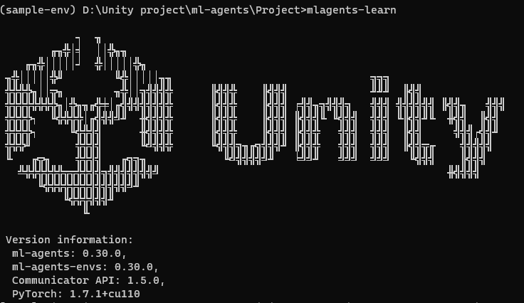
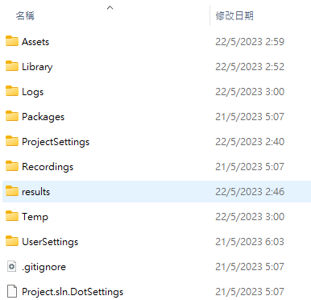
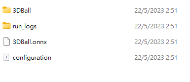
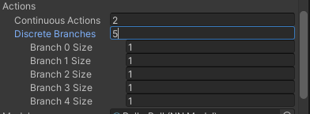

## Unity Machine Learning  Agent

**The Unity Machine Learning Agents Toolkit** (ML-Agents) is an open-source project that enables games and simulations to serve as environments for **training intelligent agents**. We provide implementations (based on PyTorch) of state-of-the-art algorithms to enable game developers and hobbyists to easily train intelligent agents for 2D, 3D and VR/AR games. Researchers can also use the provided simple-to-use Python API to train Agents using reinforcement learning, imitation learning, neuroevolution, or any other methods. These trained agents can be used for multiple purposes, including controlling NPC behavior (in a variety of settings such as multi-agent and adversarial), automated testing of game builds and evaluating different game design decisions pre-release. The ML-Agents Toolkit is mutually beneficial for both game developers and AI researchers as it provides a central platform where advances in AI can be evaluated on Unity’s rich environments and then made accessible to the wider research and game developer communities.


### How Unity ML-Agents works

- **Integrate** \
  Integrate the ML-Agents Unity package.
- **Train** \
  Connect your integrated Unity project and start training the agents to learn the right behaviour. 
- **Embed** \
  When training is complete, embed the trained agent model back into your Unity project.

### Installation
https://unity-technologies.github.io/ml-agents/Installation/

### Using virtual environment
A Virtual Environment is a self contained directory tree that contains a Python installation for a particular version of Python, plus a number of additional packages. 

A Virtual Environment keeps all dependencies for the Python project separate from dependencies of other projects.

Use your virtual environment for specific python version and pip version, and also python package such as mlagents.


To create a new environment named sample-env execute:
```
python -m venv python-envs\sample-env
```

Go to your virtual environment directory to activate the environment execute:
```
python-envs\sample-env\Scripts\activate
```
To deactivate the environment execute:
```
deactivate
```

> To run `mlagents-learn`, it is recommend to activate virtual environment first


https://unity-technologies.github.io/ml-agents/Using-Virtual-Environment/

https://docs.python.org/3/library/venv.html

### Example for getting started guide from official doc
https://github.com/Unity-Technologies/ml-agents/blob/release_20_docs/docs/Getting-Started.md

### Sample projects
Unity ml agents provide 18+ example environments for demo. 

load the sample Unity Project provided by ml-agents.

- In the Unity Hub, click **Open** > **Add project from disk**.
- Navigate to wherever you cloned or downloaded the **ml-agents repository** from github.
- Select the **'Project'** folder, and click **'Select Folder'** in the file browser

https://github.com/Unity-Technologies/ml-agents/blob/release_18_docs/docs/Learning-Environment-Examples.md


### Train your agent with reinforcement learning
Run in your terminal from the **root** directory of your project. Under your **virtual environment** mode in terminal:
```
mlagents-learn
```
> run `mlagents-learn` from any directory in your project.

> If you don't specify any config yaml file for the training, unity will use default configuration. If you have own customed configuration for the training, specify the path of locating it by following `mlagents-learn` command

To view a description of all the **CLI** options accepted by `mlagents-learn`, use the `--help`:

```shell
mlagents-learn --help
```
Possible flags and detailed description of all the **CLI** arguments can be found by `--help` flag

> **Note**: **ML-Agents** defaults to a **time scale of 20** to speed up training. You can modify by the flag **`--time-scale`**. This is useful for simulate the physics like free fall in the training, Because the physics in this environment is **time-dependant**. So you can explicitly setting the flag **`--time-scale=1`** for normal speed.

eg: 
```
mlagents-learn <trainer-config-file> --run-id=<run-identifier> --time-scale=1
```

If `mlagents-learn` runs correctly, you can see this in the terminal:



You can see this on terminal:
```
[INFO] Listening on port 5004. Start training by pressing the Play button in the Unity Editor.
```
Now go to your Unity project and click the ▶️ button to start the training process. You can click the ▶️ button to stop the training process. At any time you will be able to resume training by adding the `--resume` flag on terminal.

eg:

```
mlagents-learn config/ppo/3DBall.yaml --run-id=first3DBallRun --resume
```

If you would like to **re-run a previously interrupted or completed training run** and **re-use the same run ID** , then use the **`--force`** flag.

Your trained model will be at **root directory of your project > `results/<run-identifier>/<behavior_name>.onnx`** where **<behavior_name>** is the name of the Behavior Name of the agents corresponding to the model.







> You can find the configurations for this training process in `.yaml` file.


> **Note**: There is a known bug on Windows that causes the saving of the model to fail when you early terminate the training, it's recommended to wait until Step has reached the max_steps parameter you set in your config YAML.

#### More details of how to use `mlagents-learn` to train your agents
Use the `mlagents-learn` command to train agents. `mlagents-learn` supports training with [reinforcement learning](https://github.com/gzrjzcx/ML-agents/blob/master/docs/Background-Machine-Learning.md#reinforcement-learning), [curriculum learning](https://github.com/gzrjzcx/ML-agents/blob/master/docs/Training-Curriculum-Learning.md), and [behavioral cloning imitation learning](https://github.com/gzrjzcx/ML-agents/blob/master/docs/Training-Imitation-Learning.md).

```
mlagents-learn <trainer-config-file> --env=<env_name> --run-id=<run-identifier> --train
```

-   `<trainer-config-file>` is the file path of the trainer configuration yaml.
-   `<env_name>`**(Optional)** is the name (including path) of your Unity executable containing the agents to be trained. If `<env_name>` is not passed, the training will happen in the Editor. Press the ▶️ button in Unity when the message _"Start training by pressing the Play button in the Unity Editor"_ is displayed on the screen.
-   `<run-identifier>` is an optional identifier you can use to identify the results of individual training runs. This is a **unique name** for the **training session**.

https://github.com/Unity-Technologies/ml-agents/blob/develop/docs/Training-ML-Agents.md#starting-training

https://github.com/gzrjzcx/ML-agents/blob/master/docs/Training-ML-Agents.md

https://github.com/Unity-Technologies/ml-agents/blob/develop/docs/Training-ML-Agents.md

#### Multiple Training Areas within the Same Scene
To generally speeds up training, allow multiple training within the same scene. 

This can be achieved simply by instantiating many Agents with the **same Behavior Name**.

1. Drag the TrainingArea GameObject, along with its attached GameObjects, into your Assets browser, turning it into a prefab.
2. You can now instantiate copies of the **TrainingArea prefab**. Drag them into your scene, positioning them so that they do not overlap.

Alternatively, you can use the `TrainingAreaReplicator` to replicate training areas. Use the following steps:

1.  Create a new empty Game Object in the scene.
2.  Click on the new object and add a **`TrainingAreaReplicator` component** to the empty Game Object through the inspector.
3.  Drag the training area to `Base Area` in the **Training Area Replicator**.
4.  **Specify the number of areas** to replicate and the separation between areas.
5.  Hit play and the areas will be replicated automatically.

#### Training Using Concurrent Unity Instances
Unity enable developers to **run concurrent, parallel instances** of the Unity executable during training.

Another level of parallelization comes by training using **concurrent Unity instances**. 
```
mlagents-learn <trainer-config-file> --env=<env_name> --run-id=<run-identifier> --num-envs=<n>
```

Above will start **ML Agents training** with **N** environment instances. **Combining multiple training areas within the same scene**, with concurrent Unity instances, effectively gives you two levels of parallelism to speed up training. The command line option **`--num-envs=<n>`** controls the number of concurrent Unity instances that are executed in parallel during training.

### Set up & start training envrionment

3 script need to be added as component to your agent.

- Your customed **Agent script**(with your own customed logic) by drag script into the agent.
- Add a **Decision Requester script** with the Add Component button.
- Add a **Behavior Parameters script** with the Add Component button.
- In your **Agent script**, Import ML-Agent package by adding: 

  ```cs
    using Unity.MLAgents;
    using Unity.MLAgents.Sensors;
    using Unity.MLAgents.Actuators;
  ```
  Then change the base class from **`MonoBehaviour`** to **`Agent`**.
- Delete **`Update()`** since we are not using it, but keep **`Start()`**.


https://github.com/Unity-Technologies/ml-agents/blob/develop/docs/Learning-Environment-Create-New.md


#### Decision Requester

Attach a **DecisionRequester** component to the same [GameObject] as the Agent component.

> The **DecisionRequester** component provides **a convenient and flexible way** to **trigger the agent decision making process**. Without a **DecisionRequester**, your Agent implementation **must manually call its `RequestDecision()` function**.

| Name | Description |
| --- | --- |
| DecisionPeriod | The frequency with which the agent requests a decision. A DecisionPeriod of 5 means that the Agent will request a decision every 5 Academy steps. /// |
| DecisionStep | Indicates when to requests a decision. By changing this value, the timing of decision can be shifted even among agents with the same decision period. The value can be from 0 to DecisionPeriod - 1. |
| TakeActionsBetweenDecisions | Indicates whether or not the agent will take an action during the Academy steps where it does not request a decision. Has no effect when DecisionPeriod is set to 1. |

https://docs.unity3d.com/Packages/com.unity.ml-agents@3.0/api/Unity.MLAgents.DecisionRequester.html


#### Behavior Parameters

A component for setting an **Agent instance's behavior** and **brain properties**.

| Name | Description |
| --- | --- |
| BehaviorName | The name of this behavior, which is used as a base name. See FullyQualifiedBehaviorName for the full name. This should not be set at runtime; use Agent.SetModel(string,Model,Policies.InferenceDevice) to set it instead. |
| BehaviorType | The BehaviorType for the Agent. |
| BrainParameters | The associated BrainParameters for this behavior. |
| DeterministicInference | Whether to select actions deterministically during inference from the provided neural network. |
| FullyQualifiedBehaviorName | Returns the behavior name, concatenated with any other metadata (i.e. team id). |
| InferenceDevice | How inference is performed for this Agent's model. This should not be set at runtime; use Agent.SetModel(string,Model,Policies.InferenceDevice) to set it instead. |
| Model | The neural network model used when in inference mode. This should not be set at runtime; use Agent.SetModel(string,Model,Policies.InferenceDevice) to set it instead. |
| ObservableAttributeHandling | Determines how the Agent class is searched for ObservableAttributes. |
| UseChildActuators | Whether or not to use all the actuator components attached to child GameObjects of the agent. Note that changing this after the Agent has been initialized will not have any effect. |
| UseChildSensors | Whether or not to use all the sensor components attached to child GameObjects of the agent. Note that changing this after the Agent has been initialized will not have any effect. |
| Continous Actions | The number of continuous actions available. |
| Discrete branch | The array of branch sizes for the discrete actions(Number of branches contained in the array)|
| Branch [i] Size | The number of actions available for that specific branch. |




https://docs.unity3d.com/Packages/com.unity.ml-agents@3.0/api/Unity.MLAgents.Policies.BehaviorParameters.html

#### BrainParameters
**Holds information about the brain**. It defines what are the inputs and outputs of the decision process.


https://docs.unity3d.com/Packages/com.unity.ml-agents@2.3/api/Unity.MLAgents.Policies.BrainParameters.html

#### Observations and Sensors

ML-Agents provides multiple ways for an Agent to make observations: 1. Overriding the `Agent.CollectObservations()` method and passing the observations to the provided `VectorSensor`. 1. Adding the `[Observable]` attribute to fields and properties on the Agent. 1. Implementing the `ISensor` interface, using a `SensorComponent` attached to the Agent to create the `ISensor`.

- **Vector Observations**: Both `Agent.CollectObservations()` and `ObservableAttribute`s produce vector observations, which are represented at lists of `float`s. `ISensor`s can produce both vector observations and visual observations, which are multi-dimensional arrays of floats.
- **Visual Observations**: Visual observations are generally provided to agent via either a `CameraSensor` or `RenderTextureSensor`. These collect image information and transforms it into a 3D Tensor which can be fed into the convolutional neural network (CNN) of the agent policy.
- R**aycast Observations**: Raycasts are another possible method for providing observations to an agent. This can be easily implemented by adding a `RayPerceptionSensorComponent3D` (or `RayPerceptionSensorComponent2D`) to the Agent GameObject.
- **Variable Length Observations**: It is possible for agents to collect observations from a varying number of GameObjects by using a `BufferSensor`. You can add a `BufferSensor` to your Agent by adding a `BufferSensorComponent` to its GameObject. The `BufferSensor` can be useful in situations in which the Agent must pay attention to a varying number of entities (for example, a varying number of enemies or projectiles).

https://unity-technologies.github.io/ml-agents/Learning-Environment-Design-Agents/#observations-and-sensors


#### Actions and Actuators
An action is an instruction from the Policy that the agent carries out. The action is passed to the an `IActionReceiver` (either an `Agent` or an `IActuator`) as the `ActionBuffers` parameter when the Academy invokes the `IActionReciever.OnActionReceived()` function. There are two types of actions supported: **Continuous** and **Discrete**.

Neither the Policy nor the training algorithm know anything about what the action values themselves mean. The training algorithm simply tries different values for the action list and observes the affect on the accumulated rewards over time and many training episodes. Thus, the only place actions are defined for an Agent is in the `OnActionReceived()` function.

An Agent can use **continuous and/or discrete actions**. Configure this along with the size of the action array, in the `BrainParameters` of the agent's associated **BehaviorParameters component**.

- **Continuous Actions**: When an Agent's Policy has **Continuous** actions, the `ActionBuffers.ContinuousActions` passed to the Agent's `OnActionReceived()` function is an array with length equal to the `Continuous Action Size` property value. The individual values in the array have whatever meanings that you ascribe to them. \
  When an Agent's Policy has **Continuous** actions, the `ActionBuffers.ContinuousActions` passed to the Agent's `OnActionReceived()` function is an array with length equal to the `Continuous Action Size` property value. The individual values in the array have whatever meanings that you ascribe to them. If you assign an element in the array as the speed of an Agent, for example, the training process learns to control the speed of the Agent through this parameter.
- **Discrete Actions**: When an Agent's Policy uses **discrete** actions, the `ActionBuffers.DiscreteActions` passed to the Agent's `OnActionReceived()` function is an array of integers with length equal to `Discrete Branch Size`. When defining the discrete actions, `Branches` is an array of integers, each value corresponds to the number of possibilities for each branch. \
  When an Agent's Policy uses **discrete** actions, the `ActionBuffers.DiscreteActions` passed to the Agent's `OnActionReceived()` function is an array of integers with length equal to `Discrete Branch Size`. When defining the discrete actions, `Branches` is an array of integers, each value corresponds to the number of possibilities for each branch.
  

https://unity-technologies.github.io/ml-agents/Learning-Environment-Design-Agents/#actions-and-actuators

#### Rewards

In reinforcement learning, the reward is a signal that the agent has done something right. The PPO reinforcement learning algorithm works by optimizing the choices an agent makes such that the agent earns the highest cumulative reward over time. The better your reward mechanism, the better your agent will learn.

**Note:** Rewards are not used during inference by an Agent using a trained model and is also not used during imitation learning.

Allocate rewards to an Agent by calling the `AddReward()` or `SetReward()` methods on the agent. The reward assigned between each decision should be in the range \[-1,1\]. Values outside this range can lead to unstable training. The `reward` value is reset to zero when the agent receives a new decision. If there are multiple calls to `AddReward()` for a single agent decision, the rewards will be summed together to evaluate how good the previous decision was. The `SetReward()` will override all previous rewards given to an agent since the previous decision.

https://unity-technologies.github.io/ml-agents/Learning-Environment-Design-Agents/#rewards

### Agent


The Agent is the actor that observes and takes actions in the environment. In the 3D Balance Ball environment, the Agent components are placed on the twelve "Agent" GameObjects. The base Agent object has a few properties that affect its behavior:

-   **Behavior Parameters** — Every Agent must have a Behavior. The Behavior determines how an Agent makes decisions.
-   **Max Step** — Defines how many simulation steps can occur before the Agent's episode ends.

#### Behavior Parameters : Vector Observation Space

Before making a decision, an agent collects its observation about its state in the world. The vector observation is a **vector of floating point** numbers which contain relevant information for the agent to **make decisions**.

#### Behavior Parameters : Actions

An Agent is given instructions in the form of actions. ML-Agents Toolkit classifies actions into two types: **continuous** and **discrete**.


https://github.com/Unity-Technologies/ml-agents/blob/main/docs/Learning-Environment-Design-Agents.md


### Designing a learning environment

https://github.com/Unity-Technologies/ml-agents/blob/main/docs/Learning-Environment-Design.md


### Training Configuration File
The **hyperparameters** for training are specified in a configuration file that you pass to the `mlagents-learn` program. 

Create a new **<trainer-config-file>**(**`_config.yaml`**) file under **`config/`** with **hyperparameter values**.
  
example:
```yaml
  behaviors:
  RollerBall:
    trainer_type: ppo
    hyperparameters:
      batch_size: 10
      buffer_size: 100
      learning_rate: 3.0e-4
      beta: 5.0e-4
      epsilon: 0.2
      lambd: 0.99
      num_epoch: 3
      learning_rate_schedule: linear
      beta_schedule: constant
      epsilon_schedule: linear
    network_settings:
      normalize: false
      hidden_units: 128
      num_layers: 2
    reward_signals:
      extrinsic:
        gamma: 0.99
        strength: 1.0
    max_steps: 500000
    time_horizon: 64
    summary_freq: 10000
  ```
  
https://github.com/Unity-Technologies/ml-agents/blob/develop/docs/Training-Configuration-File.md

#### Behavior Configurations
The primary section of the trainer config file is a set of configurations for each Behavior in your scene. These are defined under the sub-section `behaviors` in your trainer config file. Some of the configurations are required while others are optional. To help us get started, below is a sample file that includes all the possible settings if we're using a PPO trainer with all the possible training functionalities enabled (memory, behavioral cloning, curiosity, GAIL and self-play). You will notice that curriculum and environment parameter randomization settings are not part of the `behaviors` configuration, but in their own section called `environment_parameters`.
  
#### Default Behavior Settings
In some cases, you may want to specify a set of default configurations for your Behaviors. This may be useful, for instance, if your Behavior names are generated procedurally by the environment and not known before runtime, or if you have many Behaviors with very similar settings. To specify a default configuraton, insert a `default_settings` section in your YAML. This section should be formatted exactly like a configuration for a Behavior.
  
#### Adding CLI Arguments to the Training Configuration file  
Additional CLI arguments are grouped into environment, engine, checkpoint and torch. The available settings and example values are shown below.

- Environment settings
  ```
  env_settings:
  env_path: FoodCollector
  env_args: null
  base_port: 5005
  num_envs: 1
  seed: -1
  max_lifetime_restarts: 10
  restarts_rate_limit_n: 1
  restarts_rate_limit_period_s: 60
  ```
- Engine settings
  ```
  engine_settings:
  width: 84
  height: 84
  quality_level: 5
  time_scale: 20
  target_frame_rate: -1
  capture_frame_rate: 60
  no_graphics: false
  ```
  
 - Checkpoint settings
   ```
    checkpoint_settings:
    run_id: foodtorch
    initialize_from: null
    load_model: false
    resume: false
    force: true
    train_model: false
    inference: false
   ```
  
 - Torch settings:
   ```
    torch_settings:
    device: cpu
  
   ```
  
  
#### Create a yaml file:
Using `echo` (Win) :
```
echo > XXX_config.yaml
```
Using `touch` (Mac) :
```
touch XXX_config.yaml  
```

YAML Formatter tool \
https://codebeautify.org/yaml-beautifier
  
  
  
### Observing Training Progress
Once you start training using `mlagents-learn`, while training, you'll receive information about the training progress from the console. 
  
Regardless of which training methods, configurations or hyperparameters you provide, the training process will always generate three artifacts, all found in the `results/<run-identifier>` folder:

1. **Summaries**: these are training metrics that are updated throughout the training process. They are helpful to monitor your training performance and may help inform how to update your hyperparameter values.
2. **Models**: these contain the model checkpoints that are updated throughout training and the final model file (**`.onnx`**). This final model file is generated once either when training completes or is interrupted.
3. **Timers file** (under **`results/<run-identifier>/run_logs`**): this contains aggregated metrics on your training process, including time spent on specific code blocks.
  
These artifacts are updated throughout the training process and finalized when training is completed or is interrupted.
  
  
You'll also be able to visualize the training by running in a separate terminal:
```
tensorboard --logdir results
```
Then navigate to **`localhost:6006`** in your browser to view the TensorBoard summary statistics
  
https://unity-technologies.github.io/ml-agents/Using-Tensorboard/


### Embedding the model back into your Unity Environment
Once training has been completed, the training process saves the model. Your trained model will be at **`results/<run-identifier>/<behavior_name>.onnx`** where **`<behavior_name>`** is the name of the Behavior Name of the agents corresponding to the model.  

> **Note**: Do not just close the Unity Window once the Saved Model message appears. Either wait for the training process to close the window or press `Ctrl+C` at the command-line prompt. If you close the window manually, the **`.onnx`** file containing the trained model is not exported.


- In the Hierarchy panel, select the **Agent object**.
- Drag your model (**`behavior_name>.onnx`** file) the *Model** field under **Behavior Parameters** in the Inspector panel.
- Set inference device to CPU (for most of the models generated with the ML-Agents toolkit, CPU will be faster than GPU)


### ref
web doc \
https://unity-technologies.github.io/ml-agents/ \
https://unity-technologies.github.io/ml-agents/ML-Agents-Toolkit-Documentation/

package doc \
https://docs.unity3d.com/Packages/com.unity.ml-agents@2.3/api/Unity.MLAgents.html

Github \
https://github.com/Unity-Technologies/ml-agents \
https://github.com/gzrjzcx/ML-agents/tree/master


https://unity.com/products/machine-learning-agents

https://medium.com/ericzhan-publication/unity-ml-agent%E7%AD%86%E8%A8%98-%E5%AE%8C%E5%85%A8%E5%BE%9E%E9%9B%B6%E9%96%8B%E5%A7%8B%E7%9A%84%E6%A9%9F%E5%99%A8%E5%AD%B8%E7%BF%92-01-39472fccc7be

https://a0707127.medium.com/unity-ml-agents-installation-%E7%AD%86%E8%A8%98-3f2f18a14e8c

https://youtu.be/Z6fjTZAtziQ

https://medium.com/@fgriasa123/unity-ml-agents-%E7%AC%AC%E4%B8%80%E7%AB%A0-%E5%BB%BA%E6%A7%8B%E7%92%B0%E5%A2%83-ee27391cf4b0

https://learn.unity.com/course/ml-agents-hummingbirds

https://thomassimonini.medium.com/an-introduction-to-unity-ml-agents-with-hugging-face-efbac62c8c80

Making a New Learning Environment \
https://github.com/Unity-Technologies/ml-agents/blob/main/docs/Learning-Environment-Create-New.md

Interact with Unity built \
https://unity-technologies.github.io/ml-agents/Python-Gym-API/

Example environment \
https://unity-technologies.github.io/ml-agents/Learning-Environment-Examples/ \
https://www.gocoder.one/blog/introduction-to-unity-ml-agents/#whats-unity-ml-agents \
https://www.gocoder.one/blog/build-a-reinforcement-learning-environment-using-unity-mlagents/ \
https://www.gocoder.one/blog/designing-reinforcement-learning-agents-using-unity-ml-agents/ \
https://www.gocoder.one/blog/training-agents-using-ppo-with-unity-ml-agents/ \
https://www.gocoder.one/blog/competitive-self-play-unity-ml-agents/ 


Python Mlagents package \
https://pypi.org/project/mlagents/

AI LEARNS TENNIS \
https://youtu.be/HcWbggArjXo

在Unity環境中訓練強化學習AI \
https://www.youtube.com/watch?v=aOb0GSfA1pw&t=52s \
https://youtu.be/61j0q81hoIw \
https://www.youtube.com/watch?v=RjWpb7BazdA \
https://www.youtube.com/watch?v=UIaywmBsCFM \
https://www.youtube.com/watch?v=bsEYAlrD3mA \
https://www.youtube.com/watch?v=RbouZ_KgaUc \
https://www.youtube.com/watch?v=xsvpvHn4WU8

