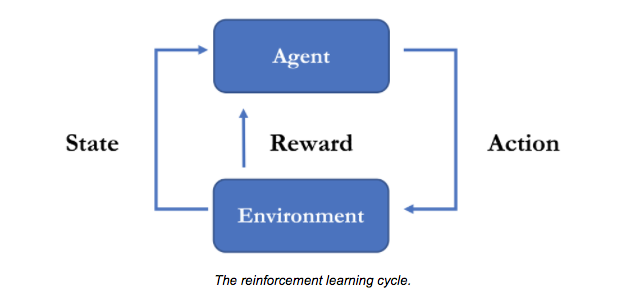

### Reinforcement Learning

#### What is reinforcement learning?
Reinforcement learning (RL) is a machine learning (ML) technique that trains software to make decisions to achieve the most optimal results. It mimics the trial-and-error learning process that humans use to achieve their goals. Software actions that work towards your goal are reinforced, while actions that detract from the goal are ignored. 

RL algorithms use a reward-and-punishment paradigm as they process data. They learn from the feedback of each action and self-discover the best processing paths to achieve final outcomes. The algorithms are also capable of delayed gratification. The best overall strategy may require short-term sacrifices, so the best approach they discover may include some punishments or backtracking along the way. RL is a powerful method to help artificial intelligence (AI) systems achieve optimal outcomes in unseen environments.

The Reinforcement Learning problem involves an agent exploring an unknown environment to achieve a goal. RL is based on the hypothesis that all goals can be described by the maximization of expected cumulative reward. The agent must learn to sense and perturb the state of the environment using its actions to derive maximal reward. The formal framework for RL borrows from the problem of optimal control of **Markov Decision Processes(MDP)**.

**The main elements of an RL system are:**

1.  The agent or the learner
2.  The environment the agent interacts with
3.  The policy that the agent follows to take actions
4.  The reward signal that the agent observes upon taking actions

### ref 
https://mofanpy.com/tutorials/machine-learning/reinforcement-learning/

https://github.com/dennybritz/reinforcement-learning

https://github.com/udacity/deep-reinforcement-learning

https://github.com/aikorea/awesome-rl

https://github.com/gzrjzcx/ML-agents/blob/master/docs/Background-Machine-Learning.md#reinforcement-learning

https://aws.amazon.com/what-is/reinforcement-learning/?nc1=h_ls

https://youtu.be/C2zw2H1c5Fk

https://www.synopsys.com/ai/what-is-reinforcement-learning.html 

https://www.andrew.cmu.edu/course/10-703/textbook/BartoSutton.pdf

https://web.stanford.edu/class/psych209/Readings/SuttonBartoIPRLBook2ndEd.pdf

**Gymnasium** \
https://gymnasium.farama.org/ \
https://github.com/Farama-Foundation/Gymnasium

