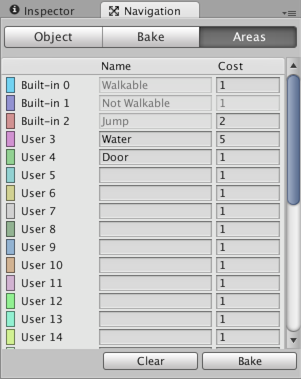

## Navigation and Pathfinding
The **navigation system** allows you to create characters that can **intelligently move around the game world**, using **navigation meshes** that are created automatically from your Scene
geometry. 
 
Dynamic obstacles allow you to alter the navigation of the characters at runtime, while OffMesh links let you build specific actions like opening doors or jumping down from a ledge.
 
 
### Navigation system
The **Navigation System** allows you to create characters which can navigate the game world. It gives your characters the ability to understand that they need to take stairs to reach second floor, or to jump to get over a ditch. The **Unity NavMesh system** consists of the following pieces:
 
-   **NavMesh** (short for Navigation Mesh) is a data structure which describes the walkable surfaces of the game world and allows to find path from one walkable location to another in the game world. The data structure is built, or baked, automatically from your level geometry.
-   **NavMesh Agent** component help you to create characters which avoid each other while moving towards their goal. Agents reason about the game world using the NavMesh and they know how to avoid each other as well as moving obstacles.
-   **OffMesh Link** component allows you to incorporate navigation shortcuts which cannot be represented using a walkable surface. For example, jumping over a ditch or a fence, or opening a door before walking through it, can be all described as OffMesh links.
-   **NavMesh Obstacle** component allows you to describe moving obstacles the agents should avoid while navigating the world. A barrel or a crate controlled by the physics system is a good example of an obstacle. While the obstacle is moving the agents do their best to avoid it, but once the obstacle becomes stationary it will carve a hole in the navmesh so that the agents can change their paths to steer around it, or if the stationary obstacle is blocking the path way, the agents can find a different route.
 

### Building a NavMesh
The process of creating a NavMesh from the level geometry is called **NavMesh Baking**. The process collects the Render Meshes and Terrains of all Game Objects which are marked as **Navigation Static**, and then processes them to create a navigation mesh that approximates the walkable surfaces of the level.

In Unity, `NavMesh` generation is handled from the Navigation window (menu: **Window > AI > Navigation**).

Building a `NavMesh` for your scene can be done in 4 quick steps:

-   **Select** scene geometry that should affect the navigation – walkable surfaces and obstacles. (After you selected the scene geometry for baking NavMesh, you can see the object you selected in Object tab in Navigation window)_
-   **Check Navigation Static** on to include selected objects in the NavMesh baking process.
-   **Adjust** the bake settings to match your agent size.
    -   _Agent Radius_ defines how close the agent center can get to a wall or a ledge.
    -   _Agent Height_ defines how low the spaces are that the agent can reach.
    -   _Max Slope_ defines how steep the ramps are that the agent walk up.
    -   _Step Height_ defines how high obstructions are that the agent can step on.
-   Click **bake** to build the NavMesh.


Or using **NavMesh Surface** component in the selected scene geometry to bake the **NavMesh**.
### NavMesh building components
**`NavMesh`** building components provide additional controls for generating and using **`NavMeshes`** in the Unity Editor and at runtime.

**`NavMesh`** building components are available through the AI Navigation package. To install this package, follow the instructions on adding a registry package by name and add the `com.unity.ai.navigation package`.

https://docs.unity3d.com/Packages/com.unity.ai.navigation@1.0/manual/index.html

#### NavMesh Surface
The NavMesh Surface component represents the walkable area for a specific NavMesh Agent type, and defines a part of the Scene where a NavMesh should be built.

https://docs.unity3d.com/Packages/com.unity.ai.navigation@1.0/manual/NavMeshSurface.html

#### NavMeshModifier
Use for affecting the NavMesh generation of NavMesh area types based on the transform hierarchy.
 
NavMesh Modifiers adjust how a specific GameObject behaves during NavMesh baking at runtime.

To use the NavMesh Modifier component, navigate to **GameObject** > **AI** > **NavMesh Modifier**.

https://docs.unity3d.com/Packages/com.unity.ai.navigation@1.0/manual/NavMeshModifier.html

#### NavMeshModifierVolume
Use for affecting the NavMesh generation of NavMesh area types based on volume.

NavMesh Modifier Volume marks a defined area as a certain type (for example, **Lava** or **Door**). Whereas [NavMesh Modifier](https://docs.unity3d.com/Packages/com.unity.ai.navigation@1.0/manual/NavMeshModifierVolume.htmlNavMeshModifier.html) marks certain GameObjects with an area type. NavMesh Modifier Volume allows you to change an area type locally based on a specific volume.

To use the NavMesh Modifier Volume component, navigate to **GameObject** > **AI** > **NavMesh Modifier Volume**.

NavMesh Modifier Volume is useful for marking certain areas of walkable surfaces that might not be represented as separate geometry, for example danger areas. You can also use It to make certain areas non-walkable.

The NavMesh Modifier Volume also affects the NavMesh generation process, meaning the NavMesh has to be updated to reflect any changes to NavMesh Modifier Volumes.

https://docs.unity3d.com/Packages/com.unity.ai.navigation@1.0/manual/NavMeshModifierVolume.html


#### NavMeshLink 
Use for connecting the same or different NavMesh surfaces for one type of Agent.

NavMesh Link creates a navigable link between two locations that use NavMeshes.

This link can be from point to point or it can span a gap, in which case the Agent uses the nearest location along the entry edge to cross the link.

You must use a NavMesh Link to connect different NavMesh Surfaces.

To use the NavMesh Link component, navigate to **GameObject** > **AI** > **NavMesh Link**.

https://docs.unity3d.com/Packages/com.unity.ai.navigation@1.0/manual/NavMeshLink.html


### Min Region Area
The **Min Region Area** advanced build settings allows you to cull away small non-connected **NavMesh regions**. **NavMesh regions** whose surface area is smaller than the specified value, will be removed.

Please note that some areas may not get removed despite the **Min Region Area** setting. The NavMesh is built in parallel as a grid of tiles. If an area straddles a tile boundary, the area is not removed. The reason for this is that the area pruning happens at a stage in the build process where surrounding tiles are not accessible.


### Voxel Size
Manual voxel size allows you to change the accuracy at which the bake process operates.

The NavMesh bake process uses voxelization to build the NavMesh from arbitrary level geometry. In the first pass of the algorithm, the scene
 is rasterized into voxels, then the walkable surfaces are extracted, and finally the walkable surfaces are turned into a navigation mesh
. The voxel size describes how accurately the resulting NavMesh represents the scene geometry.

The default accuracy is set so that there are 3 voxels per agent radius, that is, the whole agent width is 6 voxels. This is a good trade off between accuracy and bake speed. Halving the voxel size will increase the memory usage by 4x and it will take 4x longer to build the scene.

> Generally you should not need to adjust the voxel size, there are two scenarios where this might be necessary: building a smaller agent radius, or more accurate NavMesh.

#### Smaller Agent Radius

When you bake for an artificially smaller agent radius, the NavMesh bake system will also reduce the voxel size. If your other agent dimensions stays the same, it may not be necessary to increase the NavMesh build resolution.

The easiest way to do that is as follows:

1. Set the Agent Radius to the real agent radius.
2. Turn on the Manual Voxel Size, this will take the current voxel size and “freeze it”.
3. Set the artificially smaller Agent Radius, since you have checked on the Manual Voxel Size the voxel size will not change.


#### More Accurate NavMesh
If your level has a lot of tight spots, you may want to increase the accuracy by making the voxel smaller. The label under the Voxel Size shows the relation between the voxel size and Agent Radius. A good range is something between 2–8, going further than that generally results really long build times.

When you intentionally build tight corridors in your game, please note that you should leave at least 4 * voxelSize clearance in addition to the agent radius, especially if the corridors are at angles.

If you need smaller corridors than the NavMesh baking can support, please consider using OffMesh Links. These have the additional benefit that you can detect when they are being used and can, for example, play a specific animation.


https://docs.unity3d.com/Manual/nav-AdvancedSettings.html

### Create a NavMesh
You can create a **NavMesh** to define an area of your scene within which a character can navigate intelligently.

To create a NavMesh do the following:

1. Select the scene geometry where you want to add the NavMesh.
2. In the Inspector window, click **Add Component**.
3. Select **Navigation > NavMesh Surface**.
4. In the NavMesh Surface component, specify the necessary settings. 
5. When you are finished, click **Bake**.
The NavMesh is generated and displayed in the scene as a blue overlay on the underlying scene geometry whenever the Navigation window is open and visible.


### Creating a NavMesh Agent
Once you have a **NavMesh** baked for your level it is time to create a character which can navigate the **scene**. We’re going to build our prototype agent from a cylinder and set it in motion. This is done using a NavMesh Agent component and a simple script.

First let’s create the character:

1.  Create a **cylinder**: **GameObject > 3D Object > Cylinder**.
2.  The default cylinder dimensions (height 2 and radius 0.5) are good for a humanoid shaped agent, so we will leave them as they are.
3.  Add a **NavMesh Agent** component: **Component > Navigation > NavMesh Agent**.

https://docs.unity3d.com/Manual/nav-CreateNavMeshAgent.html


### Creating a NavMesh Obstacle
1. First create a **cube** to depict the crate: **Game Object > 3D Object > Cube**.
2. Move the cube to the platform at the top, the default size of the cube is good for a crate so leave it as it is.
3. Add a **NavMesh Obstacle component** to the cube. Choose **Add Component** from the inspector and choose **Navigation > NavMesh Obstacle**.
4. Set the shape of the obstacle to **box**, changing the shape will automatically fit the center and size to the render **mesh**.
5. Add a **Rigid body** to the obstacle. Choose **Add Component** from the inspector and choose **Physics > Rigid Body**.
6. Finally turn on the **Carve** setting from the **`NavMesh`** Obstacle inspector so that the agent knows to find a path around the obstacle.

https://docs.unity3d.com/Manual/nav-CreateNavMeshObstacle.html

### Creating an OffMesh Link
OffMesh Links are used to create paths crossing outside the walkable navigation mesh surface. For example, jumping over a ditch or a fence, or opening a door before walking through it, can be all described as OffMesh links.

1. First create **two cylinders**: **Game Object > 3D Object > cylinder**.
2. You can scale the cylinders to **(0.1, 0.5, 0.1)** to make it easier to work with them.
3. Move the **first cylinder** at the edge of the top platform, close to the **NavMesh** surface.
4. Place the **second cylinder** on the ground, close to the **NavMesh**, at the location where the link should land.
5. Select the **first cylinder** cylinder and add an Off-Mesh Link component to it. Choose **Add Component** from the inspector and choose **Navigation > Off Mesh Link**.
6. Assign the **first cylinder** in the **Start** field and the **second cylinder** in the **End** field.
 
https://docs.unity3d.com/Manual/nav-CreateOffMeshLink.html

https://vionixstudio.com/2022/05/10/unity-off-mesh-link-tutorial/

#### Building OffMesh Links Automatically
https://docs.unity3d.com/Manual/nav-BuildingOffMeshLinksAutomatically.html


### Height Mesh
While navigating, the NavMesh Agent is constrained on the surface of the NavMesh. Since the NavMesh is an approximation of the walkable space, some features are evened out when the NavMesh is being built. For example, stairs may appear as a slope in the NavMesh. If your game requires accurate placement of the agent, you should enable Height Mesh building when you bake the NavMesh. The setting can be found under the Advanced settings in Navigation window. Note that building Height Mesh will take up memory and processing at runtime, and it will take a little longer to bake the NavMesh.

https://docs.unity3d.com/Manual/nav-HeightMesh.html

### Navigation Areas and Costs
The **Navigation Areas** define how difficult it is to walk across a specific area, the **lower cost** areas will be preferred during path finding. In addition each NavMesh Agent has an Area Mask which can be used to specify on which areas the agent can move.

#### Pathfinding Cost
In a nutshell, the cost allows you to control which areas the pathfinder favors when finding a path. For example, if you set the cost of an area to 3.0, traveling across that area is considered to be three times longer than alternative routes.

#### Area Types
The area types are specified in the Navigation Window’s Areas tab. There are 29 custom types, and 3 built-in types: Walkable, Not Walkable, and Jump.



-   **Walkable** is a generic area type which specifies that the area can be walked on.
-   **Not Walkable** is a generic area type which prevents navigation. It is useful for cases where you want to mark certain object to be an obstacle, but without getting NavMesh on top of it.
-   **Jump** is an area type that is assigned to all auto-generated OffMesh Links.

> If several objects of different area types are overlapping, the resulting navmesh area type will generally be the one with the highest index. There is one exception however: Not Walkable always takes precedence. Which can be helpful if you need to block out an area.

https://docs.unity3d.com/Manual/nav-AreasAndCosts.html

#### Area Mask
Each agent has an **Area Mask** which describes which areas it can use when navigating. The area mask can be set in the agent properties, or the bitmask can be manipulated using a script at runtime.

The area mask is useful when you want only certain types characters to be able to walk through an area. For example, in a zombie evasion game, you could mark the area under each door with a Door area type, and uncheck the Door area from the zombie character’s Area Mask.


https://docs.unity3d.com/Manual/nav-AreasAndCosts.html


### Loading Multiple NavMeshes using Additive Loading
The **NavMeshes** in different Scenes are not connected by default. When you load another level using **`Application.LoadLevelAdditive()`** you will need to use OffMesh links to connect the **NavMeshe**s in different scenes.


### Telling a NavMeshAgent to Move to a Destination
You can tell an agent to start calculating a path simply by setting the **`NavMeshAgent.destination`** property with the point you want the agent to move to. As soon as the calculation is finished, the agent will automatically move along the path until it reaches its destination. 
```cs
// MoveDestination.cs
using UnityEngine;

public class MoveDestination : MonoBehaviour 
{
   public Transform goal;
   void Start () 
   {
      NavMeshAgent agent = GetComponent<NavMeshAgent>();
      agent.destination = goal.position; 
    }
 }
```

https://docs.unity3d.com/Manual/nav-MoveToDestination.html

### Moving an Agent to a Position Clicked by the Mouse
You can choose the destination point on the **`NavMesh`** by clicking the mouse on the object’s surface. The position of the click is determined by a raycast, rather like pointing a laser beam at the object to see where it hits(Rays from the Camera).


```cs

// MoveToClickPoint.cs
    using UnityEngine;
    using UnityEngine.AI;
    
    public class MoveToClickPoint : MonoBehaviour 
    {
        NavMeshAgent agent;
        
        void Start() 
        {
            agent = GetComponent<NavMeshAgent>();
        }
        
        void Update() 
        {
            if (Input.GetMouseButtonDown(0)) 
            {
                RaycastHit hit;
                
                if (Physics.Raycast(Camera.main.ScreenPointToRay(Input.mousePosition), out hit, 100)) 
                {
                    agent.destination = hit.point;
                    // or use SetDestination() method
                    // agent.SetDestination(hit.point);
                }
            }
        }
    }
```

https://docs.unity3d.com/Manual/nav-MoveToClickPoint.html

### Making an Agent Patrol Between a Set of Points
Many games feature **NPCs** that patrol automatically **around the playing area**.

The patrol points are supplied to the script using a public array of Transforms. This array can be assigned from the inspector using GameObjects to mark the points’ positions. The **`GotoNextPoint`** function sets the destination point for the agent (which also starts it moving) and then selects the new destination that will be used on the next call. As it stands, the code cycles through the points in the sequence they occur in the array but you can easily modify this, say by using **`Random.Range`** to choose an array index at random.

In the Update function, the script checks how close the agent is to the destination using the **`remainingDistance`** property. When this distance is very small, a call to GotoNextPoint is made to start the next leg of the patrol.

```cs
// Patrol.cs
    using UnityEngine;
    using UnityEngine.AI;
    using System.Collections;


    public class Patrol : MonoBehaviour {

        public Transform[] points;
        private int destPoint = 0;
        private NavMeshAgent agent;


        void Start () {
            agent = GetComponent<NavMeshAgent>();

            // Disabling auto-braking allows for continuous movement
            // between points (ie, the agent doesn't slow down as it
            // approaches a destination point).
            agent.autoBraking = false;

            GotoNextPoint();
        }


        void GotoNextPoint() {
            // Returns if no points have been set up
            if (points.Length == 0)
                return;

            // Set the agent to go to the currently selected destination.
            agent.destination = points[destPoint].position;

            // Choose the next point in the array as the destination,
            // cycling to the start if necessary.
            destPoint = (destPoint + 1) % points.Length;
        }


        void Update () {
            // Choose the next destination point when the agent gets
            // close to the current one.
            if (!agent.pathPending && agent.remainingDistance < 0.5f)
                GotoNextPoint();
        }
    }
```

```cs
// Patrol.js
    var points: Transform[];
    var destPoint: int = 0;
    var agent: NavMeshAgent;


    function Start() {
        agent = GetComponent.<NavMeshAgent>();

        // Disabling auto-braking allows for continuous movement
        // between points (ie, the agent doesn't slow down as it
        // approaches a destination point).
        agent.autoBraking = false;

        GotoNextPoint();
    }


    function GotoNextPoint() {
        // Returns if no points have been set up
        if (points.Length == 0)
            return;
            
        // Set the agent to go to the currently selected destination.
        agent.destination = points[destPoint].position;

        // Choose the next point in the array as the destination,
        // cycling to the start if necessary.
        destPoint = (destPoint + 1) % points.Length;
    }


    function Update() {
        // Choose the next destination point when the agent gets
        // close to the current one.
        if (!agent.pathPending && agent.remainingDistance < 0.5f)
            GotoNextPoint();
    }

```

https://docs.unity3d.com/Manual/nav-AgentPatrol.html


### Coupling Animation and Navigation
Setup navigating humanoid characters to move using the navigation system.

https://docs.unity3d.com/Manual/nav-CouplingAnimationAndNavigation.html


### ref 
https://docs.unity3d.com/Manual/Navigation.html

https://docs.unity3d.com/Packages/com.unity.ai.navigation@1.1/manual/index.html

**Scripting API** \
https://docs.unity3d.com/ScriptReference/AI.NavMesh.html

**Advanced NavMesh Bake Settings** \
https://docs.unity3d.com/Manual/nav-AdvancedSettings.html

**Navigation window reference** \
https://docs.unity3d.com/Packages/com.unity.ai.navigation@1.1/manual/NavigationWindow.html

**AI Navigation preferences** \
https://docs.unity3d.com/Packages/com.unity.ai.navigation@1.1/manual/NavEditorPreferences.html

**NavMesh Agent** \
https://docs.unity3d.com/Manual/class-NavMeshAgent.html \
https://docs.unity3d.com/Packages/com.unity.ai.navigation@1.1/manual/NavMeshAgent.html

**Nav Mesh Obstacle** \
https://docs.unity3d.com/Manual/class-NavMeshObstacle.html \
https://docs.unity3d.com/Packages/com.unity.ai.navigation@1.1/manual/NavMeshObstacle.html

**OffMesh Link** \
https://docs.unity3d.com/Manual/class-OffMeshLink.html \
https://docs.unity3d.com/Packages/com.unity.ai.navigation@1.1/manual/OffMeshLink.html

**NavMeshLink** \
https://docs.unity3d.com/Packages/com.unity.ai.navigation@1.1/manual/NavMeshLink.html

**NavMesh Modifier** \
https://docs.unity3d.com/Packages/com.unity.ai.navigation@1.1/manual/NavMeshModifier.html

**NavMeshModifierVolume** \
https://docs.unity3d.com/Packages/com.unity.ai.navigation@1.1/manual/NavMeshModifierVolume.html

**NavMesh Surface** \
https://docs.unity3d.com/Packages/com.unity.ai.navigation@1.1/manual/NavMeshSurface.html

**Navigation tutorial** \
https://learn.unity.com/search?k=%5B%22q%3ANavigation%22%5D


**Brackeys Unity NavMesh Tutorial** \
https://www.youtube.com/watch?v=CHV1ymlw-P8

https://www.youtube.com/watch?v=FkLJ45Pt-mY

https://www.youtube.com/watch?v=atCOd4o7tG4

https://www.youtube.com/watch?v=blPglabGueM

https://www.youtube.com/watch?v=blPglabGueM&t=11s

https://www.youtube.com/watch?v=G9Otw12OUvE


