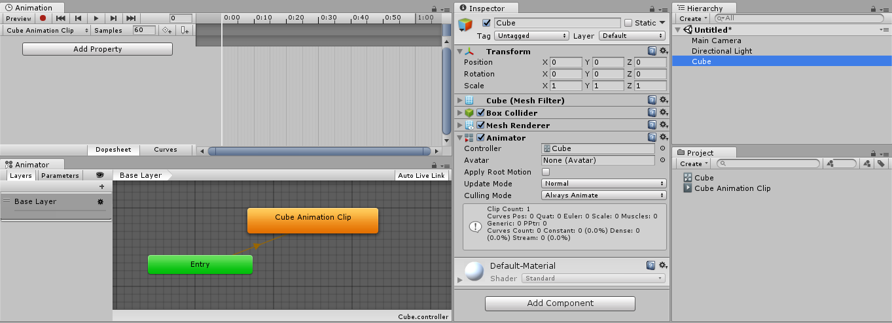

## Animation Clips
Animation Clips are one of the core elements to Unity’s animation system. Unity **supports importing animation from external sources**, and **offers the ability to create animation clips from scratch** within the editor using the **Animation window**.

### Animation from External Sources

Animation clips imported from external sources could include:

- Humanoid animations captured at a motion capture studio
- Animations created from scratch by an artist in an external 3D application (such as **Autodesk®** **3ds Max®** or **Autodesk® Maya®**)
- Animation sets from 3rd-party libraries (eg, from Unity’s asset store)
- Multiple clips cut and sliced from a single imported timeline.

#### Importing animation files

Before any animation can be used in Unity, it must first be imported into your project. Unity can import native **Autodesk® Maya® (.mb or .ma)**, **Autodesk® 3ds Max® (.max)**, and **Blender™ (.blend)**, and also generic FBX files which can be exported from most animation packages. Note that importing from .blend files requires a local installation of **Blender™**.

### Creating a new Animation Clip from scratch using Animation window

To create a new Animation Clip, select a GameObject in your Scene, and open the **Animation Window** (top menu:) **Window > Animation > Animation**.

If the GameObject does not yet have any Animation Clips assigned, the "**Create**" button appears in the centre of the **Animation Window** timeline area

When you **save this new empty Animation Clip**, Unity does the following:

- Creates a new **Animator Controller Asset**
- Adds the new clip into the **Animator Controller** as the default state
- Adds an **Animator Component** to the **GameObject** that you are applying animation to
- **Assigns the new Animator Controller** to the **Animator Component**

All the required elements of the animation system are now set up, and you can begin animating the GameObject.

#### Adding another Animation Clip

If the GameObject already has **one or more Animation Clips** assigned, the **"Create"** button is not visible. Instead, one of the existing clips is **visible in the Animation window**. To **switch between Animation Clips**, use the menu in the **top-left of the Animation window**
.

To create a new Animation Clip on a GameObject that has existing animations, select **"Create New Clip"** from this menu. Again, Unity **prompts you to save your new empty Animation Clip** before you can work on it.

> A GameObject **must** have an **Animator component**

> The **Animator component** **must** have an **Animator Controller Asset** assigned

> The **Animator Controller** asset **must have one or more Animation Clips** assigned

After you create a new Animation Clip, you can now see:

- The **Animation Window** (top left) shows a timeline with a white playback head line, ready to record new keyframes. The clip’s name is visible in the clip menu, just below the playback controls.
- The **Inspector**(center) shows that the “Cube” GameObject has an Animator Component, and the Controller field of the component shows that an Animator Controller Asset called Cube is assigned to it.
- The **Project Window**(bottom right) shows that two new Assets have been created: an Animator Controller asset called Cube and an Animation Clip Asset called Cube Animation Clip.
- The **Animator Window**(bottom left) shows the contents of the Animator Controller: there is a Cube Animation Clip on the controller, and that it is in the default state (as indicated by the orange color). Subsequent clips you add to the controller have a grey color, indicating they are not the default state (see Fig 4: New Animation Clip in the Project Window).

