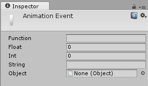

## Animation Events

Use Animation Events to call functions at specific points in the timeline. 
These functions can be in any script attached to the GameObject.

The function called by an Animation Event also has the option to take one parameter. The parameter can be a `float`, `string`, `int`, or `object` reference, or an `AnimationEvent object`. The AnimationEvent object has member variables that allow a `float`, `string`, `integer` and `object` reference to be passed into the function all at once, along with other information about the Event that triggered the function call.

To add an Animation Event to a clip at the current playhead position, click the Event button. 
To add an Animation event to any point in the Animation, double-click the Event line at the point where you want the Event to be triggered. 
Once added, you can drag the mouse to reposition the Event. To delete an Event, select it and press the **Delete** key, or right-click on it and select **Delete Event**.

When you add an Event, the Inspector
Window displays several fields. These fields allow you to specify the name of the function you want to call, and the value of the parameter you want to pass to it.

https://docs.unity3d.com/Manual/script-AnimationWindowEvent.html

