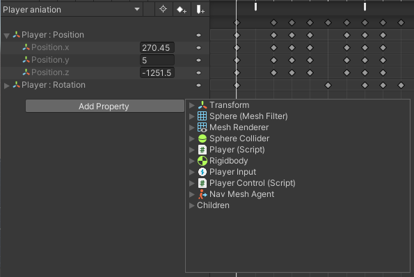
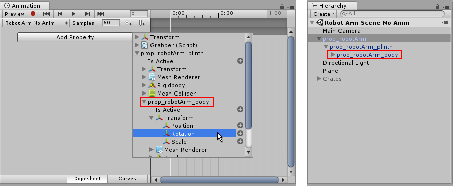
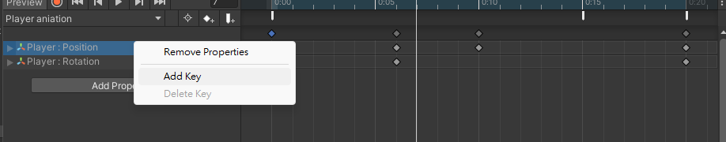
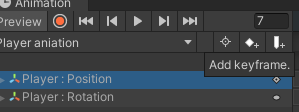

## Animation window

Select the gameobject with animator component, **Window > Animation > Animation**.

When you begin to animate various properties within this clip, the animated properties will appear here. If the animation controls **multiple child objects**, the list will also **include hierarchical sub-lists of each child object’s** animated properties. 

### The Animation Timeline
 
On the right side of the Animation View is the timeline for the current clip. The keyframes for each animated property appear in this timeline. 
The timeline view has two modes, **Dopesheet** and **Curves**. To toggle between these modes, click Dopesheet or Curves at the bottom of the animated property list area
  
- **Dopesheet mode**: \
  Dopesheet mode offers a more compact view, allowing you to view each property’s keyframe sequence in an individual horizontal track. This allows you to view a simple overview of the keyframe timing for multiple properties or GameObjects.  
  
- **Curves mode**: \
  Curves mode displays a resizable graph containing a view of how the values for each animated property changes over time. All selected properties appear overlaid within the same graph view. This mode allows you to have great control over viewing and editing the values, and how they are interpolated between.
  > Press **F** on the keyboard to zoom the view to the currently selected keyframes.

  > Press **A** on the keyboard to fit and re-scale the window to show all the keyframes in the clip, regardless of which ones are selected. 
  
  
### Time line
You can click anywhere on the Animation window time line to move the playback head to that frame, and preview or modify that frame in the Animation Clip. The numbers in the time line are shown as **seconds and frames**, so **1:30 means 1 second and 30 frames**.

> Note: The time line appears **tinted blue** when in _Preview_ mode, or **tinted red** when in _Record_ mode.

### Animating a GameObject

Once you have saved the new Animation clip Asset, you are ready to begin **adding keyframes** to the clip.

There are two distinct methods you can use to animate GameObjects in the Animation window: **Record Mode** and **Preview Mode**.

- **Record Mode**(Also referred to as **auto-key mode**): \
  In record mode, Unity **automatically creates keyframes** at the playback head **when you move, rotate, or otherwise modify any animatable property** on your animated GameObject. Press the button with the **red circle** to enable record mode. The Animation window time line is **tinted red** when in record mode.
  

- **Preview Mode**: \
  In preview mode, modifying your animated GameObject **_does not_ automatically create keyframes**. You **must manually create keyframes** each time you modify your GameObject to a desired new state (for example, moving or rotating it). Press the **Preview** button to enable preview mode. The Animation window time line is **tinted blue** when in preview mode. \
  
  > **Note**: In **record mode**, the **Preview** button is also **active**, because you are previewing the existing animation and recording new keyframes at the same time. If you move the time frame or click play button, it will enable preview mode.

#### Animated properties
You can select specific property for the gameobject to animate by click the **"Add property"** to open the menu.

#### Animating Child Game Objects
You may want to animate GameObjects that have multiple moving parts.

You can animate multiple parts with an Animation component added to the parent GameObject. In some cases, it is useful to add additional Animation components to each child.

The GameObject hierarchy is shown in the panel to the left of the **Animation View**.

You **display the children of a GameObject with the foldout triangle** next to the name of the GameObject. The properties of a child GameObject is animated the same as its parent.

Use **Add Property** to display the **list of animatable properties**. You can also list the **animatable properties for child GameObjects**.

> **Note**: You can also **select the child GameObject to animate** from the Hierarchy panel or the scene view and manipulate the object or change its properties in the inspector while in animation recording mode.

### Recording keyframes
To begin recording keyframes for the selected GameObject, click on the **Animation Record button**. This enters Animation Record Mode, where changes to the GameObject are recorded into the Animation Clip.

Once in Record mode you can create keyframes by setting the white Playback head to the desired time in the Animation time line, and then **modify your GameObject to the state** you want it to be at that point in time.

**The changes** you make to the GameObject **are recorded as keyframes at the current time** shown by the white line (the playback head) in the Animation Window.

**Any change to an animatable property** (such as its **position or rotation**) will **cause a keyframe for that property to appear in the Animation window**.

**Clicking** or **dragging** in the time line bar moves the playback head and shows the state of the animation at the playback head’s current time.

You can stop the **Record Mode** at any time by clicking the **Record button** again. When you stop Record mode, the Animation window switches to **Preview mode**, so that you can still see the GameObject in its current position according to the animation time line.

You can animate any property of the GameObject by manipulating it while in Animation Record Mode. Moving, Rotating or Scaling the GameObject adds corresponding keyframes for those properties in the animation clip. Adjusting values directly in the GameObject’s inspector also adds keyframes while in Record mode. This applies to any animatable property in the inspector, including numeric values, checkboxes, colors, and most other values.

Any properties of the GameObject that are currently animated are shown listed in the left-hand side of the Animation Window. Properties which are not animated are not shown in this window. Any new properties that you animate, including properties on child objects, are added to the property list area as soon as you start animating them.

**Transform** properties are special in that the **.x**, **.y**, and **.z** properties are linked, so curves for all three are added at the same time.

### Creating keyframes in preview mode

As well as using **Record mode** to automatically create keyframes when you modify a GameObject, you can create keyframes in **Preview mode** by modifying a property on the GameObject, then **explicitly choosing to create a keyframe for that property**.

In **preview mode**, **animated properties are tinted blue in the Inspector window**. When you see this **blue tint**, it means these values are being driven by the keyframes of the animation clip currently being previewed in the animation window.

Eg: \

A modified animated property in preview mode. This change has not yet been saved as a keyframe

> In this modified state, you **must manually create a keyframe to "save" this modification**. If you move the playback head, or switch your selection away from the animated GameObject, you will lose the modification.

### Manually creating keyframes
There are three different ways to manually create a keyframe when you have modified a GameObject in preview mode.

1. You can add a keyframe by **right-clicking the property label** of the property you have modified, which allows you to either **add a keyframe** for **just that property**, or for **all animated properties**.
   _
2. You can also **add a keyframe** by clicking the **Add Keyframe button** in the Animation window. \
   
3. You can add a keyframe (or keyframes) by using the hotkeys **K** or **Shift-K** as described below:
   - **K** - Key all animated. **Adds an keyframe for all animated properties at the current position** of the playback head in the animation window.
   - **Shift-K** - Key all modified. **Adds an keyframe for only those animated properties which have been modified at the current position** of the playback head in the animation window.

### ref
https://docs.unity3d.com/Manual/animeditor-UsingAnimationEditor.html \
https://docs.unity3d.com/Manual/animeditor-AnimatingAGameObject.html

