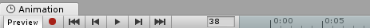

## Animation window

Select the gameobject with animator component, **Window > Animation > Animation**.

When you begin to animate various properties within this clip, the animated properties will appear here. If the animation controls **multiple child objects**, the list will also **include hierarchical sub-lists of each child object’s** animated properties. 

### The Animation Timeline
 
On the right side of the Animation View is the timeline for the current clip. The keyframes for each animated property appear in this timeline. 
The timeline view has two modes, **Dopesheet** and **Curves**. To toggle between these modes, click Dopesheet or Curves at the bottom of the animated property list area
  
- **Dopesheet mode**: \
  Dopesheet mode offers a more compact view, allowing you to view each property’s keyframe sequence in an individual horizontal track. This allows you to view a simple overview of the keyframe timing for multiple properties or GameObjects.  
  
- **Curves mode**: \
  Curves mode displays a resizable graph containing a view of how the values for each animated property changes over time. All selected properties appear overlaid within the same graph view. This mode allows you to have great control over viewing and editing the values, and how they are interpolated between.
  > Press **F** on the keyboard to zoom the view to the currently selected keyframes.

  > Press **A** on the keyboard to fit and re-scale the window to show all the keyframes in the clip, regardless of which ones are selected. 
  
  
### Time line
You can click anywhere on the Animation window time line to move the playback head to that frame, and preview or modify that frame in the Animation Clip. The numbers in the time line are shown as seconds and frames, so 1:30 means 1 second and 30 frames.

### Animating a GameObject

Once you have saved the new Animation clip Asset, you are ready to begin **adding keyframes** to the clip.

There are two distinct methods you can use to animate GameObjects in the Animation window: **Record Mode** and **Preview Mode**.

- **Record Mode**(Also referred to as **auto-key mode**): \
  In record mode, Unity **automatically creates keyframes** at the playback head **when you move, rotate, or otherwise modify any animatable property** on your animated GameObject. Press the button with the **red circle** to enable record mode. The Animation window time line is **tinted red** when in record mode.
  

- **Preview Mode**: \
  In preview mode, modifying your animated GameObject **_does not_ automatically create keyframes**. You **must manually create keyframes** each time you modify your GameObject to a desired new state (for example, moving or rotating it). Press the **Preview** button to enable preview mode. The Animation window time line is **tinted blue** when in preview mode. \
  

_Note: In record mode, the **Preview** button is also active, because you are previewing the existing animation and recording new keyframes at the same time._

### Manually creating keyframes
There are three different ways to manually create a keyframe when you have modified a GameObject in preview mode.

1. You can add a keyframe by **right-clicking the property label** of the property you have modified, which allows you to either **add a keyframe** for **just that property**, or for **all animated properties**.
   _
2. You can also **add a keyframe** by clicking the **Add Keyframe button** in the Animation window. \
   
3. You can add a keyframe (or keyframes) by using the hotkeys **K** or **Shift-K** as described below:
   - **K** - Key all animated. **Adds an keyframe for all animated properties at the current position** of the playback head in the animation window.
   - **Shift-K** - Key all modified. **Adds an keyframe for only those animated properties which have been modified at the current position** of the playback head in the animation window.

### ref
https://docs.unity3d.com/Manual/animeditor-UsingAnimationEditor.html \
https://docs.unity3d.com/Manual/animeditor-AnimatingAGameObject.html

