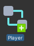
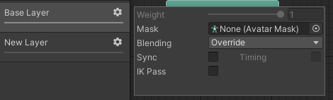
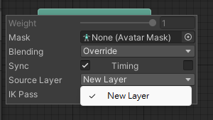

## Animator controller
An Animator Controller allows you to arrange and maintain a set of Animation Clips and associated Animation Transitions for a character or object.

When you have animation clips ready to use, you need to use an Animator Controller to bring them together. An **Animator Controller asset** is created within Unity and allows you to maintain a set of animations for a character or object.

 
The various ways an **Animator Controller** can be created:

- From the Project View by selecting `Create > Animator Controller`.

- By right-clicking in the Project View and selecting `Create > Animator Controller`.

- From the Assets menu by selecting `Assets > Create > Animator Controller`.

This creates a `.controller` asset on disk. In the Project Browser window the icon will look like:

> Animator Controller assets are created from the Assets menu, or from the Create menu in the Project window.

The controller manages the various **animation states** and the transitions between them using a so-called **State Machine**
, which could be thought of as a kind of flow-chart, or a simple program written in a visual programming language within Unity.

> To focus on an item in the Animator Controller window, select one or multiple states (click or drag a selection box around the states you wish to select), then press the F key to zoom in on the selection.

> Press the A key to fit all of the animation states into the Animator Controller view.

https://www.youtube.com/watch?v=S3ys0jCUE9s

### Animator Controller Asset
When you have animation clips ready to use, you need to use an Animator Controller
 to bring them together. An **Animator Controller asset** is **created within Unit**y and allows you to **maintain a set of animations** for a character or object.

Animator Controller assets are created from the Assets menu, or from the Create menu in the Project window.

The controller manages the **various animation states and the transitions between them using a so-called State Machine**. 

### Animator window

The **Animator Window** allows you to create, view and modify Animator Controller assets. 

**Animator window**: \

The **Animator Controller window** contains:

- The Animation Layer Widget (top-left corner, see Animation Layers)
- The Event Parameters Widget (top-left, see Animation Parameters)
- The visualization of the State Machine itself.

The **left-hand pane** can be switched betwen **Parameters view** and **Layers view**. The parameters view **allows you to create, view and edit the Animator Controller Parameters**. These are variables you define that act as inputs into the state machine. To add a parameter, click the Plus icon and select the parameter type from the pop up menu. To delete a parameter, select the parameter in the lists and press the delete key (on macOS use fn-Delete to delete the selected parameter).

When the **left-hand pane is switched to Layers view**, you can create, view and edit layers
 within your Animator Controller. \
This allows you to **have multiple layers of animation within a single animation controller working at the same time**, each **controlled by a separate state machine**. A common use of this is to have a **separate layer** **playing upper-body animations over a base layer** that controls the general movement animations for a character.

To **add a layer**, click the **plus icon**. To **delete a layer**, select the layer and right click to select delete.

Clicking the **"eye" icon** on or **off** will **show or hide the Parameters & Layers side-pane**, allowing you more room to see and edit your state machine.

The **lock icon**
enabling the lock icon will keep the Animator Window focused on the current state machine. When the lock icon is off, clicking a new animator asset or a Game Object with an animator component will switch the Animator Window to show that item’s state machine. Locking the window allows you to keep the Animator window showing the same state machine, regardless of which other assets or Game Objects are selected.

#### Animation Parameters
Animation Parameters are variables that are defined within an Animator Controller
 that can be **accessed and assigned values from scripts**. This is how a script can **control or affect the flow of the state machine**.

-   _Integer_ - a whole number
-   _Float_ - a number with a fractional part
-   _Bool_ - true or false value (represented by a checkbox)
-   _Trigger_ - a boolean parameter that is reset by the controller when consumed by a transition (represented by a circle button)

https://docs.unity3d.com/Manual/AnimationParameters.html

#### Animation Layers

Unity uses **Animation Layers** for **managing complex state machines** for **different body parts**. An example of this is if you have a lower-body layer for walking-jumping, and an upper-body layer for throwing objects / shooting.

You can manage animation layers from the Layers Widget in the top-left corner of the Animator Controller.

Clicking the gear wheel on the right of the window shows you the settings for this layer.

On each layer, you can specify the **mask** and the **Blending type**. The **mask specifies the body parts** on which to **apply the animation**. 

The **Blending type** specifies how the animation is **applied**.

-   Select **Override** to use the animation on this layer, **replacing the animation** on **previous layers**.
-   Select **Additive** to add the animation on this layer **on top of the animation** from **previous layers**.  
    > For additive blending to be successful, the animation on the additive layer **must contain the same properties** as the previous layers.

Add a new layer by pressing the **+** above the widget.

The **Mask property** is there to **specify the mask used on this layer**. \
The **mask specifies the body parts** on which to **apply the animation**. \
For example if you wanted to play a throwing animation on just the upper body of your model, while having your character also able to walk, run or stand still at the same time, you would use a mask on the layer which plays the throwing animation where the upper body sections are defined

**Animation Layer syncing**:

Sometimes it is useful to be able to **re-use the same state machine in different layers**. \
For example if you want to simulate "wounded" behavior, and have "wounded" animations for walk / run / jump instead of the "healthy" ones. You can click the Sync checkbox on one of your layers, and then select the layer you want to sync with. The state machine structure will then be the same, but the actual animation clips used by the states will be distinct.

This means the **Synced layer** **does not have its own state machine** definition at all - instead, it is an **instance of the source of the synced layer**. \
Any changes you make to the layout or structure of the state machine in the synced layer view (eg, adding/deleting states or transitions) is **done to the source of the synced layer**. The **only changes that are unique to the synced layer are the selected animations used within each state**.

The **Timing checkbox** allows the **animator to adjust how long each animation in synced layers takes**, determined by the weight. \
If Timing is **unselected** then **animations on the synced layer will be adjusted**. The adjustment will be **stretched to the length of the animation on the original layer**. If the **option is selected** the **animation length will be a balance for both animations**, **based on weight**. In both cases (chosen and not chosen) the **animator adjusts the length of the animations**. If not chosen then the original layer is the sole master. If chosen, it is then a compromise.

https://docs.unity3d.com/Manual/AnimationLayers.html

###  Animator Override Controller
It is a type of asset which allows you to extend an existing Animator Controller, replacing the specific animation clips but otherwise retaining the original’s structure, parameters and logic. The difference is the animation clips. 

This allows you to create multiple variants of the same basic state machine, but with each using different sets of animations.

> Reuse the original animation controller from other game object(with same logic, structure and parameters), just override the specific orignal animation clips

To create a new Animator Override Controller, use the **Assets > Create** menu, or the **Create** button in the Project view, and select **Animator Override Controller**.

In the controller field in the **Animator Override Controller** component, dragging an existing controller into the Animator Override Controller’s inspector.

Parameters can be assigned values **from a script** using functions in the `Animator` class: `SetFloat`, `SetInteger`, `SetBool`, `SetTrigger` and `ResetTrigger`.

### ref 
https://docs.unity3d.com/Manual/AnimatorControllers.html \
https://docs.unity3d.com/Manual/class-AnimatorController.html \
https://docs.unity3d.com/Manual/AnimatorControllerCreation.html

