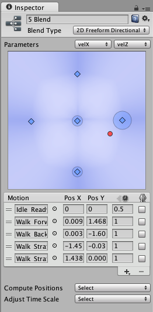

## Blend trees
A common task in game animation is to blend between two or more similar motions. Perhaps the best known example is the blending of walking and running animations according to the character’s speed. Another example is a character leaning to the left or right as it turns during a run.

Blend Trees are used for **allowing multiple animations to be blended smoothly** by incorporating parts of them all to varying degrees. The amount that each of the motions contributes to the final effect is controlled using a blending parameter, which is just one of the numeric animation parameters associated with the Animator Controller. In order for the blended motion to make sense, the motions that are blended **must be of similar nature and timing**. Blend Trees are a **special type of state** in an Animation State Machine.

### Using Blend Trees
To start working with a new Blend Tree, you need to:

1. Right-click on empty space on the Animator Controller Window.
2. Select **Create State > From New Blend Tree** from the context menu that appears.
3. Double-click on the Blend Tree to enter the Blend Tree Graph.

To add animation clips to the blend tree you can select the blend tree, then click the plus icon in the motion field in the inspector.

A Blend Node shown in the inspector before any motions have been added. The plus icon is used to add animation clips or child blend trees.
Alternatively, you can add animation clips or child blend nodes by right-clicking on the blend tree and selecting from the context menu:
The context menu when right-clicking on a blend tree node.

To add animation clips or child blend nodes by right-clicking on the blend tree and selecting from the context menu: 

Alternatively, you can add animation clips to the blend tree you can select the blend tree, then click the **"+"** icon in the motion field in the inspector.

**Nested blend tree:**

You can add a new blend tree inside other blend tree to build a nested blend tree.

> The first option in the Inspector of a Blend Node is the Blend Type. This drop-down is used to select one of the different blend types that can blend according to one or two parameters.

### Blend types

#### 1D blend tree
1D Blending **blends the child motions** according to a **single parameter**.

> After setting the Blend Type, the first thing you need is to select the **Animation Parameter** that will **control this Blend Tree**.

you can add individual animations by clicking the small **"+"** button and selecting **Add Motion Field** from the popup menu.

The **red vertical bar** indicates **the value of the Parameter**. If you **press Play** in the Preview at the bottom of the Inspector and drag the red bar in the diagram left and right, you can see **how the value of the parameter is controlling the blending of the different motions**.

**Parameter Range** \
The range of the parameter used by the Blend Tree is shown below the diagram as two numbers to the left and right. Either one of them can be changed by clicking on the number and dragging left or right with the mouse. Note that the values correspond to the threshold of the first and last motion in the motion list.

**Thresholds** 

You can change the threshold value of a motion by clicking on its corresponding blue pyramid in the diagram and dragging it left or right. If the “Automate Thresholds” toggle is not enabled, you can also edit the threshold value of a motion in the motion list by typing in a number in the number field in the Threshold column.

Below the motion list is the checkbox Automate Thresholds. Enabling it will distribute the thresholds of the motions evenly across the parameter range. For example, if there are five clips and the parameter ranges from –90 to +90, the thresholds will be set to –90, –45, 0, +45 and +90 in order.

https://docs.unity3d.com/Manual/BlendTree-1DBlending.html

https://www.youtube.com/watch?v=m8rGyoStfgQ

https://youtu.be/HeHvlEYpRbM

#### 2D blend tree
The 2D blending types **blends the child motions** according to **two parameters**.

**2D Blend Types:**
- **2D Simple Directional**: \
  Best used when your **motions represent different directions**, such as “walk forward”, “walk backward”, “walk left”, and “walk right”, or “aim up”, “aim down”, “aim left”, and “aim right”. Optionally a single motion at position (0, 0) can be included, such as “idle” or “aim straight”. In the Simple Directional type there **should not be multiple motions in the same direction**, such as “walk forward” and “run forward”. (Less than 180 degree). Used in single motion for any direction, that means only one motion for a direction.
- **2D Freeform Directional**: \
  This blend type is also used when your **motions represent different directions**, however **you can have multiple motions in the same direction**, for example “walk forward” and “run forward”. In the Freeform Directional type the set of motions should always include a single motion at position (0, 0), such as “idle”.
- **2D Freeform Cartesian**: \
  **Best used when your motions do not represent different directions**. With Freeform Cartesian your **X parameter** and **Y parameter** can represent **different concepts**, such as **angle**, **angular speed** and **linear speed**. An example would be motions such as “walk forward no turn”, “run forward no turn”, “walk forward turn right”, “run forward turn right” etc.

The **red dot** indicates the values of the two Parameters.

In the diagram you can also see the influence of each motion represented as circles around each motion. You will see that if you move the red dot on top of one of the blue dots representing a motion, the circle for that motion gains its maximum radius and the circles for all other motions shrink down to nothing.

If you select one of the motions in order to see the blue influence field of that motion, you can see that as you move the red dot around, the circle size of the motion corresponds exactly with how strong the influence field is at various positions.

When no motion is selected, the diagram shows a mix of all the influence fields that is more blue where a single motion dominates and less blue where many motions contribute to the blend.

You can add individual animations by clicking **+** -> **Add Motion Field** to add an **Animation Clip** to the blend tree.

> After setting the Blend Type, the first thing you need is to select the **two Animation Parameters**
 that will **control this Blend Tree**.

The positions in 2D blending are like the thresholds in 1D blending, except that there are **two values instead of one**, **corresponding to each of the two parameters**.

> Their positions along the **horizontal X axis correspond to the first parameter**, and their **positions along the vertical Y axis correspond to the second parameter**.

Eg: \
A walking forward animation might have a velocityX of 0 and a velocityZ of 1.5, so those values should be typed into the Pos X and Pos Y number fields for the motion.

You can change the positions of a motion by clicking on its corresponding blue dot in the diagram and dragging it around. You can also edit position coordinates of a motion in the motion list by typing in numbers in the number fields in the Pos X and Pos Y columns.

The **Compute Positions** drop-down will set the positions from data of your choice obtained from the  root motions in the Animation Clips. The data that is available to choose from is speed, velocity x, y, or z, and angular speed in degrees or radians. If one or both of your parameters correspond to one of these properties, you can compute the Pos X and/or Pos Y using the Compute Positions drop-down.

https://docs.unity3d.com/Manual/BlendTree-2DBlending.html

https://youtu.be/_J8RPIaO2Lc

#### Direct blend tree
This type of blend tree lets user **control the weight of each node directly**. Useful for **facial shapes** or **random idle blending**. 

Using a Direct Blend Tree allows you to **map animator parameters directly to the weight of a BlendTree child**. This can be useful if you want to **have exact control over the various animations that are being blended rather than blend them indirectly** using **one or two parameters**.

When setting up a direct blend tree, the inspector allows you to add motions to the motion list. Each motion should then be assigned a corresponding parameter to directly control its blend weight in the tree. 

This allow you to blend multiple animations based on multiple parameters, each parameter corresponds to control blend weight for its motion. 

https://docs.unity3d.com/Manual/BlendTree-DirectBlending.html

https://youtu.be/ihmPDjiF-zg

### Additional Blend Tree Options
The options below are **common to both 1D and 2D blending**.

#### Time Scale
You can alter the “natural” speed of animation clips with the animation speed number fields (the columns with a clock icon). For example, you can double the speed of a walk clip by specifying a value of 2.0. The Adjust Time Scale > Homogeneous Speed button rescales the speed of the clips so that they correspond with the chosen minimum and maximum values of the parameter but keep the same relative speed they initially had.

> Note that the Adjust Time Scale drop-down is **only available if all the motions are Animation Clips and not child Blend Trees**.

#### Mirroring
**Enable the Mirror checkbox** to **mirror any humanoid Animation** Clip in the motions list. Mirroring uses the same animation as its unmirrored original without doubling the memory and space.

However, **mirroring an animation in a blend tree does not create a fully symmetrical animation**. Unity automatically adds offsets to ensure that run cycles, walk cycles, and animations such as footsteps are blended correctly with other animation clips and blend trees. For example, if your blend tree has a humanoid running left, and you enable Mirror to switch the humanoid to run right, the foot cycles need to match so that the left foot touches the ground at the same time. This ensures that the mirrored Blend tree correctly blends with surrounding clips and other blend trees that have not been mirrored.

https://docs.unity3d.com/Manual/BlendTree-AdditionalOptions.html

### ref 
https://tw.voicetube.com/videos/24234 \
https://zhuanlan.zhihu.com/p/148260708

