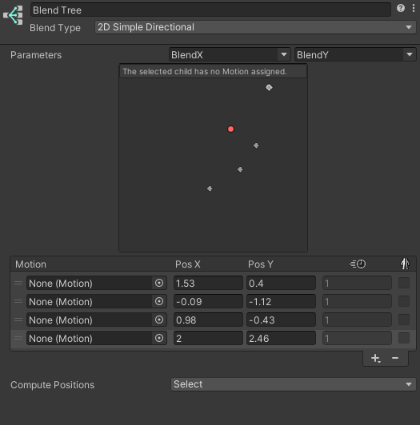

## Blend trees
A common task in game animation is to blend between two or more similar motions. Perhaps the best known example is the blending of walking and running animations according to the character’s speed. Another example is a character leaning to the left or right as it turns during a run.

Blend Trees are used for **allowing multiple animations to be blended smoothly** by incorporating parts of them all to varying degrees. The amount that each of the motions contributes to the final effect is controlled using a blending parameter, which is just one of the numeric animation parameters associated with the Animator Controller. In order for the blended motion to make sense, the motions that are blended **must be of similar nature and timing**. Blend Trees are a **special type of state** in an Animation State Machine.

### Using Blend Trees
To start working with a new Blend Tree, you need to:

1. Right-click on empty space on the Animator Controller Window.
2. Select **Create State > From New Blend Tree** from the context menu that appears.
3. Double-click on the Blend Tree to enter the Blend Tree Graph.

To add animation clips to the blend tree you can select the blend tree, then click the plus icon in the motion field in the inspector.

A Blend Node shown in the inspector before any motions have been added. The plus icon is used to add animation clips or child blend trees.
Alternatively, you can add animation clips or child blend nodes by right-clicking on the blend tree and selecting from the context menu:
The context menu when right-clicking on a blend tree node.

To add animation clips or child blend nodes by right-clicking on the blend tree and selecting from the context menu: 

Alternatively, you can add animation clips to the blend tree you can select the blend tree, then click the **"+"** icon in the motion field in the inspector.

**Nested blend tree:**

You can add a new blend tree inside other blend tree to build a nested blend tree.

> The first option in the Inspector of a Blend Node is the Blend Type. This drop-down is used to select one of the different blend types that can blend according to one or two parameters.

### Blend types

#### 1D blend tree
1D Blending **blends the child motions** according to a **single parameter**.

> After setting the Blend Type, the first thing you need is to select the **Animation Parameter** that will **control this Blend Tree**.

you can add individual animations by clicking the small **"+"** button and selecting **Add Motion Field** from the popup menu.

https://docs.unity3d.com/Manual/BlendTree-1DBlending.html

https://www.youtube.com/watch?v=m8rGyoStfgQ

https://youtu.be/HeHvlEYpRbM

#### 2D blend tree
The 2D blending types **blends the child motions** according to **two parameters**.

**2D Blend Types:**
- **2D Simple Directional**: \
  Best used when your **motions represent different directions**, such as “walk forward”, “walk backward”, “walk left”, and “walk right”, or “aim up”, “aim down”, “aim left”, and “aim right”. Optionally a single motion at position (0, 0) can be included, such as “idle” or “aim straight”. In the Simple Directional type there **should not be multiple motions in the same direction**, such as “walk forward” and “run forward”. (Less than 180 degree). Used in single motion for any direction, that means only one motion for a direction.
- **2D Freeform Directional**: \
  This blend type is also used when your **motions represent different directions**, however **you can have multiple motions in the same direction**, for example “walk forward” and “run forward”. In the Freeform Directional type the set of motions should always include a single motion at position (0, 0), such as “idle”.
- **2D Freeform Cartesian**: \
  **Best used when your motions do not represent different directions**. With Freeform Cartesian your **X parameter** and **Y parameter** can represent **different concepts**, such as **angle**, **angular speed** and **linear speed**. An example would be motions such as “walk forward no turn”, “run forward no turn”, “walk forward turn right”, “run forward turn right” etc.

You can add individual animations by clicking **+** -> **Add Motion Field** to add an **Animation Clip** to the blend tree.

> After setting the Blend Type, the first thing you need is to select the **two Animation Parameters**
 that will **control this Blend Tree**.

The positions in 2D blending are like the thresholds in 1D blending, except that there are **two values instead of one**, **corresponding to each of the two parameters**.

> Their positions along the **horizontal X axis correspond to the first parameter**, and their **positions along the vertical Y axis correspond to the second parameter**.

Eg:
A walking forward animation might have a velocityX of 0 and a velocityZ of 1.5, so those values should be typed into the Pos X and Pos Y number fields for the motion.

https://docs.unity3d.com/Manual/BlendTree-2DBlending.html

https://youtu.be/_J8RPIaO2Lc

#### Direct blend tree
This type of blend tree lets user **control the weight of each node directly**. Useful for **facial shapes** or **random idle blending**. \
Using a Direct Blend Tree allows you to **map animator parameters directly to the weight of a BlendTree child**. This can be useful if you want to **have exact control over the various animations that are being blended rather than blend them indirectly** using one or two parameters.

https://docs.unity3d.com/Manual/BlendTree-DirectBlending.html

https://youtu.be/ihmPDjiF-zg

### ref 
https://tw.voicetube.com/videos/24234 \
https://zhuanlan.zhihu.com/p/148260708

