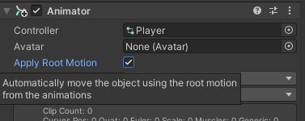
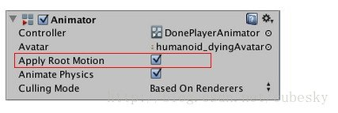
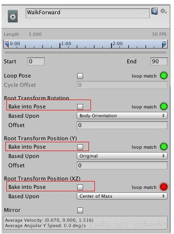

## Root motion
Motion of character’s root node, whether it’s controlled by the animation itself or externally.

Automatically **move the object using the root motion** from the animations instead of animating the  object in-place with moving animation. In root motion, Unity **calculate the motion** and **move the object according to the animation**. 

### Root node
A transform in an animation hierarchy that allows Unity to establish consistency between Animation clips for a generic model. It also enables Unity to properly blend between Animations that have not been authored “in place” (that is, where the whole Model moves its world position while animating). 

### Explain root motion
Animations set things to a specific value. For example, if a movement animation might start the position.x at 0 and move it to 1 over the course of the animation, but then when the animation loops it will set it to 0 again and teleport back to the start.

**Root motion changes any movement that would normally be applied to the root object to be additive instead**. \
So if your `position.x` is at 4 and you play that animation it will add the motion so it moves towards 5 and not jump back to the starting value when it loops.

In Unity, it is possible to move our game objects using **root motion** without writing any script. Unity **calculate the motion** and **move the object according to the animation**.

https://forum.unity.com/threads/confused-about-apply-root-motion-in-the-animator-component.940223/

https://youtu.be/Xl_5roq4UlI

https://youtu.be/Kn6jxLWA31M

https://www.youtube.com/watch?v=9bV0K-pifXE

### What's root motion and how it works?
**Treadmill vs root motion**: There are two types of animation, **treadmill** and **root motion**. 
- **Treadmill** means that the animation stays at the origin and we use code to move that asset around.
- **Root motion** means the motion is built right into the animation and it's the animation that determines how far something moves rather than code.

https://answers.unity.com/questions/1238987/whats-root-motion-and-how-it-works.html

https://docs.unrealengine.com/4.27/en-US/AnimatingObjects/SkeletalMeshAnimation/RootMotion/

在很多動畫當中，模型的位置、角度往往會發生變化，我們需要決定是否將模型再動畫中發生的這些變換應用到實際模型。Unity中有兩個跟這個有關的設置。

https://read01.com/8PyaeG.html#.Y9dX3XbMJD8

### Root motion with character controller 

https://youtu.be/mNxEetKzc04

### Control the root motion
The **Animation Clip Editor** settings - **Root Transform Rotation**, **Root Transform Position (Y)** and **Root Transform Position (XZ)** - let you control the Root Transform projection from the Body Transform. Depending on these settings some parts of the Body Transform may be transferred to Root Transform. For example you can decide if you want the motion Y position to be part of the Root Motion (trajectory) or part of the pose (body transform), which is known as Baked into Pose.

### Body Transform
The Body Transform is the mass center of the character. It is used in Mecanim’s retargeting engine and provides the most stable displacement model. The Body Orientation is an average of the lower and upper body orientation relative to the Avatar T-Pose.
Body Transform不影響模型實際的位置和角度，所以這裡只是純粹的動畫效果，模型的位置和角度參數值不變

https://read01.com/8PyaeG.html

### Root Transform
The Root Transform is a projection on the Y plane of the Body Transform and is computed at runtime. At every frame, a change in the Root Transform is computed. This change in transform is then applied to the Game Object to make it move.

> root transform是指body transform在在Y平面上的投影（即Y=0的平面，可以理解为模型所站立的“地面”。且这个投影是在运行时执行计算。在每一帧，root transform的每一个变化都会被计算。然后这些变化将会作用到game object上，使得它发生运动

也就是说，root motion就是指：在动画中物体产生的位移，可以在运行时，让绑定了Animator组件的game object，也发生实际的位移。且这个位移，是根据播放动画中每一帧物体的位移，在 X 和 Z 轴上投影计算而得。

对于某些技能动画，整个动画是有一定位移的，但是动画的位移是动作设计师在设计时根据动作需要调出来的，位移是跟动作的幅度直接相关和匹配的。那么在释放技能的时候就只需要直接播放动画，只要应用这个 Root Motion 的特性，就可以很好的完成角色在播放动作的同时进行移动，动作播放完毕之后就在动画结束帧角色所在的位置。而不要额外地做计算工作。

http://www.xionggf.com/post/unity3d/generic_animation_root_motion/

Root Transform將影響模型的實際位置和角度（前提是要設置「Apply Root Motion」，如果不設置Apply Root Motion的話，也就是說變換將不應用，場景中的模型位置或角度是不會有變化的（參數值自然也不變），就像一個行走動畫，可能一直在原地行走）。

https://read01.com/8PyaeG.html

### Root Transform Rotation
- **Bake into Pose**: The orientation will stay on the body transform (or Pose). The Root Orientation will be constant and delta Orientation will be identity. This means that the Game Object will not be rotated at all by that AnimationClip.

Only AnimationClips that have similar start and stop Root Orientation should use this option. You will have a Green Light in the UI
telling you that an AnimationClip is a good candidate. A suitable candidate would be a straight walk or a run.

- **Based Upon**: This lets you set the orientation of the clip. Using Body Orientation, the clip will be oriented to follow the forward vector of body. This default setting works well for most Motion Capture (Mocap) data like walks, runs, and jumps, but it will fail with motion like strafing where the motion is perpendicular to the body’s forward vector. In those cases you can manually adjust the orientation using the Offset setting. Finally you have Original that will automatically add the authored offset found in the imported clip. It is usually used with Keyframed data to respect orientation that was set by the artist.

- **Offset**: used to enter the offset when that option is chosen for Based Upon.

### Root Transform Position (Y)
- **Bake Into Pose**: The Y component of the motion will stay on the Body Transform (Pose). The Y component of the Root Transform will be constant and Delta Root Position Y will be 0. This means that this clip won’t change the Game Object Height. Again you have a Green Light telling you that a clip is a good candidate for baking Y motion into pose.

Most of the AnimationClips will enable this setting. Only clips that will change the GameObject
 height should have this turned off, like jump up or down.

> **Note**: the Animator.gravityWeight is driven by Bake Into Pose position Y. When enabled, gravityWeight = 1, when disabled = 0. gravityWeight is blended for clips when transitioning between states.

- **Based Upon**: In a similar way to Root Transform Rotation you can choose from Original or Mass Center (Body). There is also a Feet option that is very convenient for AnimationClips that change height (Bake Into Pose disabled). When using Feet the Root Transform Position Y will match the lowest foot Y for all frames. Thus the blending point always remains around the feet which prevents floating problem when blending or transitioning.

- **Offset**: In a similar way to Root Transform Rotation, you can manually adjust the AnimationClip height using the Offset setting.

### Root Transform Position (XZ)

**Bake Into Pose** will usually be used for “Idles” where you want to force the delta Position (XZ) to be 0. It will stop the accumulation of small deltas drifting after many evaluations. It can also be used for a Keyframed clip with Based Upon Original to force an authored position that was set by the artist.

### Loop Pose
Loop Pose (like Pose Blending in Blend Trees or Transitions) happens in the referential of Root Transform. Once the Root Transform is computed, the Pose becomes relative to it. The relative Pose difference between Start and Stop frame is computed and distributed over the range of the clip from 0–100%

### Stiuation

1. 勾選」Bake into Pose",不勾選「Apply Root Motion",勾選」Bake into Pose"後，變換屬於Body Transform，所以即使這裡未勾選」Apply Root Motion「，但是動畫依然會在場景中體現，人物會按照動畫的路逕行走（但是如果我們觀察Inspector中模型的position參數，值一直不變）。但是因為沒有勾選Apply Root Motion，所以動畫結束後，變換不會應用到模型，所以如果這時候，如果開始一個新的動畫的話，模型會瞬間回到起始位置（新的動畫開始時候，模型處於行走動畫開始時的位置）。
2. 勾選」Bake into Pose",並勾選「Apply Root Motion"，這裡跟上面的情況唯一不同的就是，動畫結束後，開始新的動畫之前，變換會應用到模型。（模型的position在新的動畫開始之前會發生變化，新的動畫開始時候，模型處於動畫結束時的位置）
3. 不勾選」Bake into Pose",勾選「Apply Root Motion"，這時候，變換是作為Root Transform，所以因為這裡勾選了Apply Root Motion，變換會應用到模型（模型的position跟著動畫不停的變化），自然，新的動畫開始時候，模型處於動畫結束時的位置。
4. 勾選」Bake into Pose",但不勾選「Apply Root Motion"，這裡變化還是作為Root Transform，但是因為沒有勾選Apply Root Motion，所以變換將不被應用，所以模型將一直在本地不動，自然，新的動畫開始時候，模型處於行走動畫開始時的位置

https://read01.com/8PyaeG.html

### Ref
https://docs.unity3d.com/Manual/RootMotion.html \
http://www.xionggf.com/post/unity3d/generic_animation_root_motion/

