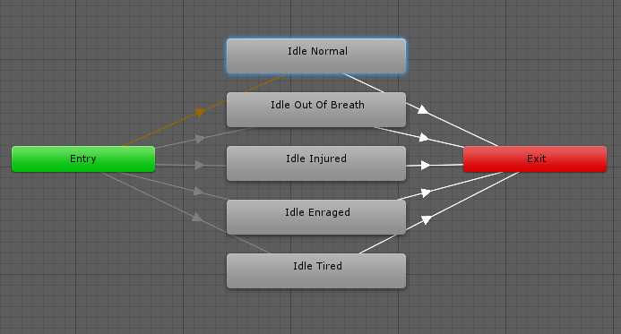

## Animation State Machines

Unity’s Animation State Machines provide **a way to overview all of the animation clips** related to a particular character and **allow various events** in the game (for example user input) to **trigger** different animations.

State Machines consist of **States, Transitions and Events** and **smaller Sub-State Machines** can be used as components in larger machines.

> The **Exit** node is used to indicate that a state machine **should exit**.

> The **Any State** is a special state which is always present. It exists for the situation where you want to go to a specific state regardless of which state you are currently in. This is a shorthand way of adding the same outward transition to all states in your machine. Note that the special meaning of **Any State** implies that it cannot be the end point of a transition (ie, jumping to "any state" cannot be used as a way to pick a random state to enter next).

https://docs.unity3d.com/Manual/StateMachineBasics.html

### Animation States
Animation States are the basic building blocks of an Animation State Machine
. Each state contains an animation sequence (or blend tree) that plays when the character is in that state. Select the state in the Animator Controller
, to view the properties for the state in the Inspector
 window.

 

 

 
| Property: | Description: |
| --- | --- |
| Motion | The animation clip or blend tree assigned to this state. |
| Speed | The default speed of the motion for this state. Enable Parameter to modify the speed with a custom value from a script. For example, you can multiply the speed with a custom value to decelerate or accelerate the play speed. |
| Motion Time | The time used to play the motion for this state. Enable Parameter to control the motion time with a custom value from a script. |
| Mirror | This property only applies to states with humanoid animation. Enable to mirror the animation for this state. Enable Parameter to enable or disable mirroring from a script. |
| Cycle Offset | The offset added to the state time of the motion. This offset does not affect the Motion Time. Enable Parameter to specify the Cycle Offset from a script. |
| Foot IK | This property only applies to states with humanoid animation. Enable to respect Foot IK for this state. |
| Write Defaults | Whether the AnimatorStates writes the default values for properties that are not animated by its motion. |
| Transitions | The list of transitions originating from this state. |

The default state, displayed in brown, is the state that the machine will be in when it is first activated. You can change the default state, if necessary, by right-clicking on another state and selecting Set As Default from the context menu. The **`solo`** and **`mute` checkboxes** on each transition are used to **control the behaviour of animation previews**.

#### Creating new State / Sub-State Machine

A **new state**/ **new Sub-State Machine** can be added by **right-clicking on an empty space** in the **Animator Controller Window** and selecting **Create State->Empty**/**Create Sub-State Machine** from the context menu.

**Alternatively, you can drag an animation into the Animator Controller Window to create a state** containing that animation.

https://docs.unity3d.com/Manual/class-State.html

### Sub-State Machines
It is common for a character to have complex actions that consist of a number of stages. Rather than handle the entire action with a single state, it makes sense to identify the separate stages and use a separate state for each. For example, a character may have an action called “Trickshot” where it crouches to take a steady aim, shoots and then stands up again.

>  A sub-state machine is represented in the editor by an **elongated hexagon** to distinguish it from normal states.

When you **double-click the hexagon**, the editor is cleared to let you **edit the sub-state machine** as though it were a completely separate state machine in its own right. The bar at the top of the window shows a “breadcrumb trail” to show which sub-state machine is currently being edited (and note that you can create sub-state machines within other sub-state machines, and so on). Clicking an item in the trail will focus the editor on that particular sub-state machine.

> You will notice an extra state in the sub-state machine whose name begins with **"Up"**.

The _Up_ state represents the “outside world”, the state machine that encloses the sub-state machine in the view. If you add a transition from a state in sub-state machine to the _Up_ state, you will be prompted to choose one of the states of the enclosing machine to connect to.

https://docs.unity3d.com/Manual/NestedStateMachines.html

### Animation transitions

State Machine Transitions exist to help you **simplify large or complex State Machines**. They allow you to have a higher level of abstraction over the state machine logic.

**Animation transitions** allow the **state machine to switch or blend from one animation state to another**. Transitions define not only how long the blend between states should take, but also under what conditions they should activate. You can set up a transition to occur only when certain conditions are true. To set up these conditions, specify values of parameters in the Animator Controller.

> Each view in the animator window has an **Entry** and **Exit** node. These are used during State Machine Transitions.

**Exit** node is used to indicate that a state machine should exit.

The **Entry** node is used when transitioning into a state machine. The entry node will be evaluated and will branch to the destination state according to the conditions set. In this way the entry node can control which state the state machine begins in, by evaluating the state of your parameters when the state machine begins.

> You canalso add **additional transitions from the Entry node to other states**, to control whether the state machine should begin in a different state.

Each **sub-state** within a state machine is **considered a separate and complete state machine**, so by using these **entry** and **exit** nodes, you can **control the flow from a top-level state machine into its sub-state machines more elegantly**.

> It is possible to **mix state machine transitions with regular state transitions**, so it is possible to **transition from state to state**, **from a state to a statemachine**, and **from one statemachine directly to another statemachine**.

#### Transition properties
To view properties for a transition, click on the transition line connecting two states in the Animator window. The properties appear in the Inspector window.

| Property | Function |
| --- | --- |
| Has Exit Time | Exit Time is a special transition that doesn’t rely on a parameter. Instead, it relies on the normalized time of the state. Check to make the transition happen at the specific time specified in Exit Time. |
| Settings | Fold-out menu containing detailed transition settings as below. |
| Exit Time | If Has Exit Time is checked, this value represents the exact time at which the transition can take effect. This is represented in normalized time (for example, an exit time of 0.75 means that on the first frame where 75% of the animation has played, the Exit Time condition is true). On the next frame, the condition is false.For looped animations, transitions with exit times smaller than 1 are evaluated every loop, so you can use this to time your transition with the proper timing in the animation every loop.Transitions with an Exit Time greater than 1 are evaluated only once, so they can be used to exit at a specific time after a fixed number of loops. For example, a transition with an exit time of 3.5 are evaluated once, after three and a half loops. |
| Fixed Duration | If the Fixed Duration box is checked, the transition time is interpreted in seconds. If the Fixed Duration box is not checked, the transition time is interpreted as a fraction of the normalized time of the source state. |
| Transition Duration | The duration of the transition, in normalized time or seconds depending on the Fixed Duration mode, relative to the current state’s duration. This is visualized in the transition graph as the portion between the two blue markers. |
| Transition Offset | The offset of the time to begin playing in the destination state which is transitioned to. For example, a value of 0.5 means the target state begins playing at 50% of the way through its own timeline. |
| Interruption Source | Use this to control the circumstances under which this transition may be interrupted (see Transition interruption below). |
| Ordered Interruption | Determines whether the current transition can be interrupted by other transitions independently of their order (see Transition interruption below). |
| Conditions | A transition can have a single condition, multiple conditions, or no conditions at all. If your transition has no conditions, the Unity Editor only considers the Exit Time, and the transition occurs when the exit time is reached. If your transition has one or more conditions, the conditions must all be met before the transition is triggered.A condition consists of:- An event parameter (the value considered in the condition).- A conditional predicate (if needed,for example, ‘less than’ or ‘greater than’ for floats).- A parameter value (if needed).If you have Has Exit Time selected for the transition and have one or more conditions, note that the Unity Editor considers whether the conditions are true after the Exit Time. This allows you to ensure that your transition occurs during a certain portion of the animation. |

#### Conditions
A transition can have a **single condition**, **multiple conditions**, or **no conditions** at all. If your transition has no conditions, the Unity Editor **only considers the Exit Time**, and the **transition occurs when the exit time is reached**. 
> If your transition has one or more conditions, the conditions must all be met before the transition is triggered.

A condition consists of:

- An event parameter, the value of which is considered in the condition.
- A conditional predicate, if needed (for example, less or greater for floats).
- A parameter value, if needed.

> If **Has Exit Time** is enabled for the transition and has one or more conditions, these conditions are only checked after the **exit time** of the state. This allows you to **ensure that your transition only occurs during a certain portion of the animation**.

#### Transition interruption
Use the Interruption Source and Ordered Interruption properties to control how your transition can be interrupted.

**Interruption Source property** 

The transitions in AnyState are always added first in the queue, then other transitions are queued depending on the value of Interruption Source:

| Value | Function |
| --- | --- |
| None | Don’t add any more transitions. |
| Current State | Queue the transitions from the current state. |
| Next State | Queue the transitions from the next state. |
| Current State then Next State | Queue the transitions from the current state, then queue the ones from the next state. |
| Next State then Current State | Queue the transitions from the next state, then queue the ones from the current state. |

**Ordered Interruption property** 

The property Ordered Interruption changes how the queue is parsed.

| Value | Ends when |
| --- | --- |
| Checked | A valid transition or the current transition has been found. |
| Unchecked | A valid transition has been found. |

> Only an AnyState transition can be interrupted by itself.

#### Transition graph

To **manually adjust the settings** listed above, you can either **enter numbers directly into the fields** or **use the transition graph**. The **transition grap**h modifies the values above when the **visual elements are manipulated**.

The Transition settings and graph as shown in the Inspector

Change the transition properties in the graph view using the following directions::

-   Drag the **Duration “out”** marker to change the **Duration** of the transition.
-   Drag the **Duration “in”** marker to change the duration of the transition and the **Exit Time**.
-   Drag the target state to adjust the **Transition Offset**.
-   Drag the preview playback marker to scrub through the animation blend in the preview window at the bottom of the Inspector.

#### Transitions between Blend Tree states
If either the current or next state belonging to this transition is a Blend Tree state, the Blend Tree parameters appear in the Inspector. Adjust these values to preview how your transition would look with the Blend Tree values set to different configurations. If your Blend Tree contains clips of differing lengths, you should test what your transition looks like when showing both the short clip and the long clip. Adjusting these values does not affect how the transition behaves at runtime; they are solely for helping you preview how the transition could look in different situations.

https://docs.unity3d.com/Manual/StateMachineTransitions.html \
https://docs.unity3d.com/Manual/class-Transition.html 

### ref 
https://docs.unity3d.com/Manual/StateMachineBasics.html \
https://docs.unity3d.com/Manual/class-State.html

