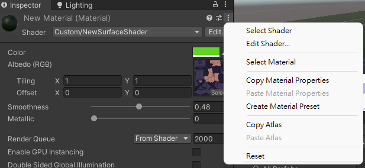

## Materials
In Unity, you use materials and shaderstogether to define the appearance of your scene.

To draw something in Unity, you must provide information that describes its shape, and information that describes the appearance of its surface. You use **meshes to describe shapes**, and **materials to describe the appearance of surfaces**.

> **Materials** and **shaders** are closely linked; you always use materials with shaders.

A material contains a reference to a **Shader** object. If that Shader object defines material properties, then the material can also contain data such as **colors** or **references to textures**.

The **Material class** represents a material in C# code. 

A **material asset** is a file with the **`.mat`** extension. It represents a material in your Unity project. For information on viewing and editing a material asset using the **Inspector** window

### Creating a material asset
-   To create a new material asset in your project, from the main menu or the Project View context menu, select **Assets** > **Create** > **Material**.
-   To assign a **shader** to the material asset, in the Inspector window use the **Shader** drop-down menu.

### Assigning a material asset to a GameObject
To render a GameObject using a **material**:

1. Add a component that inherits from **Renderer**. **MeshRenderer1** is the most common and is suitable for most use cases, but **`SkinnedMeshRenderer`**, **`LineRenderer`**, or **`TrailRenderer`** might be more suitable if your GameObject has **special requirements**.
2. Assign the **material asset** to the component’s **Material** property.

To render a **particle system** in the **Built-in Particle System** using a **material**:

1. Add a **Renderer Module** to the **Particle System**.
2. Assign the **material asset** to the Renderer Module’s **Material** property, or just drag the **material asset** directly into the gameobject in the scene.

> The properties that the Unity Editor displays for a material depend on the material properties defined in the **shader** that the material uses.

### Material inspector
#### Setting
Click the **3 dot icon** in the top right of the Inspector to open the Settings menu for the material and access the following options:

| Setting | Function |
| --- | --- |
| Select Shader | Selects the shader asset in the Project view. |
| Edit Shader | Opens the source file for the shader asset in your default external text editor. |
| Create Material Preset | Creates a duplicate of the material at the same location in your project. |
| Copy Material Properties | Copies the material properties to the clipboard. |
| Paste Material Properties | If the clipboard contains material properties, Unity pastes them into this material. Otherwise, it has no effect. |
| Copy Atlas | If the material is a Text Mesh
 Pro material, Unity copies the font atlas to the clipboard. Otherwise, it has no effect. |
| Paste Atlas | If the material is a Text Mesh
 Pro material and the clipboard contains a Text Mesh Pro font atlas, Unity pastes it into this material. Otherwise, it has no effect. |
| Reset | Reset all material properties to the default values defined in the shader asset. |

#### Shader
Use this drop-down menu to assign a **shader asset** to this material. (Shaders assets are organised according to their name). You can also click edit button to edit your **shader asset** (**`.shader`** extension).

#### Properties
> The properties that the Unity Editor displays for a material depend on the **material properties defined in the shader** that the material uses. That means if different shader may have different **material properties**.

### Physically Based Rendering Material Validator

The Physically Based Rendering Material Validator is a draw mode in the Scene
 View. It allows you to make sure your materials use values which fall within the recommended reference values for physically-based shaders
. If pixel
 values in a particular material fall outside of the reference ranges, the Material Validator highlights the pixels in different colors to indicate failure.

To use the Material Validator, select the Scene View’s draw mode drop-down menu, which is is usually set to Shaded by default.

Navigate to the **Material Validation section**. The **Material Validato**r has two modes:** Validate Albedo** and **Validate Metal Specular**.

https://docs.unity3d.com/Manual/MaterialValidator.html

### Using materials with C# scripts
All the parameters of a material asset that you see in the Inspector window are accessible via script, giving you the power to change or animate how a material works at runtime.

This allows you to modify numeric values on the material, change colours, and swap textures dynamically during gameplay. 

Using **Material class**

https://docs.unity3d.com/Manual/ViewModes.html

### ref
https://docs.unity3d.com/Manual/materials-introduction.html
