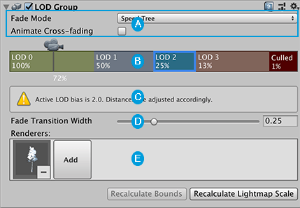
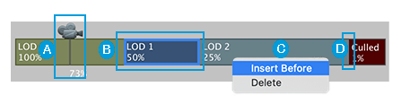
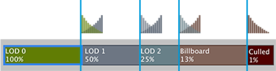
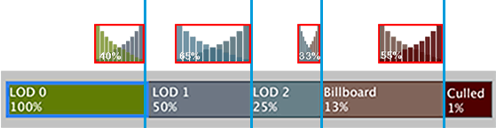

## LOD Group inspector 

> The **LOD Group** component manages **level of detail (LOD**) for GameObjects.

LOD Group inspector

**A** : Controls for [transitioning between LOD levels](https://docs.unity3d.com/Manual/class-LODGroup.html#transitions)

**B** : [LOD Group selection bar](https://docs.unity3d.com/Manual/class-LODGroup.html#LODGroup) for switching between LOD levels and previewing LOD rendering

**C** : Information about the [Lod Bias](https://docs.unity3d.com/Manual/class-LODGroup.htmlclass-QualitySettings.html#LODBias) Quality setting. This message appears if the **Lod Bias** property is set to anything other than 1.

**D** : [Fade Transition Width](https://docs.unity3d.com/Manual/class-LODGroup.html#width) setting for the selected LOD level. This property only appears if you disable the **Animate Cross-fading** property: that is, when you choose to set a transition zone by width instead of time.

**E** : **Mesh** [Renderers](https://docs.unity3d.com/Manual/class-LODGroup.html#renderers) set for the selected LOD level

In addition there are two buttons at the bottom of the component:

-   Click **Recalculate Bounds** to recalculate the **bounding volume**A closed shape representing the edges and faces of a collider or trigger. [More info](https://docs.unity3d.com/Manual/class-LODGroup.htmlSpatialMappingComponentsGeneralSettings)  
    See in [Glossary](https://docs.unity3d.com/Manual/class-LODGroup.htmlGlossary.html#Boundingvolume) of all LOD Mesh GameObjects after a new LOD level is added.
-   Click **Recalculate **Lightmap**A pre-rendered texture that contains the effects of light sources on static objects in the scene. Lightmaps are overlaid on top of scene geometry to create the effect of lighting. [More info](https://docs.unity3d.com/Manual/class-LODGroup.htmlLightmapping.html)  
    See in [Glossary](https://docs.unity3d.com/Manual/class-LODGroup.htmlGlossary.html#Lightmap) Scale** to update the [Scale in Lightmap](https://docs.unity3d.com/Manual/class-LODGroup.htmlclass-MeshRenderer.html#lightmapping) property on all LOD **Mesh Renderers**A mesh component that takes the geometry from the Mesh Filter and renders it at the position defined by the object’s Transform component. [More info](https://docs.unity3d.com/Manual/class-LODGroup.htmlclass-MeshRenderer.html)  
    See in [Glossary](https://docs.unity3d.com/Manual/class-LODGroup.htmlGlossary.html#MeshRenderer), based on the changes you made to the LOD level boundaries.

### LOD Group selection bar
The LOD Group selection bar represents the different LOD levels as colored boxes.

The percentage that appears in each LOD level box represents the threshold at which that level becomes active, based on the ratio of the GameObject’s screen space height to the total screen height. 

**For example, if the threshold for LOD 1 is set to 50%, then LOD 1 becomes active when the camera pulls back far enough that the GameObject’s height fills half of the view.**
 

LOD Group selection bar

- **A** : The playhead for [the LOD preview](https://docs.unity3d.com/Manual/class-LODGroup.html#preview). You can scrub the camera icon back and forth to test the LOD levels and their transitions. At the bottom of the playhead you can see the current percentage.

- **B** : To select a level, click on the level box. For each LOD level you select, you can [pick the Renderer to use](https://docs.unity3d.com/Manual/class-LODGroup.html#renderers) or [customize the transition zone](https://docs.unity3d.com/Manual/class-LODGroup.html#width).

- **C** : To add and remove LOD levels from the selection bar, right-click the LOD level box and then choose **Insert Before** or **Delete** from the context menu.

- **D** : Level adjustment control. To change the percentage value for the LOD level, drag the left border of the LOD level box’s boundary.

> **Note**: If the [Lod Bias](https://docs.unity3d.com/Manual/class-LODGroup.htmlclass-QualitySettings.html#LODBias) property is not set to 1, the Camera position might not match the position where each LOD level actually transitions from the next. In this case, a warning message appears below the selection bar.

The Scene view displays a **preview of the transitions between LOD levels when you move the camera icon on the LOD Group selection bar**. The camera icon acts like a playhead which you can use to scrub back and forth to control the exact position to preview along the LOD Group selection bar. The preview shows what the Camera will render at each LOD level.

The LOD preview playhead shows the exact position as a percentage along the LOD Group selection bar from 100% on the left to 0% on the right. The percentage represents the ratio of the GameObject’s screen space height to the total screen height.

### Renderers for LOD Meshes
When you select an LOD level box on the LOD Group selection bar, a Renderers panel appears.

Renderers panel with the Billboard Renderer for LOD 3

The **"Renderers"** are actually GameObjects that hold the Mesh for that LOD level. Usually this is a child of the GameObject that has the **LODGroup** component.

To set a renderer Mesh for the current LOD level, click the **Add** box and choose the GameObject for that LOD level from the object picker.

> You can choose any GameObject for the renderer, but if you choose a GameObject that isn’t already a child, Unity prompts you to parent it to the **LODGroup** GameObject.

### Transitioning between LOD levels
**Smooth transitions** between LOD levels improves the player’s experience of your game. As the Camera moves closer or farther away, you **don’t want players to see an obvious switchover (sometimes called _popping_)** from the current LOD level to the next.

Smooth transitions take place inside _transition zones_, where Unity renders both the current and next LOD levels separately, and then cross-fades them together.

> **Cross-fading** is the technique of **rendering two levels at the same time**, with a weighting of 1 to 0 for the _current_ LOD level and 0 to 1 for the _next_ LOD level.

Unity usually implements the cross-fading by using either screen-space dithering or transparency. For the last LOD level, there is no cross-fading: the current level just fades out.

To set up smooth transitions on your LOD levels:

1.  Select the **Fade Mode** drop-down menu and choose **Cross Fade**:
    
    > **Note:** If your Tree Asset was made with [SpeedTree](https://store.speedtree.com/unity/), choose the **Speed Tree** mode instead. For more information, see [Working with SpeedTree Models](https://docs.unity3d.com/Manual/class-LODGroup.html#SpeedTreeModels).
    
2.  By default, the **Animate Cross-fading** option is enabled, meaning that Unity **performs a time-based transition**. If you want to **define your own transition zone based on the Camera’s position**, disable the **Animate Cross-fading** option and set the **Fade Transition Width** property.
    
    For more information, see [Customizing the transition zone](https://docs.unity3d.com/Manual/class-LODGroup.html#width) value.

### Customizing the transition zone

The transition between two LOD levels begins the moment the Model’s height ratio crosses the next LOD threshold. For example, if the **LOD 1** threshold is set at **60%**, the **transition between the LOD 0 and LOD 1 levels always begins as soon as the height of the Model is 60%**. The transition lasts for a **short period of time**:

Animate Cross-fading (by time)

Above is animated by **time**, so you don’t need to set any properties once you enable the **Animate Cross-fading** property. The exact duration of the **cross-fade** is the same for every LOD level.

Alternatively, you can manually define **transition zones** inside each LOD level by **its position**. Each zone **begins and ends before the next LOD level’s threshold**. You define what proportion of each LOD level to use as the transition zone; that is, you **set how far before the next level’s threshold the transition begins**:

Fade Transition Width (by position)

Use the **Fade Transition Width** property to define the transition zone on each LOD level:

1.  Disable the **Animate Cross-fading** option.
    
2.  Click on the specific LOD level box that you want to set.
    The **Fade Transition Width** property appears below the **LOD Group** selection bar.
    
3.  Set the **Fade Transition Width** property to define the width of the cross-fade transition zone as a proportion (**between 0.0 and 1.0**) of the current LOD level’s entire length. For example, specify a smaller value to delay the onset of the blending and create a faster transition.

### SpeedTree Models

SpeedTree geometries store the _next_ LOD position for each vertex. Every vertex then knows how to interpolate between the current LOD position and the next LOD position. When Unity imports Models created in SpeedTree, it automatically sets them to the **Speed Tree** mode.

> **Note:** The **Speed Tree** mode is only used for blending between two _Mesh LOD levels_: that is, when both current and next LOD levels have a Mesh Renderer. When transitioning to a _Billboard LOD level_ or when fading out entirely, Unity performs **Cross Fade**\-style blending.

### ref
https://docs.unity3d.com/Manual/class-LODGroup.html#width

https://www.youtube.com/watch?v=ifNyVS2_6f8

https://www.youtube.com/watch?v=-mE4qreuqJY
