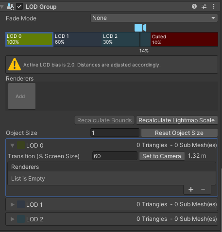

## LOD Group inspector 

> The **LOD Group** component manages **level of detail (LOD**) for GameObjects.

LOD Group inspector

**A** : Controls for [transitioning between LOD levels](https://docs.unity3d.com/Manual/class-LODGroup.html#transitions)

**B** : [LOD Group selection bar](https://docs.unity3d.com/Manual/class-LODGroup.html#LODGroup) for switching between LOD levels and previewing LOD rendering

**C** : Information about the [Lod Bias](https://docs.unity3d.com/Manual/class-LODGroup.htmlclass-QualitySettings.html#LODBias) Quality setting. This message appears if the **Lod Bias** property is set to anything other than 1.

**D** : [Fade Transition Width](https://docs.unity3d.com/Manual/class-LODGroup.html#width) setting for the selected LOD level. This property only appears if you disable the **Animate Cross-fading** property: that is, when you choose to set a transition zone by width instead of time.

**E** : **Mesh** [Renderers](https://docs.unity3d.com/Manual/class-LODGroup.html#renderers) set for the selected LOD level

In addition there are two buttons at the bottom of the component:

-   Click **Recalculate Bounds** to recalculate the **bounding volume**A closed shape representing the edges and faces of a collider or trigger. [More info](https://docs.unity3d.com/Manual/class-LODGroup.htmlSpatialMappingComponentsGeneralSettings)  
    See in [Glossary](https://docs.unity3d.com/Manual/class-LODGroup.htmlGlossary.html#Boundingvolume) of all LOD Mesh GameObjects after a new LOD level is added.
-   Click **Recalculate **Lightmap**A pre-rendered texture that contains the effects of light sources on static objects in the scene. Lightmaps are overlaid on top of scene geometry to create the effect of lighting. [More info](https://docs.unity3d.com/Manual/class-LODGroup.htmlLightmapping.html)  
    See in [Glossary](https://docs.unity3d.com/Manual/class-LODGroup.htmlGlossary.html#Lightmap) Scale** to update the [Scale in Lightmap](https://docs.unity3d.com/Manual/class-LODGroup.htmlclass-MeshRenderer.html#lightmapping) property on all LOD **Mesh Renderers**A mesh component that takes the geometry from the Mesh Filter and renders it at the position defined by the object’s Transform component. [More info](https://docs.unity3d.com/Manual/class-LODGroup.htmlclass-MeshRenderer.html)  
    See in [Glossary](https://docs.unity3d.com/Manual/class-LODGroup.htmlGlossary.html#MeshRenderer), based on the changes you made to the LOD level boundaries.

