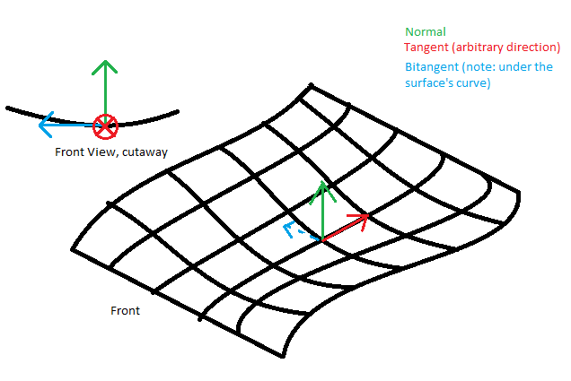
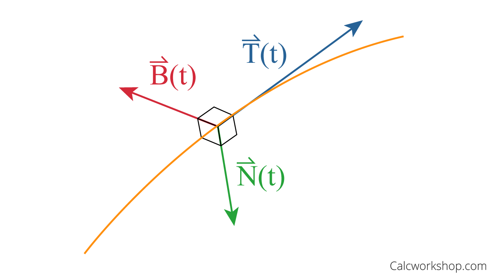

## Mesh data

A **mesh** is defined by these properties:

- **Vertices**: **A collection of positions** in 3D space, with optional additional attributes.
- **Topology**: **The type of structure** that defines each face of the surface.
- **Indices**: **A collection of integers** that describe how the vertices combine to create the surface, based on the topology.

In addition to this, **deformable meshes** contain either:

- **Blend shapes**: Data that describes different **deformed versions of the mesh**, for use with animation.
- **Bind poses**: Data that describes the **"base" pose** of the **skeleton** in a **skinned mesh**.

### Vertex data
The elements of vertex data are called **vertex attributes**.

Every **vertex** can have the following attributes:

- **Position** \
  The vertex position represents the position of the vertex in object space. Unity uses this value to determine the surface of the mesh. In the **Mesh class**, the simplest way to access this data is with **`Mesh.GetVertices`** and **`Mesh.SetVertices`**. Unity also stores this data in **`Mesh.vertices`**, but this older property is less efficient and user-friendly.
  > This vertex attribute is **required** for all meshes.
- **Normal** \
  The vertex normal represents the **direction** that points directly **"out"** from the surface at the position of the vertex. 
  In the **Mesh class**, the simplest way to access this data is with **`Mesh.GetNormals`** and **`Mesh.SetNormals`**. Unity also stores this data in **`Mesh.normals`**, but this older property is less efficient and user-friendly.
  > Unity uses this value to calculate the way that **light reflects off the surface of a mesh**.
  > > However, this vertex attribute is **optional**.
- **Tangent** \
  The vertex tangent represents the **direction that points along the "u"** (horizontal texture) axis of the surface at the position of the vertex.
  
  Unity stores the **vertex tangent** with an additional piece of data, in a **four-component vector**. The x,y,z components of the vector describe the tangent, and the w component of the vector describes its orientation. Unity uses the **w** value to compute the **binormal**, which is the **cross-product of the tangent and normal**.
  
  
  
  > Unity uses the tangent and binormal values in **normal mapping**.
  > > However, this vertex attribute is **optional**.

  In the **Mesh class**, the simplest way to access this data is with **`Mesh.GetTangents`** and **`Mesh.SetTangents`**. Unity also stores this data in **`Mesh.tangents`**, but this older property is less efficient and user-friendly.
- **Color** \
  The vertex color represents the **base color** of a vertex, if any.
  
  This color exists independently of any textures that the mesh may use.
  > This vertex attribute is **optional**.

  In the **Mesh class**, the simplest way to access this data is with **`Mesh.GetColors`** and **`Mesh.SetColors`**. Unity also stores this data in **Mesh.colors**, but this older property is less efficient and user-friendly.
  
- **Up to 8 texture coordinates**
  A mesh can contain up to **eight sets of texture coordinates**. Texture coordinates are commonly called **UVs**, and the sets are called **channels**.
  
  Unity uses texture coordinates when it **"wraps"** a texture around the mesh. The **UVs** indicate **which part of the texture aligns with the mesh surface at the vertex position**.
  
  **UV channels** are commonly called **"UV0"** for the first channel, **"UV1"** for the second channel, and so on up to **"UV7"**. The **channels** respectively **map to the shader** semantics `TEXCOORD0`, `TEXCOORD1`, and so on up to `TEXCOORD7`.
  
  By default, Unity uses the **first channel (UV0)** to store **UVs** for regular textures such as **diffuse maps** and **specular maps**. Unity can use the **second channel (UV1)** to store **baked lightmap
 UVs**, and the **third channel (UV2)** to store input data for **real-time lightmap UVs**.
  
  > All eight texture coordinate attributes are **optional**.
  
  In the **Mesh class**, the simplest way to access this data is with **`Mesh.GetUVs`** and **`Mesh.SetUVs`**. Unity also stores this data in the following properties: **`Mesh.uv`**, **`Mesh.uv2`**, **`Mesh.uv3`** and so on, up to **`Mesh.uv8`**.
  
- **Bone weights and blend indices (skinned meshes only)**
  In a skinned mesh, 
  - **blend indices** indicate which bones affects a vertex.
  - **bone weights** describe how much influence those bones have on the vertex.
  
  Unity uses **blend indices** and **bone weights** to **deform a skinned mesh** based on the movement of its skeleton.

  > These vertex attributes are required for **skinned meshes**.

  In the past, Unity only allowed up to **4 bones** to influence a vertex. It stored this data in a **`BoneWeight`** struct, in the **Mesh.boneWeights array**. Now, Unity allows up to **256 bones** to influence a vertex. It stores this data in a **`BoneWeight1`** struct, and you can access it with Mesh.GetAllBoneWeights and Mesh.SetBoneWeights.
  
  
  

> Internally, all vertex data is stored in separate arrays of the same size. If your mesh contains an array with 10 vertex positions, it also has arrays with 10 elements for each other vertex attribute that it uses.

> In C#, Unity describes the available vertex attributes with the **`VertexAttribute`** enum. You can check whether an instance of the **Mesh class** has a given **vertex attribute** with the **`Mesh.HasVertexAttribute`** function.

### Topology
Topology describes the type of face that a mesh has.

A mesh’s topology defines the structure of the index buffer, which in turn describes how the vertex positions combine into faces. Each type of topology uses a different number of elements in the index array to define a single face.

Unity supports the following mesh topologies:

- Triangle
- Quad
- Lines
- LineStrip
- Points

> Note: The Points topology doesn’t create faces; instead, Unity renders a single point at each position. All other mesh topologies use more than one index to create either faces or edges.

In the **Mesh class**, you can get the topology with **`Mesh.GetTopology`**, and set it as a parameter of **`Mesh.SetIndices`**.

For more information on supported **mesh topologies**, see the documentation for the **`MeshTopology enum`**.

### Index data
The index array contains integers that **refer to elements in the vertex positions array**. These integers are called **indices**.

Unity uses the indices to connect the vertex positions into faces. The number of indices that make up each face depends on the topology of the mesh.

In the **Mesh class**, you can get this data with **`Mesh.GetIndices`**, and set it with **`Mesh.SetIndices`**. Unity also stores this data in **`Mesh.triangles`**, but this older property is less efficient and user-friendly.

### ref
https://docs.unity3d.com/Manual/AnatomyofaMesh.html

https://gamedev.stackexchange.com/questions/51399/what-are-normal-tangent-and-binormal-vectors-and-how-are-they-used

