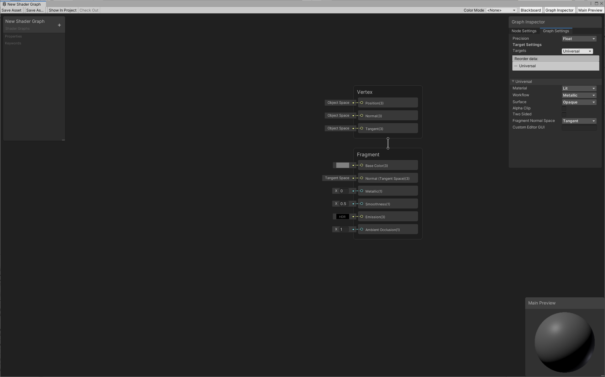
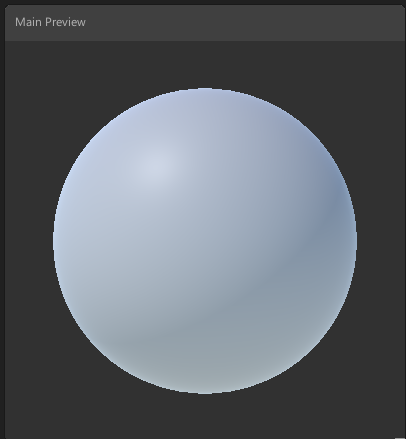
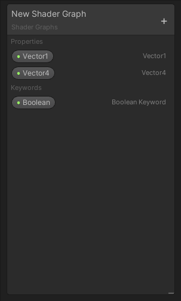
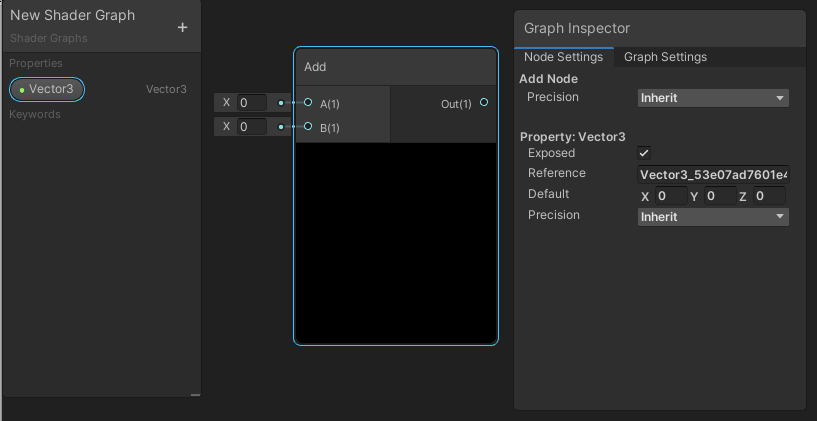

## Shader graph 16.0.0

Modern video game development platforms such as Unity, Unreal Engine and Godot increasingly include **node-based editors** that can create shaders **without the need for actual code**.

**Shader Graph** enables you to **build shaders visually**. Instead of writing code, you create and **connect nodes in a graph framework**. **Shader Graph gives instant feedback that reflects your changes**, and it’s simple enough for users who are new to shader creation.

Shader Graph is available through the **Package Manager window** in supported versions of the Unity Editor. If you install a **Scriptable Render Pipeline (SRP)** such as the **Universal Render Pipeline (URP)** or the **High Definition Render Pipeline (HDRP)**, Unity **automatically installs Shader Graph in your project**.

Use Shader Graph with either of the **Scriptable Render Pipelines (SRPs)** available in Unity version **2018.1 and later**:

- **The High Definition Render Pipeline (HDRP)**
- **The Universal Render Pipeline (URP)**

> As of Unity version **2021.2**, you can also use Shader Graph with the **Built-In Render Pipeline**.

> **Note**: Shader Graph support for the Built-In Render Pipeline is for compatibility purposes only. Shader Graph doesn't receive updates for Built-In Render Pipeline support, aside from bug fixes for existing features. It's recommended to use Shader Graph with the Scriptable Render Pipelines.

### Creating a new Shader Graph Asset
After you configure an SRP, you can create a new Shader Graph Asset. **Right-click the Project window**, locate **Create > Shader** in the context menu, then **select your desired type of Shader Graph**.

The type of Shader Graph available is dependent on the render pipelines present in your project. Some options may or may not be present based on the render pipelines.

The following options are always available:
|  |  |
| --- | --- |
| Blank Shader Graph | A completely blank shader graph. No target is selected and no blocks are added to the Master Stack. |
| Sub Graph | A blank sub graph asset. |

### Shader Graph window

The Shader Graph window consists of the Master Stack, the Preview Window, the Blackboard, and the Graph Inspector.

#### Master Stack
The final connection that determines your shader output. Refer to Master Stack for more information.

#### Preview window

#### Blackboard
An area that contains all of the shader's properties in a single, collected view. Use the Blackboard to add, remove, rename, and reorder properties.

#### Internal Inspector
An area that contains information contextual to whatever the user is currently clicking on. It's a window that automatically is hidden by default and only appears when something is selected that can be edited by the user. Use the Internal Inspector to display and modify properties, node options, and the graph settings.

### ref
https://docs.unity3d.com/Packages/com.unity.shadergraph@16.0/manual/index.html

https://www.youtube.com/watch?v=Ar9eIn4z6XE

https://www.youtube.com/watch?v=-QcwEYOHt2I

https://www.youtube.com/watch?v=u9pbpypdq0Q&t=3s

https://hackmd.io/@IM23/rkpebgif5

https://youtube.com/playlist?list=PLpPd_BKEUoYjcFaqriaMchx5gOqBs2tDh

https://youtu.be/V5XFrIhLpGQ

https://youtube.com/playlist?list=PLzDRvYVwl53tpvp6CP6e-Mrl6dmxs9uhx

