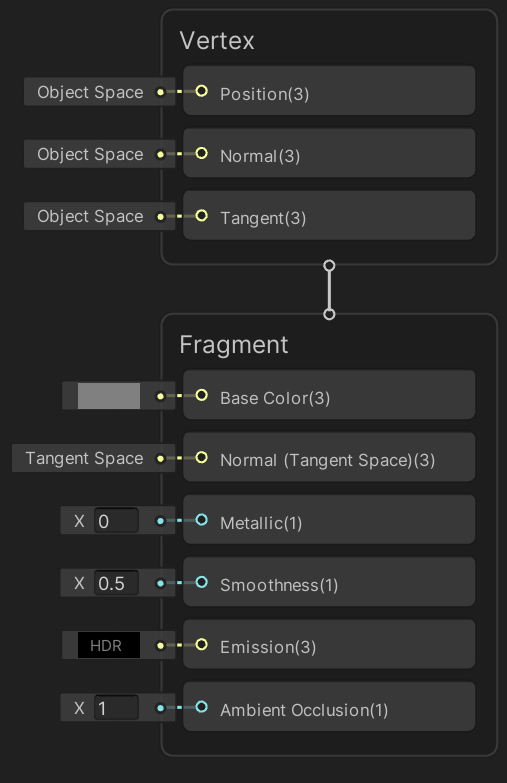
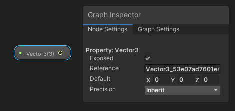
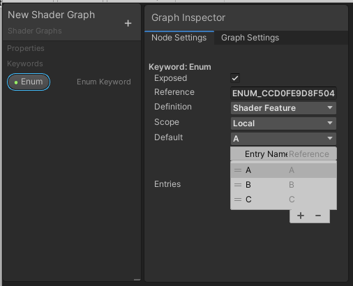
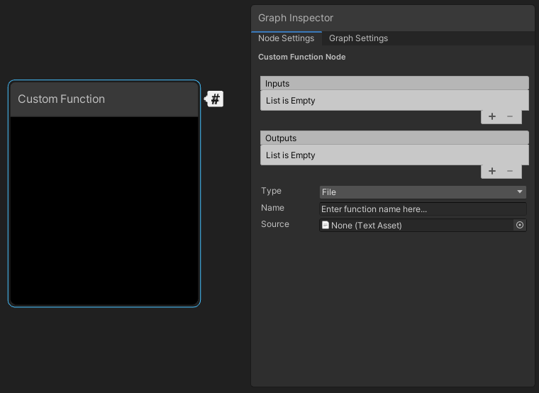
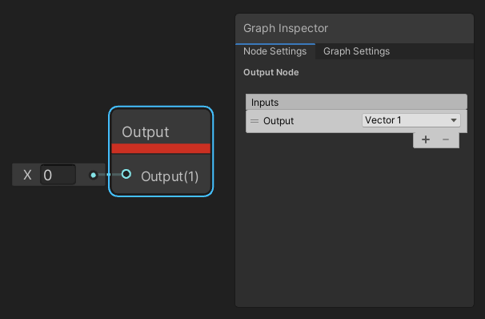
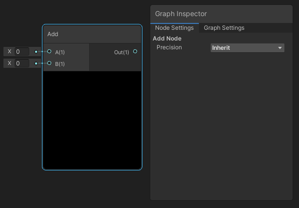
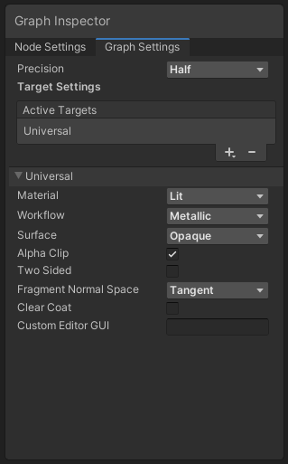
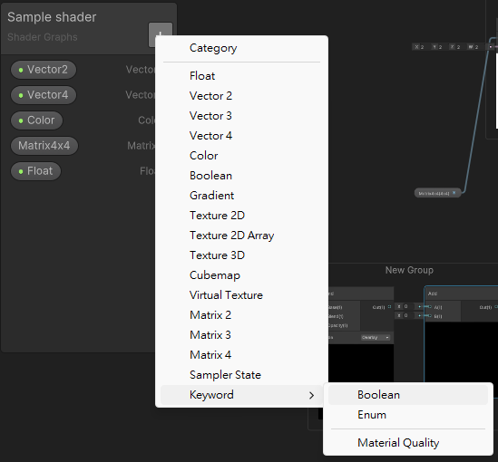
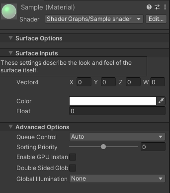
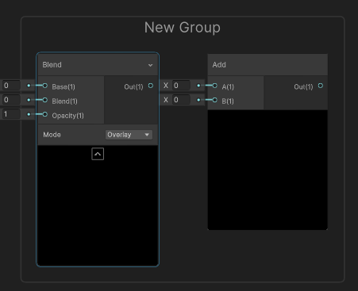

## Shader graph 16.0.0

Modern video game development platforms such as Unity, Unreal Engine and Godot increasingly include **node-based editors** that can create shaders **without the need for actual code**.

**Shader Graph** enables you to **build shaders visually**. Instead of writing code, you create and **connect nodes in a graph framework**. **Shader Graph gives instant feedback that reflects your changes**, and it’s simple enough for users who are new to shader creation.

Shader Graph is available through the **Package Manager window** in supported versions of the Unity Editor. If you install a **Scriptable Render Pipeline (SRP)** such as the **Universal Render Pipeline (URP)** or the **High Definition Render Pipeline (HDRP)**, Unity **automatically installs Shader Graph in your project**.

Use Shader Graph with either of the **Scriptable Render Pipelines (SRPs)** available in Unity version **2018.1 and later**:

- **The High Definition Render Pipeline (HDRP)**
- **The Universal Render Pipeline (URP)**

> As of Unity version **2021.2**, you can also use Shader Graph with the **Built-In Render Pipeline**.

> **Note**: Shader Graph support for the Built-In Render Pipeline is for compatibility purposes only. Shader Graph doesn't receive updates for Built-In Render Pipeline support, aside from bug fixes for existing features. It's **recommended to use Shader Graph with the Scriptable Render Pipelines**.

### Creating a new Shader Graph Asset
After you configure an SRP, you can create a new Shader Graph Asset. **Right-click the Project window**, locate **Create > Shader Graph** in the context menu, then **select your desired type of Shader Graph**.

The type of Shader Graph available is dependent on the render pipelines present in your project. Some options may or may not be present based on the render pipelines.

The following options are always available:
|  |  |
| --- | --- |
| Blank Shader Graph | A completely blank shader graph. No target is selected and no blocks are added to the Master Stack. |
| Sub Graph | A blank sub graph asset. |

### Shader Graph window

The Shader Graph window consists of the Master Stack, the Preview Window, the Blackboard, and the Graph Inspector.

#### Master Stack
The final connection that determines your shader output. Refer to **Master Stack** for more information.

The **Master Stack** is the **end point of a Shader Graph that defines the final surface appearance of a shader**. Your Shader Graph should always contain only one Master Stack.

The content of the Master Stack might change depending on the Graph Settings you select. The Master Stack is made up of Contexts, which contain Block nodes.

The Master Stack contains **two Contexts**: **Vertex** and **Fragment**. These represent the **two stages of a shader**. 

Nodes that you connect to Blocks in the **Vertex Context** become **part of the final shader's vertex function**. 

Nodes that you connect to Blocks in the **Fragment Context** become **part of the final shader's fragment (or pixel) function**, define the **appearance**. 

If you **connect any nodes to both Contexts**, they are **executed twice**, **once in the vertex function** and then **again in the fragment function**. You **can't cut, copy, or paste Contexts**.

> Press **Space bar** to add new node

#### Preview window

#### Blackboard
An area that **contains all of the shader's properties in a single**, **collected view**. Use the Blackboard to **add, remove, rename, and reorder properties**.

#### Internal Inspector
An area that **contains information contextual to whatever the user is currently clicking on**. It's a window that **automatically is hidden by default** and **only appears when something is selected that can be edited by the user**. Use the Internal Inspector to display and modify properties, node options, and the graph settings.

#### Graph inspector
The Graph Inspector makes it possible for you to **interact with any selectable graph elements** and graph-wide settings for a Shader Graph Asset. You can use the Graph Inspector to **edit attributes and default values**.

When you open a Shader Graph, the Graph Inspector displays the Graph Settings tab by default. Graph-wide settings for that specific Shader Graph appear in this tab.

Select a node in the graph to display settings available for that node in the Graph Inspector. Settings available for that node appear in the Node Settings tab of the Graph Inspector. For example, if you select a Property node either in the graph or the Blackboard, the Node Settings tab displays attributes of the Property that you can edit.

- **Properties** \
  

- **Keywords** \
  

- **Custom Function nodes** \
  

- **Subgraph Output nodes** \
  

- **Per-node precision** \
  

https://docs.unity3d.com/Packages/com.unity.shadergraph@17.0/manual/Internal-Inspector.html

#### Graph setting

| Menu Item | Description |
| --- | --- |
| Precision | A Precision Mode drop-down menu that lets you set the default precision for the entire graph. You can override the Precision setting here at the node level in your graph. |
| Preview Mode | (Subgraphs only) Your options are Inherit, Preview 2D, and Preview 3D. |
| Active Targets | A list that contains the Targets you've selected. You can add or remove entries using the Add (+) and Remove (-) buttons.Shader Graph supports three targets: the Universal Render Pipeline, the High Definition Render Pipeline, and Built-In Render Pipeline. Target-specific settings appear below the standard setting options. The displayed Target-specific settings change according to which Targets you select. |

https://docs.unity3d.com/Packages/com.unity.shadergraph@17.0/manual/Graph-Settings-Tab.html \
https://docs.unity3d.com/Packages/com.unity.shadergraph@16.0/manual/Precision-Modes.html

#### Create a new node

Use the Create Node menu to create new nodes. There are two ways to open the menu:

- Right click, and select Create Node from the context menu.
- Press the spacebar.

In the menu, you can type in the search bar to look for specific nodes, or browse all nodes in the library.

#### Connect nodes

To build a graph, you need to connect nodes together. To do so, **click the Output Slot of a node, and drag that connection into the Input Slot of another node**.

#### Create a Material
After **saving your graph**, use the shader to **create a new Material**. The process of creating a new Material and assigning it a Shader Graph shader is the s**ame as that for regular shaders**. \
In either the main menu or the Project View context menu, select **Assets > Create > Material**. **Select the Material** you just created. In its Inspector window, select the **Shader drop-down menu**, click **Shader Graphs**, and choose the **Shader Graph shader you wish to apply to the Material**.

> You can also **right-click the Shader Graph shader**, and select **Create > Material**. This method **automatically assigns that Shader Graph shader to the newly created Material**.

A **Material** is also **automatically generated as a subasset of the Shader Graph**. You can **assign it directly to an object in your scene**. Modifying a property from the Blackboard on the Shader Graph will **update this material in real time**, which allows for **quick visualization** in the scene.

#### properties
You can also **use properties to alter your shader's appearance**. 

**Properties are options that are visible from the Material's Inspector**, which lets others **change settings** in your shader **without the need to open the Shader Graph**.

To create a **new property**, use the **Add (+)** button on the **top right corner of the Blackboard**, and **select the type of property to create**.

This **adds a new property in the Blackboard** with the following options in the Node Settings tab of the Graph Inspector when the property is selected.

There are two ways to **reference a property in your graph**(**create a node from property**):

- **Drag the property from the Blackboard onto the graph**.
- **Right-click and select Create Node**. The property is listed in the Properties category.

**Convert a node to property**:

Some nodes can be **converted to property and show on blackboard**. If you create a node which is in the proprty list, you can right click the node and select **Convert to > Property**.

**Property type**
Property Types are the **types of Property** than can be **defined on the Blackboard for use in the Graph**. These Properties are **exposed to the Inspector for Materials** that use the shader.

Each property **has an associated Data Type**.

**Data Types**:

| Name | Color | Description |
| --- | --- | --- |
| Float | Light Blue | A **Float** or scalar value |
| Vector 2 | Green | A **Vector 2** value |
| Vector 3 | Yellow | A **Vector 3** value |
| Vector 4 | Pink | A **Vector 4** value |
| Dynamic Vector | Light Blue | See **Dynamic Data Types** below |
| Matrix 2 | Blue | A **Matrix 2x2** value |
| Matrix 3 | Blue | A **Matrix 3x3** value |
| Matrix 4 | Blue | A **Matrix 4x4** value |
| Dynamic Matrix | Blue | See **Dynamic Data Types** below |
| Dynamic | Blue | See **Dynamic Data Types** below |
| Boolean | Purple | A **Boolean** value. Defined as a float in the generated shader |
| Texture 2D | Red | A Texture 2D asset |
| Texture 2D Array | Red | A Texture 2D Array asset |
| Texture 3D | Red | A Texture 3D asset |
| Cubemap | Red | A Cubemap asset |
| Virtual Texture | Gray | A Texture Stack |
| Gradient | Gray | A **Gradient** value. Defined as a struct in the generated shader |
| SamplerState | Gray | A state used for sampling a texture |

#### Keywords
Use Keywords to create different variants for your Shader Graph.

Keywords enable you to create shaders:

-   With features that you can turn on or off for each Material instance.
-   With features that behave differently on certain platforms.
-   That scale in complexity based on conditions you set.

There are three types of Keywords: Boolean, Enum, and Built-in. Unity defines a Keyword in the graph, shader, and optionally, the Material Inspector based on its type.

https://docs.unity3d.com/Packages/com.unity.shadergraph@16.0/manual/Property-Types.html \
https://docs.unity3d.com/Packages/com.unity.shadergraph@16.0/manual/Data-Types.html \
https://docs.unity3d.com/Packages/com.unity.shadergraph@16.0/manual/Keywords.html

### Add nodes to a group - Group selection
Press **Ctrl + G** for Group selection, adding Group name for all selected nodes

### Node library
Right-click the node and select **"Open documentation or F1"**, to see documentation about the slected node in Node library.

https://docs.unity3d.com/Packages/com.unity.shadergraph@16.0/manual/Node-Library.html

### ref
https://docs.unity3d.com/Packages/com.unity.shadergraph@16.0/manual/index.html

https://learn.unity.com/tutorial/introduction-to-shader-graph#5f500900edbc2a0022843fb3

https://www.twblogs.net/a/5f0463a35352062f754edb05

https://www.youtube.com/watch?v=Ar9eIn4z6XE

https://www.youtube.com/watch?v=-QcwEYOHt2I

https://www.youtube.com/watch?v=u9pbpypdq0Q&t=3s

https://hackmd.io/@IM23/rkpebgif5

https://youtube.com/playlist?list=PLpPd_BKEUoYjcFaqriaMchx5gOqBs2tDh

https://youtu.be/V5XFrIhLpGQ

https://youtube.com/playlist?list=PLzDRvYVwl53tpvp6CP6e-Mrl6dmxs9uhx

https://www.youtube.com/watch?v=7hpaVDivGDc
