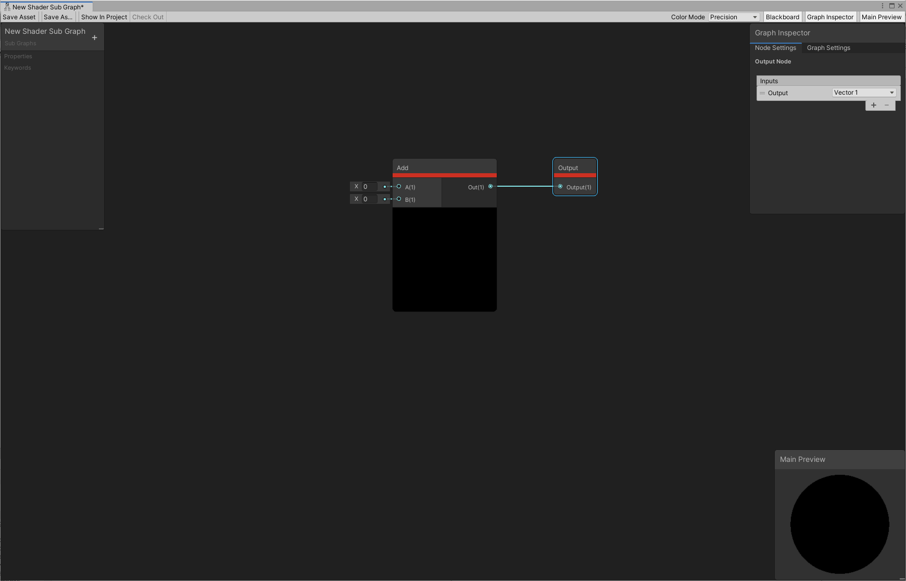

## Sub Graph

A Sub Graph is a special type of Shader Graph, which you can reference from inside other graphs. This is useful when you wish to perform the same operations multiple times in one graph or across multiple graphs. A Sub Graph differs from a Shader Graph in three main ways:

Properties in the Blackboard of a Sub Graph define the input Ports of a Sub Graph Node when you reference the Sub Graph from inside another graph.
A Sub Graph has its own Asset type. For more information, including instructions on how to make a new Sub Graph, see Sub Graph Asset.
A Sub Graph does not have a Master Stack. Instead, it has a Node called Output.
For information about the components of a Sub Graph, see Sub Graph Asset.

The Output Node defines the output ports of a Sub Graph Node when you reference the Sub Graph from inside another graph. To add and remove ports, use the Custom Port Menu in the Node Settings tab of the Graph Inspector by clicking on the Sub Graph Output node.

### Subgraph Asset

The **Subgraph Asset** is a new Asset type introduced with the Shader Graph. A Subgraph Asset defines a Subgraph. This is different to a Shader Graph. You can create a Subgraph Asset from the Project window from the Create menu via Subgraph in the Shader sub-menu.

You can open the Shader Graph Window by double clicking a Subgraph Asset or by clicking Open Shader Editor in the Inspector when the Subgraph Asset is selected.

### ref
https://docs.unity3d.com/Packages/com.unity.shadergraph@16.0/manual/Sub-graph.html

https://www.youtube.com/watch?v=zElng0TRsY8
