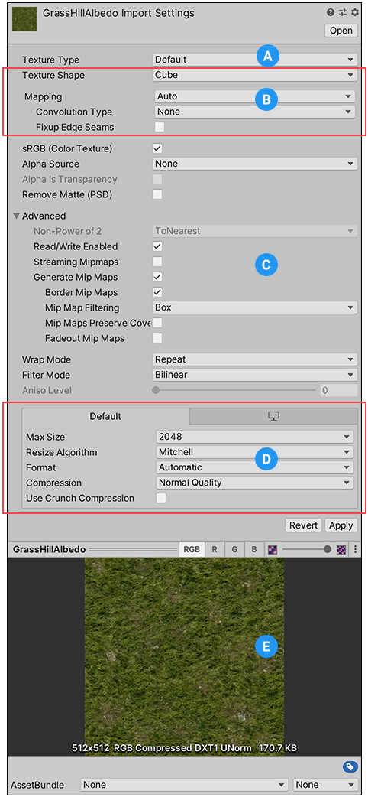

## Importing textures

The **Texture Import Settings** window defines how Unity imports images from your project’s Assets folder into the Unity Editor.

To access this window, select the image file in the **Project window**. The **Texture Import Settings** window appears in the **Inspector**.

> **Note**: Some of the less commonly used properties are hidden by default. Expand the Advanced section in the Inspector window to view these properties.

There are several sections on the Texture Import Settings window:

**(A)** [Texture Type](https://docs.unity3d.com/Manual/class-TextureImporter.html#texturetype). Select the type of Texture you want to create.

**(B)** [Texture Shape](https://docs.unity3d.com/Manual/class-TextureImporter.html#textureshape). Select the shape and set properties specific to that shape in this area.

**(C)** [Type-specific and advanced settings](https://docs.unity3d.com/Manual/class-TextureImporter.html#advanced). Depending on what **Texture Type** value you select, extra properties might appear in this area. For more information, see the documentation on [Texture types](https://docs.unity3d.com/Manual/class-TextureImporter.htmlTextureTypes.html).

**(D)** [Platform-specific overrides](https://docs.unity3d.com/Manual/class-TextureImporter.html#platform). Use the **Platform-specific overrides** panel to set default options and their overrides for a specific platforms.

**(E)** **Texture preview**. You can preview the Texture and adjust its values here.

## Texture Type

Use the **Texture Type** property to select the type of Texture you want to create from the source image file. The other properties in the Texture Import settings window change depending on the value you set.

For information about specific Texture Types, see the [Texture Types](https://docs.unity3d.com/Manual/class-TextureImporter.htmlTextureTypes.html) documentation.

 
| **Property:** | **Function:** |
| --- | --- |
| **Default** | This is the most common setting used for all Textures. It provides access to most of the properties for Texture importing. For more information, see the [Default](https://docs.unity3d.com/Manual/class-TextureImporter.htmlTextureTypes.html#Default) Texture type. |
| **Normal map**A type of Bump Map texture that allows you to add surface detail such as bumps, grooves, and scratches to a model which catch the light as if they are represented by real geometry.  
See in [Glossary](https://docs.unity3d.com/Manual/class-TextureImporter.htmlGlossary.html#Normalmap) | Select this to turn the color channels into a format suitable for real-time normal mapping. For more information, see the [Normal map](https://docs.unity3d.com/Manual/class-TextureImporter.htmlTextureTypes.html#NormalMap) Texture type documentation.  
  
For more information on normal mapping in general, see [Importing Textures](https://docs.unity3d.com/Manual/class-TextureImporter.htmlImportingTextures.html#Normalmaps). |
| **Editor GUI and Legacy GUI** | Select this if you are using the Texture on any HUD or GUI controls. For more information, see the [Editor GUI and Legacy GUI](https://docs.unity3d.com/Manual/class-TextureImporter.htmlTextureTypes.html#Editor) Texture type documentation. |
| **Sprite (2D and UI)** | Select this if you are using the Texture in a 2D game as a [Sprite](https://docs.unity3d.com/Manual/class-TextureImporter.htmlSprites.html)A 2D graphic objects. If you are used to working in 3D, Sprites are essentially just standard textures but there are special techniques for combining and managing sprite textures for efficiency and convenience during development. [More info](https://docs.unity3d.com/Manual/class-TextureImporter.htmlSprites.html)  
See in [Glossary](https://docs.unity3d.com/Manual/class-TextureImporter.htmlGlossary.html#Sprite). For more information, see the [Sprite (2D and UI)](https://docs.unity3d.com/Manual/class-TextureImporter.htmlTextureTypes.html#Sprite) Texture type documentation. |
| **Cursor** | Select this if you are using the Texture as a custom cursor. For more information, see the [Cursor](https://docs.unity3d.com/Manual/class-TextureImporter.htmlTextureTypes.html#Cursor) Texture type documentation. |
| **Cookie** | Select this to set your Texture up with the basic parameters used for the [Cookies](https://docs.unity3d.com/Manual/class-TextureImporter.htmlCookies.html) of your **Scene**A Scene contains the environments and menus of your game. Think of each unique Scene file as a unique level. In each Scene, you place your environments, obstacles, and decorations, essentially designing and building your game in pieces. [More info](https://docs.unity3d.com/Manual/class-TextureImporter.htmlCreatingScenes.html)  
See in [Glossary](https://docs.unity3d.com/Manual/class-TextureImporter.htmlGlossary.html#Scene)’s [Lights](https://docs.unity3d.com/Manual/class-TextureImporter.htmlclass-Light.html). For more information, see the [Cookie](https://docs.unity3d.com/Manual/class-TextureImporter.htmlTextureTypes.html#Cookie) Texture type documentation. |
| **Lightmap**A pre-rendered texture that contains the effects of light sources on static objects in the scene. Lightmaps are overlaid on top of scene geometry to create the effect of lighting. [More info](https://docs.unity3d.com/Manual/class-TextureImporter.htmlLightmapping.html)  
See in [Glossary](https://docs.unity3d.com/Manual/class-TextureImporter.htmlGlossary.html#Lightmap) | Select this if you are using the Texture as a [Lightmap](https://docs.unity3d.com/Manual/class-TextureImporter.htmlclass-LightmapParameters.html). This option enables encoding into a specific format (RGBM or dLDR, depending on the platform) and a **post-processing**A process that improves product visuals by applying filters and effects before the image appears on screen. You can use post-processing effects to simulate physical camera and film properties, for example Bloom and Depth of Field. [More info](https://docs.unity3d.com/Manual/class-TextureImporter.htmlPostProcessingOverview.html) post processing, postprocessing, postprocess  
See in [Glossary](https://docs.unity3d.com/Manual/class-TextureImporter.htmlGlossary.html#post-processing) step on Texture data (a push-pull dilation pass). For more information, see the [Lightmap](https://docs.unity3d.com/Manual/class-TextureImporter.htmlTextureTypes.html#Lightmap) Texture type documentation. |
| **Single Channel** | Select this if you only need one channel in the Texture. For information on the properties available only for the this typ |

### ref
https://docs.unity3d.com/Manual/class-TextureImporter.html

