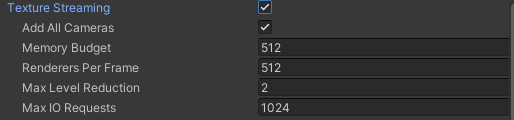

## Mipmap
A **mip or mip level** is a **version of a texture with a specific resolution**. 
**Mips** exist in sets called **mipmaps**. 
**Mipmaps** contain progressively **smaller and lower resolution versions** of a single texture.

**Mipmaps** are commonly used for rendering objects in 3D scenes, where **textured objects can vary in distance from the camera**. A **higher mip level is used for objects closer to the camera**, and **lower mip levels are used for more distant objects**.

Mipmaps can **speed up rendering operations** and **reduce rendering artifacts** in situations where the GPU renders a texture at less than its full resolution.

Sometimes, mipmaps aren’t beneficial. Mipmaps increase the size of a texture by 33%, both on disk and in memory. They also provide no benefit when a texture is only rendered at its full resolution, such as a UI texture that isn’t scaled.

You can create a mipmap for a texture manually, or you can instruct Unity to generate a mipmap for you. To automatically generate a mipmap, ensure that your original texture’s resolution is a power of two value, as shown in the example mipmap image.

You can enable or disable mipmaps for a texture asset in the Texture Import Settings Inspector.

### Mipmap Streaming system
The **Mipmap Streaming system** gives you control over how Unity **loads mipmaps**.

This system forces Unity to **only load the mip levels needed to render the current Camera
 position, instead of loading all of them by default**. It trades a small amount of CPU resources to save a potentially large amount of GPU memory.

You can set a **total memory limit** for all textures in an application, and the system automatically reduces mip levels to stay within this budget.

You can control the way that Unity **loads mipmaps** at runtime with **Mipmap Streaming**.

### Enabling Mipmap Streaming

To enable **Mipmap Streaming**, go to Unity’s Quality Settings (**Edit > Project Settings > Quality**) and **enable the Texture Streaming checkbox**.

When you enable this setting, the Quality settings window reveals the settings specific to the Mipmap Streaming system.

> By default, this enables Mipmap Streaming for all Cameras in your project.

### Making textures work with the Mipmap Streaming system
You can set up Mipmap Streaming on individual textures. Select a texture asset, navigate to the Inspector window and view the Texture Import settings. 

Open the Advanced settings, and **enable the Streaming Mip Maps checkbox**.

Unity loads mips at the highest resolution possible while observing the memory budget. You can configure the priority of a texture with the **Mip Map Priority** setting in the Texture Import Settings.

If you’re developing for Android, you also need to open the Build Settings and set the Compression Method to **LZ4 or LZ4HC**. Unity requires one of these compression methods for asynchronous Texture loading, which the Mipmap Streaming system relies upon.

Unity uses this setting to determine:

-   Which textures to prioritize when assigning resources.
-   As a mip bias value when choosing a mip level that fits in the memory budget. For example, with a priority of 2, the mipmap streaming system tries to use a mipmap two mip levels higher than Textures with a priority of 0.

Positive numbers give higher priority. Valid values range from –128 to 127.

### Mip bias
A setting called mip bias can do two things while sampling, based on the sampler settings:

-  The **mip bias** can change the **threshold for the GPU** selecting a lower or higher mip for a sample. The GPU selects a specific mip when you use point and linear filtering in a sampler. For example, the GPU’s might decide that the texture at a set of UVs uses a sample from Mip 3. With a mip bias of –2, the GPU would use the higher resolution Mip 1 for the sample, instead.
-  The **mip bias** can tell the GPU to prefer one mip over another by an exact percentage when blending samples from different mips. The GPU blends mips when you use trilinear filtering in a sampler. For example, the GPU’s calculations might return a value of 0.5. The 0.5 value tells the GPU to take 50% of the texture information it needs from one mip, and the remaining 50% from the next mip in the mipmap. With an added mip bias of 0.2, the 0.5 value would change to 0.7, and the GPU would take 70% of the texture information from the first mip and only 30% from the second.

### Streaming Lightmaps
You can use the **Mipmap Streaming system** to stream mip levels for **lightmaps**.

You can edit the **Mip Map Streaming** settings of the lightmap assets in the same way that you can any other texture, but they reset to their default values when Unity regenerates the lightmaps. To solve this, you can tell Unity to apply these values when it generates the lightmaps. The Player Settings
 (**Edit > Project Settings > Player**) provide two controls to set streaming and priority for generated lightmaps: **Lightmap Streaming Enabled** and **Streaming Priority**.

Enabling Mip Map Streaming and configuring priority work in the same way for lightmaps as for regular textures.

### Configuring Mipmap Streaming
You can configure default settings in the Unity Editor, and then use the **Mipmap Streaming API** to override these settings if required.

#### Setting the memory budget
The **Memory Budget** property determines the **maximum amount of memory** Unity uses for **textures**. If your memory budget is too small, Unity **lowers the resolution** of textures in your scene.

This can cause textures to pop or load slowly. However, the **memory budget should be as small as possible** to allow memory for other resources.

> When the memory budget is full, Unity **discards mipmaps it’s not using**, to **make room for those it needs to use**. You can control how many unused mipmaps it discards with the **Max Level Reduction**.

This value is also the **mipmap** level that the **Mipmap Streaming system** **initially loads** at startup. For example, when this is set to 2, Unity skips the two highest mipmaps on first load.

> Set this value in the **Quality Settings** window, with the **Texture Streaming > Max Level Reduction** property.

> **Note**: Unity prioritises the **Max Level Reduction** value over the memory budget. It never discards more mipmaps than the **Max Level Reduction** value, even if this causes the textures memory to exceed the budget.

The memory budget includes textures that do not use Mipmap Streaming. For example, if your budget is 100MB and you have 90MB of textures that don’t use Mipmap Streaming, Unity tries to fit all the streaming mipmaps in the remaining 10MB. If it can’t, it loads them at a lower resolution. 

> Unity always **loads textures that don’t use Mipmap Streaming at full resolution, even if that exceeds the budget**.

To figure out what your memory budget should be:

- Look at the **`Texture.desiredTextureMemory`** value when your project is running.
- Set the **Memory Budget** value slightly higher than the **`Texture.desiredTextureMemory`** value.

This makes sure there is enough texture memory available for the most resource-intensive areas of your scene and prevents textures from dropping to a lower resolution. If you have extra memory available, you can set a larger memory budget so that Unity can keep texture data that is not visible in your scene in the streaming cache.

### Configuring Cameras

By default, when you enable the Mipmap Streaming system, Unity enables it for all cameras. You can disable this setting if you like.

Control whether Unity enables **mipmap Streaming** for all Cameras in the **Quality Settings** window, with the **Texture Streaming > Add All Cameras** property.

> If you want to **exclude a specific Camera**, add a **Streaming Controller component** to that Camera and then **disable it**.

> If you **disable Add All Cameras**, then you must **enable mipmap Streaming per-Camera**. To do this, add a** Streaming Controller component** to the same GameObject as the Camera component.

This component also allows you to adjust the **mip bias** setting per-Camera.

### Configuring Play Mode behavior
**Mipmap Streaming** is enabled in **Play Mode** by **default**.

Control whether Unity enables **Mipmap Streaming** in Play Mode in the **Editor Settings** window, with the **Streaming Settings > Enable Texture Streaming in Play Mode** property.

When Mipmap Streaming is enabled in Play mode, but not enabled in Edit mode (or the other way around), toggling in and out of Play mode takes slightly longer. This prevents Unity from unloading and reloading mipmap data, and should speed up the Play Mode workflow.

> **Edit > Project Settings > Editor > Streaming Settings**

### Debugging Mipmap Streaming
Unity has a **built-in Mipmap Streaming debugging** view mode. To access it, click the **Scene view control drop-down** and **select Texture Streaming**. This view mode tints GameObjects the following colours, depending on their status in the Mipmap Streaming system:

- **Green** for Textures that have reduced mipmaps due to the Mipmap Streaming system.
- **Red** for Textures that have fewer mipmaps because the Mipmap Streaming system does not have enough resources to load them all.
- **Blue** for Textures that are not set to stream, or if there is no renderer calculating the mip levels.

You can also write your own custom debug tools and visualizations using the **Debugging API**

> **Important**: When the main texture is set using the **MainTexture** attribute, it is not visible in the game view when you use the texture **streaming debugging view mode** or a custom debug tool.

### How Unity calculates the required mip level
For textures that use **Mipmap Streaming**, Unity calculates the correct mip level using one of the following methods:

- If you assign the texture to a material that is used by a Unity **Renderer** componennt, Unity calculates the **mip level automatically**.
- Otherwise, you must request **mip levels** manually using **`Texture2D.requestedMipmapLevel`**.

> **Note**: The following systems don’t use standard Renderer components. This means you must manually set the requested mips for these systems:

- Decal projector textures.
- **Reflection probe** textures: Lower resolution mips are a lookup table for roughness. Therefore, if Unity uses a lower mipmap level, it renders materials using the wrong roughness.
- **Shaders** that use UV texture coordinates in a channel other than **`Mesh.uv`** (also called UV0), or change texture coordinates in the shader. The only exceptions are changes to scale and translation (see below).

### ref
https://docs.unity3d.com/Manual/texture-mipmaps-introduction.html
