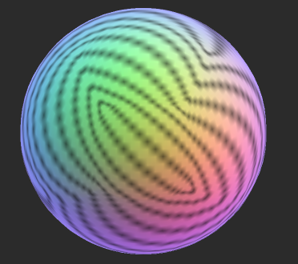

## Cubemaps
A **Cubemap** is a collection of six square textures that represent the **reflections on an environment**. 

The six squares form the faces of an imaginary cube that surrounds an object; each face represents the view along the directions of the world axes (up, down, left, right, forward and back).

> Cubemaps are often used to capture **reflections** or **"surroundings"** of objects

for example: **skyboxes** and **environment reflections** often use **cubemaps**.


### Creating Cubemaps from Textures
The fastest way to create cubemaps is to import them from specially laid out **Textures**.

Select the **Texture** in the Project window, to see the Import Settings in the Inspector window. In the Import Settings, set the Texture Type to **Default**, **Normal Map** or **Single Channel**, and the **Texture Shape** to **Cube**. Unity then automatically sets the Texture up as a **Cubemap**.


Selecting **Glossy Reflection** option is useful for cubemap textures that will be used by **Reflection Probes**. It processed **cubemap mip levels** in a special way (specular convolution) that can be used to simulate reflections from surfaces of different **smoothness**:


### Cubemap arrays
A **cubemap array** is an array of cubemaps that are the **same size and format**, and that the GPU can access as a single texture resource. Cubemap arrays are often used for implementing efficient **reflection probe**, **lighting and** **shadowing systems**.

In your Unity Project, the Unity Editor represents cubemap arrays as Texture Assets.To configure a Texture Asset’s import settings you can use the **Inspector**, or write a script that uses the **`TextureImporter** API. In the Unity engine, Unity uses the **CubemapArray** class to represent **cubemap arrays**.


### Creating a cubemap array

To create a **cubemap array** in your Project, you must use a **script**.

The following example is an Editor script that creates an instance of the CubemapArray class, populates it with color data, and then saves it to your Project as a Texture Asset.

```cs
using UnityEngine;
public class CreateCubeArrayTexture : MonoBehaviour
{
    [UnityEditor.MenuItem("CreateExamples/CubemapArray")]
    static void CreateCubemapArray()
    {
        // Configure the cubemap array and color data
        int faceSize = 16;
        int arraySize = 4;
        int[] kCubeXRemap = new int[] { 2, 2, 0, 0, 0, 0 };
        int[] kCubeYRemap = new int[] { 1, 1, 2, 2, 1, 1 };
        int[] kCubeZRemap = new int[] { 0, 0, 1, 1, 2, 2 };
        float[] kCubeXSign = new float[] { -1.0F, 1.0F, 1.0F, 1.0F, 1.0F, -1.0F };
        float[] kCubeYSign = new float[] { -1.0F, -1.0F, 1.0F, -1.0F, -1.0F, -1.0F };
        float[] kCubeZSign = new float[] { 1.0F, -1.0F, 1.0F, -1.0F, 1.0F, -1.0F };
        var baseCols = new Color[] { Color.white, new Color(1, .5f, .5f, 1), new Color(.5f, 1, .5f, 1), new Color(.5f, .5f, 1, 1), Color.gray };
        
        // Create an instance of CubemapArray
        var tex = new CubemapArray(faceSize, arraySize, TextureFormat.ARGB32, true);
        tex.filterMode = FilterMode.Trilinear;
        
        // Iterate over each cubemap
        var col = new Color[tex.width * tex.width];
        float invSize = 1.0f / tex.width;
        for (var i = 0; i < tex.cubemapCount; ++i)
        {
            var baseCol = baseCols[i % baseCols.Length];

            // Iterate over each face of the current cubemap
            for (var face = 0; face < 6; ++face)
            {
                var idx = 0;
                Vector3 signScale = new Vector3(kCubeXSign[face], kCubeYSign[face], kCubeZSign[face]);
                
                // Iterate over each pixel of the current face
                for (int y = 0; y < tex.width; ++y)
                {
                    for (int x = 0; x < tex.width; ++x)
                    {
                        // Calculate a "normal direction" color for the current pixel
                        Vector3 uvDir = new Vector3(x * invSize * 2.0f - 1.0f, y * invSize * 2.0f - 1.0f, 1.0f);
                        uvDir = uvDir.normalized;
                        uvDir.Scale(signScale);
                        Vector3 dir = Vector3.zero;
                        dir[kCubeXRemap[face]] = uvDir[0];
                        dir[kCubeYRemap[face]] = uvDir[1];
                        dir[kCubeZRemap[face]] = uvDir[2];

                        // Shift the color into the 0.4..1.0 range
                        Color c = new Color(dir.x * 0.3f + 0.7f, dir.y * 0.3f + 0.7f, dir.z * 0.3f + 0.7f, 1.0f);
                        
                        // Add a pattern to some pixels, so that mipmaps are more clearly visible
                        if (((x ^ y) & 3) == 1)
                            c *= 0.5f;
                        
                        // Tint the color with the baseCol tint
                        col[idx] = baseCol * c;
                        ++idx;
                    }
                }

                // Copy the color values for this face to the texture
                tex.SetPixels(col, (CubemapFace)face, i);
            }
        }

        // Apply the changes to the texture and upload the updated texture to the GPU
        tex.Apply();        

        // Save the texture to your Unity Project
        AssetDatabase.CreateAsset(tex, "Assets/ExampleCubemapArray.asset");
        UnityEditor.AssetDatabase.SaveAssets();
    }
}
```

### Previewing a cubemap array

To preview a cubemap array in the Inspector window, navigate to the Project window
 and select the Texture Asset. The Texture import settings for this Texture Asset are now visible in the Inspector, and Unity renders a preview of the cubemap array at the bottom of the Inspector.


### Using a cubemap array in a shader
```cs
Shader "CubemapArrayShaderExample" {
Properties {
    _MainTex ("CubemapArray", CubeArray) = "" {}
    _Mip ("Mip", Float) = 0.0
    _Intensity ("Intensity", Float) = 1.0
    _SliceIndex ("Slice", Int) = 0
    _Exposure ("Exposure", Float) = 0.0
}

SubShader {
    Tags {"Queue"="Transparent" "IgnoreProjector"="True" "RenderType"="Transparent" "ForceSupported" = "True"}

    Pass {

        CGPROGRAM
        #pragma vertex vert
            #pragma fragment frag
            #pragma require sampleLOD
            #pragma require cubearray
            #include "UnityCG.cginc"
    
    
    
            struct appdata {
                float4 pos : POSITION;
                float3 nor : NORMAL;
            };
    
            struct v2f {
                float3 uv : TEXCOORD0;
                float4 pos : SV_POSITION;
            };
    
            uniform int _SliceIndex;
            float _Mip;
            half _Alpha;
            half _Intensity;
            float _Exposure;
    
           v2f vert (appdata v) {
                v2f o;
                o.pos = UnityObjectToClipPos(v.pos);
                float3 viewDir = -normalize(ObjSpaceViewDir(v.pos));
                o.uv = reflect(viewDir, v.nor);
                return o;
            }
    
            half4 _MainTex_HDR;
            UNITY_DECLARE_TEXCUBEARRAY(_MainTex);
            fixed4 frag (v2f i) : COLOR0
            {
                fixed4 c = UNITY_SAMPLE_TEXCUBEARRAY(_MainTex, float4(i.uv, _SliceIndex));
                fixed4 cmip = UNITY_SAMPLE_TEXCUBEARRAY_LOD(_MainTex, float4(i.uv, _SliceIndex), _Mip);
                if (_Mip >= 0.0)
                    c = cmip;
                c.rgb = DecodeHDR (c, _MainTex_HDR) * _Intensity;
                c.rgb *= exp2(_Exposure);
                c = lerp (c, c.aaaa, _Alpha);
                return c;
            }
            ENDCG
        }
    }
    Fallback Off
}

```
If you use this shader with the Cubemap Array created in the example at the top of the page, the result looks like this:




### ref
https://docs.unity3d.com/Manual/class-Cubemap.html

https://docs.unity3d.com/Manual/class-CubemapArray.html
