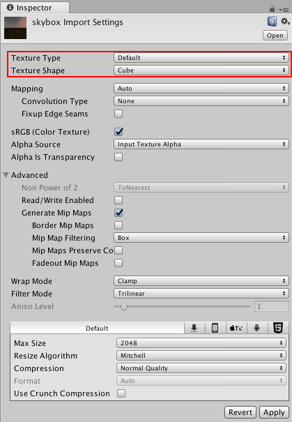
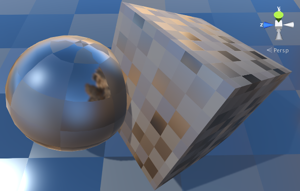

## Cubemaps
A **Cubemap** is a collection of six square textures that represent the **reflections on an environment**. 

The six squares form the faces of an imaginary cube that surrounds an object; each face represents the view along the directions of the world axes (up, down, left, right, forward and back).

> Cubemaps are often used to capture **reflections** or **"surroundings"** of objects

for example: **skyboxes** and **environment reflections** often use **cubemaps**.

### Creating Cubemaps from Textures
The fastest way to create cubemaps is to import them from specially laid out **Textures**.

Select the **Texture** in the Project window, to see the Import Settings in the Inspector window. In the Import Settings, set the Texture Type to **Default**, **Normal Map** or **Single Channel**, and the **Texture Shape** to **Cube**. Unity then automatically sets the Texture up as a **Cubemap**.

Selecting **Glossy Reflection** option is useful for cubemap textures that will be used by **Reflection Probes**. It processed **cubemap mip levels** in a special way (specular convolution) that can be used to simulate reflections from surfaces of different **smoothness**:

### ref
https://docs.unity3d.com/Manual/class-Cubemap.html
