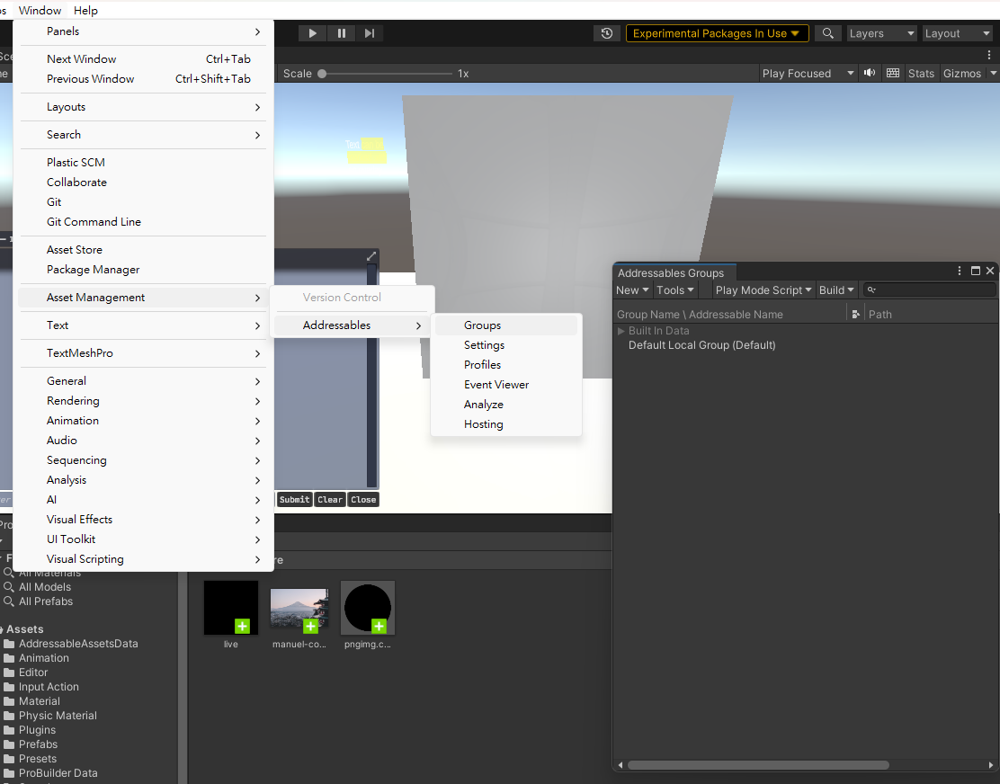
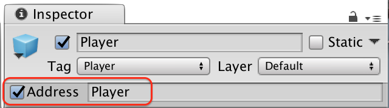

## Addressables
Mainly used in assets.

What is dynamic asset management?

Dynamic asset management systems help you improve the performance of your game by allowing you to determine when, and from where, assets are loaded in and out of memory during runtime. 
Throughout the Unity engine’s history there have been several ways to manage assets in memory. The Addressables system was designed to replace or improve upon legacy systems that have either been deprecated or are inadequate for a project that has progressed beyond a basic prototype.


The **Addressable Asset System** allows the developer to **ask for** an **asset** **via its address**. Once an asset (e.g. a prefab) is marked **"addressable"**, it **generates an address which can be called from anywhere**. 

Useful for **downloadable content (DLC)**, **reducing initial install size**, **loading assets optimized** for the end-user’s platform, and **reduce runtime memory pressure**.

Wherever the asset resides (**local or remote**), the system will **locate it and its dependencies**, then **return it**.

Use **Window > Asset Management > Addressables** to begin working with the system.

> **Addressable Assets** are assets that have a **unique address** which you can use to **load them from local or remote AssetBundles**.

Unity's Addressables system is a **dynamic asset management solution** that provides your users with only the assets they need, when they need them. It allows you to organize your on-demand assets from inside the Unity Editor while you're developing your game, and its runtime API lets you load and unload assets dynamically while users are playing your game.


### Concepts

-   **Address** - Identifies an Asset for easy run-time retrieval.
-   **AddressableAssetData directory** - Stores your addressable Asset metadata in your Project’s Assets directory.
-   **Asset Group** - Denotes a set of addressable Assets available for build-time processing.
-   **Asset Group Schema** - Defines a set of data that can be assigned to a group and used during the build.
-   **AssetReference** - An object that operates like a direct reference, but with deferred initialization (for example, for lazy loading). The `AssetReference` stores the GUID as an addressable that you can load on-demand.
-   **Asynchronous Loading** - allows the location of the Asset and dependencies (for example, local, remote and generated) to change throughout the course of your development without changing the game code. Async Loading is foundational to the Addressable Asset System.
-   **Build Script** - runs Asset Group Processors to package Assets and provides the mapping between Addresses and Resource Locations for the Resource Manager.
-   **Label** - provides an additional addressable Asset identifier for run-time loading of similar items. For example: `Addressables.DownloadDependenciesAsync("spaceHazards");`


    
### Install Addressables
To install the Addressables package in your project, use the Package Manager:

1.  Open the Package Manager (menu: **Window > Package Manager**).
2.  Set the package list to display packages from the **Unity Registry**.
3.  Select the **Addressables package** in the list.
4.  Click **Install** (at the bottom, right-hand side of the Package Manager window).

To set up the Addressables system in your Project after installation, open the **Addressables Groups** window and click **Create Addressables Settings**.




### Make an asset Addressable

You can make an asset Addressable in the following ways:

-   Enable the **Addressable** property in the asset's **Inspector** window.
    
-   Assign the asset to an **AssetReference field** in the **Inspector** window.
-   Drag the asset into a group on the **Addressables Groups window**.
-   In the Project window, **move the asset into a folder** that's marked as **Addressable**.

> Once you make an asset **Addressable**, the **Addressables system** adds it to a **default gr**oup, unless you place it in a specific group. **Addressables packs assets in a group into AssetBundles** according to your group settings when you make a content build. \
> You can **load these assets** using the **`Addressables` API**.


https://docs.unity3d.com/Packages/com.unity.addressables@1.21/manual/get-started-make-addressable.html


###  Addressables Groups window
To manage your groups and Addressables assets, open the Addressables Groups window by going to **Window >Asset Management > Addressables > Groups**. Refer to **Addressables Groups window** for details about the features of this window.

To create a group:

1.  Go to **Window** > **Asset Management** > **Addressables** and select **Groups** to open the Addressables Groups window.
2.  Select **New** > **Packed Asset** to create a new group. If you've created your own group templates, they are also displayed in the menu.
3. Context click the new group and select Rename to rename the group.
4. Open the context menu again and select Inspect Group Settings.
5. Adjust the group settings as desired.

#### Add assets to a group

Use one of the following methods to add an asset to a group:

-   Drag the assets from the Project window into the Group window and drop them into the desired group.
-   Drag the assets from one group into another.
-   Select the asset to open it in the Inspector window and enable the **Addressables** option. This adds the asset to the default group. Use the group context menu to change which group is the default group.
-   Add the folder containing the assets to a group. All assets added to the folder are included in the group.

#### Remove assets from a group
Select one or more assets in the Groups window and right-click to open the context menu, then select Remove Addressables. You can also select the assets and press the Delete key to remove the assets from the group.

#### Label

You can tag your Addressable assets with one or more labels in the Addressables Groups window. Labels have a few uses in the Addressables system, including:

-   You can use one or more labels as keys to identify which assets to load at runtime.
-   You can pack assets in a group into AssetBundles based on their assigned labels.
-   You can use labels in the filter box of the Groups window to help find labeled assets

When you load assets using a list of labels, you can specify whether you want to load all assets that have any label in the list or only assets that have every label in the list.

For example, if you used the labels, **`characters`** and **`animals`** to load assets, you could choose to load the union of those two sets of assets, which includes all characters and all animals, or the intersection of those two sets, which includes only characters that are animals. Refer to Loading multiple assets for more information.

When you choose to pack assets in a group based on their assigned labels using the group **Bundle Mode setting**, the Addressables build script creates a bundle for each unique combination of labels in the group.

For example, if you have assets in a group that you have labeled as either **`cat`** or **`dog`** and either **`small`** or **`large`**, the build produces four bundles: one for small cats, one for small dogs, one for large cats, and another for large dogs.


https://docs.unity3d.com/Packages/com.unity.addressables@2.1/manual/Labels.html

#### Add or remove labels
Select one or more assets in the Groups window, then select the label field for one of the selected assets.

To assign labels, enable or disable the checkboxes for the desired labels.

To add, remove or rename your labels, select the + button, then select Manage Labels. To only add a new label, select the + button and then select New Label. Refer to Labels for more information on how to use labels.


#### Building your game

Addressables needs to build your content into files that can be consumed by the running game before you build the player. This step is not done automatically. You can build this content via the UI or API.

1.  UI a. Open the **Addressables** window. b. Select **Build->Build Player Content**
2.  API a. **`AddressableAssetSettings.BuildPlayerContent()`**


### Use Addressables at runtime

To load and use an Addressable asset, you can:

- Use an **AssetReference** that references the asset
- Use its **address string**
- Use a **label** assigned to the asset

> Loading Addressable assets uses asynchronous operations. Refer to Operations for information about the different ways to approach asynchronous programming in Unity scripts.

https://docs.unity3d.com/Packages/com.unity.addressables@1.21/manual/use-addresssables-introduction.html#load-by-address

### Loading or instantiating by address

You can load or instantiate an Asset at run-time. Loading an Asset loads all dependencies into memory (including Asset bundle data if relevant). This allows you to use the Asset when you need to. Instantiating loads the Asset, and then immediately adds it to the scene.

To access an Asset in script using a string address:

`Addressables.LoadAssetAsync<GameObject>("AssetAddress");`

or

`Addressables.InstantiateAsync("AssetAddress");`

`LoadAssetAsync` and `InstantiateAsync` are asynch operations. You may provide a callback to work with the asset once it is loaded. 

Eg:

```cs
  GameObject myGameObject;


        ...
        Addressables.LoadAssetAsync<GameObject>("AssetAddress").Completed += OnLoadDone;
    }

    private void OnLoadDone(UnityEngine.ResourceManagement.AsyncOperations.AsyncOperationHandle<GameObject> obj)
    {
        // In a production environment, you should add exception handling to catch scenarios such as a null result;
        myGameObject = obj.Result;
    }

```

```cs
void Update()
{
    if(Input.GetKeyDown(KeyCode.T))
    {
      AsyncOperationHandle<GameObject> asyncOperationHandle =
          Addressables.LoadAssetAsync<GameObject>("AssetAddress");

      asyncOperationHandle.Completed += AsyncOperationHandle_Completed;
    }
}


void AsyncOperationHandle_Completed(AsyncOperationHandle<GameObject> asyncOperationHandle)
{
  if(asyncOperationHandle.Status == AsyncOperationStatus.Succeeded)
  {
    Instantiate(asyncOperationHandle.Result);
  } else
    {
       Debug.Log("failed to load");
    }

}

```

with an address as the key:

```cs
using System.Collections;
using UnityEngine;
using UnityEngine.AddressableAssets;
using UnityEngine.ResourceManagement.AsyncOperations;

internal class LoadAddress : MonoBehaviour
{
    public string key;
    AsyncOperationHandle<GameObject> opHandle;

    public IEnumerator Start()
    {
        opHandle = Addressables.LoadAssetAsync<GameObject>(key);
        yield return opHandle;

        if (opHandle.Status == AsyncOperationStatus.Succeeded)
        {
            GameObject obj = opHandle.Result;
            Instantiate(obj, transform);
        }
    }

    void OnDestroy()
    {
        Addressables.Release(opHandle);
    }
}

```

#### Load multiple assets

Use the **`LoadAssetsAsync`** method to load more than one Addressable asset in a single operation. When using this method, you can specify a single key, such as a label, or a list of keys.

When you specify multiple keys, you can specify a **merge mode** to set how the assets that match each key are combined:

-   `Union`: Include assets that match any key
-   `Intersection`: Include assets that match every key
-   `UseFirst`: Include assets only from the first key that resolves to a valid location


```cs
using System.Collections;
using System.Collections.Generic;
using UnityEngine;
using UnityEngine.AddressableAssets;
using UnityEngine.ResourceManagement.AsyncOperations;

internal class LoadMultiple : MonoBehaviour
{
    // Label strings to load
    public List<string> keys = new List<string>() {"characters", "animals"};

    // Operation handle used to load and release assets
    AsyncOperationHandle<IList<GameObject>> loadHandle;

    // Load Addressables by Label
    public IEnumerator Start()
    {
        float x = 0, z = 0;
        loadHandle = Addressables.LoadAssetsAsync<GameObject>(
            keys,
            addressable =>
            {
                //Gets called for every loaded asset
                Instantiate<GameObject>(addressable,
                    new Vector3(x++ * 2.0f, 0, z * 2.0f),
                    Quaternion.identity,
                    transform);

                if (x > 9)
                {
                    x = 0;
                    z++;
                }
            }, Addressables.MergeMode.Union, // How to combine multiple labels 
            false); // Whether to fail and release if any asset fails to load

        yield return loadHandle;
    }

    private void OnDestroy()
    {
        Addressables.Release(loadHandle);
        // Release all the loaded assets associated with loadHandle
        // Note that if you do not make loaded addressables a child of this object,
        // then you will need to devise another way of releasing the handle when
        // all the individual addressables are destroyed.
    }
}
```

To specify how to handle loading errors, use the **`releaseDependenciesOnFailure`** parameter. If **`true`**, then the operation fails if it encounters an error loading any single asset. The operation and any assets that loaded are released.

If **`false`**, then the operation loads any objects that it can and doesn't release the operation. If it fails, the operation still completes with a status of **`Failed`**. Also, the list of assets returned has null values where the failed assets would otherwise appear.

Set **`releaseDependenciesOnFailure`** to true when loading a group of assets that must be loaded as a set to be used. For example, if you load the assets for a game level, you might fail the operation as a whole rather than load only some of the required assets.


https://docs.unity3d.com/Packages/com.unity.addressables@2.1/manual/load-assets.html

### Loading assets by using the AssetReference Class

The **`AssetReference`** class provides a mechanism to access Assets without the need to know string (or other) addresses.

To access an Addressable Asset using the **AssetReference** class:

1.  Select an Asset.
2.  In the Inspector, click the **Add Component** button and then select the component type.
3.  Add a public `AssetReference` object in the component. For example: `public AssetReference explosion;`
4.  In the Inspector, set which Asset the object is linked to by either dragging an Asset from the Project window onto the entry or clicking the entry to choose from previously defined addressable Assets

   
#### Loading an Addressable Asset by object reference

To load an `AssetReference`, call one of the methods defined on it. For example:

`AssetRefMember.LoadAssetAsync<GameObject>();`

or

`AssetRefMember.InstantiateAsync(pos, rot);`

`LoadAssetAsync` and `InstantiateAsync` are asynch operations. You may provide a callback to work with the asset once it is loaded.

```cs
using UnityEngine.AddressableAssets;
using UnityEngine.ResourceManagement.AsyncOperations;

internal class LoadFromReference : MonoBehaviour
{
    // Assign in Editor
    public AssetReference reference;

    // Start the load operation on start
    void Start()
    {
        AsyncOperationHandle handle = reference.LoadAssetAsync<GameObject>();
        handle.Completed += Handle_Completed;
    }

    // Instantiate the loaded prefab on complete
    private void Handle_Completed(AsyncOperationHandle obj)
    {
        if (obj.Status == AsyncOperationStatus.Succeeded)
        {
            Instantiate(reference.Asset, transform);
        }
        else
        {
            Debug.LogError("AssetReference failed to load.");
        }
    }

    // Release asset when parent object is destroyed
    private void OnDestroy()
    {
        reference.ReleaseAsset();
    }
}

```

### Load by label
You can load sets of assets that have the same label in one operation:

```cs
using System.Collections.Generic;
using UnityEngine;
using UnityEngine.AddressableAssets;
using UnityEngine.ResourceManagement.AsyncOperations;

internal class LoadWithLabels : MonoBehaviour
{
    // Label strings to load
    public List<string> keys = new List<string>() {"characters", "animals"};

    // Operation handle used to load and release assets
    AsyncOperationHandle<IList<GameObject>> loadHandle;

    // Load Addressables by Label
    void Start()
    {
        float x = 0, z = 0;
        loadHandle = Addressables.LoadAssetsAsync<GameObject>(
            keys, // Either a single key or a List of keys 
            addressable =>
            {
                //Gets called for every loaded asset
                if (addressable != null)
                {
                    Instantiate<GameObject>(addressable,
                        new Vector3(x++ * 2.0f, 0, z * 2.0f),
                        Quaternion.identity,
                        transform);
                    if (x > 9)
                    {
                        x = 0;
                        z++;
                    }
                }
            }, Addressables.MergeMode.Union, // How to combine multiple labels 
            false); // Whether to fail if any asset fails to load
        loadHandle.Completed += LoadHandle_Completed;
    }

    private void LoadHandle_Completed(AsyncOperationHandle<IList<GameObject>> operation)
    {
        if (operation.Status != AsyncOperationStatus.Succeeded)
            Debug.LogWarning("Some assets did not load.");
    }

    private void OnDestroy()
    {
        // Release all the loaded assets associated with loadHandle
        Addressables.Release(loadHandle);
    }
}
```

https://docs.unity3d.com/Packages/com.unity.addressables@1.21/manual/use-addresssables-introduction.html#load-by-address

### `AsyncOperationHandle`
The `AsyncOperationHandle` struct is returned from several methods in the Addressables API. The main purpose of the `AsyncOperationHandle` is to allow access to the status and result of an operation. The result of the operation will be vaild until you call `Addressables.Release` or `Addressables.ReleaseInstance` with the operation.

When the operation completes, the `AsyncOperationHandle.Status` will be either `AsyncOperationStatus.Succeeded` or `AsyncOperationStatus.Failed`. If successful, you can access the result through the `AsyncOperationHandle.Result` property.

You can periodically check the status of the operation or register for a completed callback using the `AsyncOperationHandle.Complete` event.

When you no longer need the resource provided by an AsyncOperationHandle return through the Addressables API, you should release through the `Addressables.Release` method.

**Typed vs Typeless**:

Most of the Addressables API will return a generic `AsyncOperationHandle<T>`. This allows type safety for the `AsyncOperationHandle.Completed` event and for the `AsyncOperationHandle.Result`. There is also a non-generic `AsyncOperationHandle`. You can convert between the generic and non-generic handles. You will get a runtime exception if you attempt to cast a non-generic handle to a generic handle of an incorrect type. Below is an example of this conversion.

```cs
AsyncOperationHandle<Texture2D> textureHandle = Addressables.LoadAssetAsync<Texture2D>("mytexture");

// Convert the AsyncOperationHandle<Texture2D> to an AsyncOperationHandle
AsyncOperationHandle nonGenericHandle = textureHandle;

// Convert the AsyncOperationHandle to an AsyncOperationHandle<Texture2D>
AsyncOperationHandle<Texture2D> textureHandle2 = nonGenericHandle.Convert<Texture2D>();

// The exact type is required. This will throw and exception because Texture2D is required
AsyncOperationHandle<Texture> textureHandle3 = nonGenericHandle.Convert<Texture>();
```
**`AsyncOperationHandle`** Usage Examples: \
You can register for a completion event on `AsyncOperationHandle.Completed`:

```cs
private void TextureHandle_Completed(AsyncOperationHandle<Texture2D> handle)
{
    if (handle.Status == AsyncOperationStatus.Succeeded)
    {
        Texture2D result = handle.Result;
        // Texture ready for use
    }
}

void Start()
{
    AsyncOperationHandle<Texture2D> textureHandle = Addressables.LoadAsset<Texture2D>("mytexture");
    textureHandle.Completed += TextureHandle_Completed;
}
```

**`AsyncOperationHandle`** implements IEnumerator so it can be yielded in coroutines:

```cs
public IEnumerator Start()
{
    AsyncOperationHandle<Texture2D> handle = Addressables.LoadAssetAsync<Texture2D>("mytexture");
    yield return handle;
    if (handle.Status == AsyncOperationStatus.Succeeded)
    {
        Texture2D texture = handle.Result;
        // Texture ready for use...

        // Done. Release resource
        Addressables.Release(handle);
    }
}
```

Async await is also supported through the **`AsyncOperationHandle.Task`** property.

```cs
public async Start()
{
    AsyncOperationHandle<Texture2D> handle = Addressables.LoadAssetAsync<Texture2D>("mytexture");
    await handle.Task;
    // Task has completed. Be sure to check the Status has succeeded before getting the Result
}

```

https://docs.unity3d.com/Packages/com.unity.addressables@0.8/manual/AddressableAssetsAsyncOperationHandle.html

### Load a scene
https://docs.unity3d.com/Packages/com.unity.addressables@2.1/manual/LoadingScenes.html

### Load assets by location
https://docs.unity3d.com/Packages/com.unity.addressables@2.1/manual/load-assets-location.html

### Load AssetBundles
https://docs.unity3d.com/Packages/com.unity.addressables@2.1/manual/LoadingAssetBundles.html

### Load content from multiple projects

If you're working with **multiple projects**, such as a **large project broken up across multiple Unity projects**, you can use **`Addressables.LoadContentCatalogAsync`** to **link together code and content** across the various projects.

#### Set up multiple projects

To create a multi-project setup make sure of the following:

-   Each project uses the same version of the Unity Editor
-   Each project uses the same version of the Addressables package

Projects can contain whatever assets and code you need for your given situation. One of your projects must be your main or source project. This is the project that you'll build and deploy your game binaries from. Typically, this source project is comprised of code and little to no content. The main piece of content in the primary project is a bootstrap scene at minimum. You might want to include any scenes that need to be local for performance purposes before any AssetBundles have had a chance to be downloaded and cached.

Secondary projects are the opposit and contain content and little to no code. These projects need to have all remote Addressable Groups and Build Remote Catalog enabled. Any local data built into these projects can't be loaded in your source project's application. Non-critical scenes can live in these projects and be downloaded by the primary project when requested.

#### Work with multiple project

Once you have your projects setup, the workflow generally is as follows:

1.  Build remote content for all secondary projects
2.  Build Addressables content for source project
3.  Start the source project's Play mode or build the source project's binaries
4.  In source project, use **`Addressables.LoadContentCatalogAsync`** to load the remote catalogs of your other various projects
5.  Proceed with game runtime as normal. Now that the catalogs are loaded, Addressables can load assets from any of these locations.

It might be worth having a minimal amount of content built locally in the source project. Each project is unique, and has unique needs, but having a small set of content needed to run your game in the event of internet connection issues or other various problems is advisable.

https://docs.unity3d.com/Packages/com.unity.addressables@2.0/manual/MultiProject.html

### Remote content
https://docs.unity3d.com/Packages/com.unity.addressables@2.1/manual/RemoteContentDistribution.html


#### Cloud Content Delivery + Addressable Workthrough
https://www.youtube.com/watch?v=5IvPPI7YnwU


### ref
https://docs.unity3d.com/Packages/com.unity.addressables@1.21/manual/index.html \
https://docs.unity3d.com/Packages/com.unity.addressables@0.8/manual/index.html

**Use Addressables at runtime** \
https://docs.unity3d.com/Packages/com.unity.addressables@2.1/manual/RuntimeAddressables.html

**Loading Addressable assets** \
https://docs.unity3d.com/Packages/com.unity.addressables@2.1/manual/LoadingAddressableAssets.html

**`Addressable` API** \
https://docs.unity3d.com/Packages/com.unity.addressables@2.1/api/UnityEngine.AddressableAssets.html \

**`AsyncOperationHandle`** \
https://docs.unity3d.com/Packages/com.unity.addressables@0.8/manual/AddressableAssetsAsyncOperationHandle.html \
**`AsyncOperationHandle` API** \
https://docs.unity3d.com/Packages/com.unity.addressables@2.1/api/UnityEngine.ResourceManagement.AsyncOperations.AsyncOperationHandle.html \
https://docs.unity3d.com/Packages/com.unity.addressables@2.1/api/UnityEngine.ResourceManagement.AsyncOperations.AsyncOperationHandle-1.html


**Tutorial** \
https://learn.unity.com/course/get-started-with-addressables \
https://www.youtube.com/watch?v=5IvPPI7YnwU \
https://www.youtube.com/watch?v=0USXRC9f4Iw \
https://www.youtube.com/watch?v=cl_2icxKCyQ \
https://www.youtube.com/watch?v=dKYuyKoKU14 \
https://www.youtube.com/watch?v=C6i_JiRoIfk \
https://www.youtube.com/watch?v=wEuFAA-Ktwc

**Example how to use Addressable:** \
https://www.youtube.com/watch?v=bCObS3teFGM \
NodeJS + Addressable
https://www.youtube.com/watch?v=dfSws1QQmKo \
https://z0935323866.medium.com/unity-%E5%B0%8B%E5%9D%80%E5%BC%8F%E8%B3%87%E6%BA%90%E7%AE%A1%E7%90%86%E7%B3%BB%E7%B5%B1addressable-assets-system-%E4%B8%80-bb1e99014a88 \
https://z0935323866.medium.com/unity-%E5%B0%8B%E5%9D%80%E5%BC%8F%E8%B3%87%E6%BA%90%E7%AE%A1%E7%90%86%E7%B3%BB%E7%B5%B1addressable-assets-system-%E4%BA%8C-eb0e302fd4db \
https://azzipstar.pixnet.net/blog/post/120149247-unity-addressable-%E6%95%99%E5%AD%B8 

