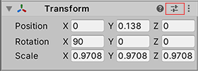
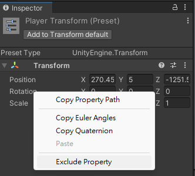
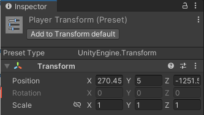

## Presets
**Presets** to apply **custom default settings for types of assets.**

Presets are assets that you can use to save and apply identical property settings across multiple components, assets, or Project Settings windows. You can also use Presets to specify default settings for new components and default import settings for assets in the Preset Manager The Preset Manager supports any importers, components, or scriptable objects you add to the Unity Editor.

### Saving and applying Presets

Presets allow you to **save the property configuration of a component, asset, or Project Settings window as a Preset asset**. You can then use this **Preset asset** to **apply the same settings** to a **different component, asset, or Project Settings window**.

**For example**, you could edit the properties of a **Rigidbody component**, **save these settings to a Preset asset**, then **apply that Preset asset to Rigidbody components** in other GameObjects
. The other components in the GameObjects are not affected; the Preset only applies its settings to the Rigidbody component.

> You can **store Presets in the Assets folder of your project** (You may create a Preset folder to store all the Presets). Use the Project window to view and select Presets to edit in the Inspector.

### Saving property settings to a Preset
To save property settings to a **Preset asset**, follow the instructions below. You can save property settings while in **Edit mo**de or in **Play mod**e.

1.  Select the GameObject, Asset import settings, or Project Settings window from which you want to reuse settings. When you select it, it appears in the **Inspector** window.
2.  In the **Inspector** window, configure the properties as you want to save them. 
3.  Click the Preset selector (the slider icon) at the top-right of the **Inspector** window.
     
4. In the Select Preset window, click **"Save current to"**.
5. Choose the location of your new Preset, enter its name, and **click Save**.

### Applying settings from a Preset

There are two ways to **apply a Preset**: the **Select Preset window**, or **for component Presets**, you can also **drag and drop a Preset from the Project window onto the GameObject that contains that component**.

To apply a Preset via the Select Preset window:

1. For GameObjects or assets you want to apply a Preset to, select them so that they appear in the Inspector window. For Project Settings that you want to apply a Preset to, open them in the Project Settings window.
2. In the Inspector, click the **Preset selector** (the **slider icon**).
3. In the Select Preset window, **search for and select the Preset to apply**. Unity applies this Preset to the component, asset, or Project Settings window.
4. Close the **Select Preset** window.

If you apply a component Preset via drag-and-drop, Unity’s behavior depends on the state of your GameObject:

-   If you drop the Preset on an existing GameObject in the Hierarchy window, Unity adds a new component and copies properties from the Preset.
-   If you drop the Preset on an empty area in the Hierarchy window, Unity creates a new, empty GameObject and adds a component with properties copied from the Preset.
-   If you drop the Preset on the Inspector window onto the title of an existing component, Unity copies properties from the Preset.
-   If you drop the Preset on an empty area in the Inspector window, Unity adds a new component and copies properties from the Preset.

#### Applying partial Presets

You can choose to only apply some properties from a Preset and exclude others. To do this:

1. Select your Preset in the **Project** window.
2. In the **Inspector**, right-click a property and choose **Exclude Property**. The window displays a red horizontal line next to excluded properties.
3. You can also include the property again by same step.
4. **Apply the Preset** to the target component, asset, or Project settings.

> **Note:** To select all or clear all checkboxes in a Preset, select the **More items** menu (**⋮**) or right-click the Preset name, and select **Include all properties** or **Exclude all properties**. You can still adjust individual properties if you need to.

### Supporting presets

In your Editor scripts, use the `ObjectFactory` class to create **new GameObjects
, components and Assets**. When creating these items, the `ObjectFactory` class **automatically uses default Presets**. Your script does not have to search for and apply default Presets, because `ObjectFactory` handles this for you.

#### Support for new types
To support and enable Presets by default, your class must inherit from one of the following:

- `UnityEngine.Monobehaviour`
- `UnityEngine.ScriptableObject`
- `UnityEngine.ScriptedImporter`

The Preset Inspector creates a temporary instance of your class, so that users can modify its values, so make sure your class does not affect or rely on other objects such as static values, Project Assets or Scene instances.

 

### ref
https://docs.unity3d.com/Manual/Presets.html \
https://docs.unity3d.com/2021.3/Documentation/Manual/SupportingPresets.html \
https://docs.unity3d.com/2021.3/Documentation/Manual/DefaultPresetsByFolder.html

**`ObjectFactory`** \
https://docs.unity3d.com/2021.3/Documentation/ScriptReference/ObjectFactory.html

