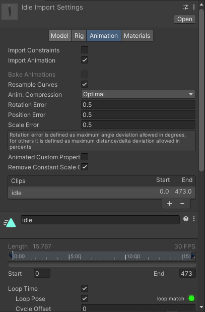
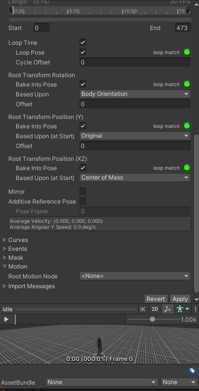

## Animation tab

### Asset-specific properties

- **Import Constraints**: \
  Import constraintsfrom this asset.
- **Import Animation**: \
  Import animation from this asset. 
  > **_Note:_** If disabled, all other options on this page are hidden and no animation is imported.
- **Bake Animations**: \
  Bake animations created using IK or Simulation to forward kinematic keyframes. \
  Only available for Autodesk® Maya®, Autodesk® 3ds Max® and Cinema 4D files.
- **Resample Curves**: \
  Resample animation curves as Quaternion values and generate a new Quaternion keyframe for every frame in the animation. \
  This option only appears if the import file contains Euler curves. This option is enabled by default. \
  Disable this option to keep animation curves as they were originally authored. You should only disable this option if there are interpolation issues in the resampled animation when compared with your original animation.
- **Anim. Compression**: \
  The type of compression to use when importing the animation.
  - **Off**: \
    Disable animation compression. This means that Unity doesn’t reduce keyframe count on import. Disabling animation compression leads to the highest precision animations, but slower performance and bigger file and runtime memory size. It is generally not advisable to use this option - if you need higher precision animation, you should enable keyframe reduction and lower allowed Animation Compression Error values instead.
  - **Keyframe Reduction**: \
    Reduce redundant keyframes on import. If enabled, the Inspector displays Animation Compression Errors options. This affects both file size (runtime memory) and how curves are evaluated. \
    Applies to Legacy, Generic, and Humanoid Animation Type rigs.
  - **Keyframe Reduction and Compression**: \
    Reduce keyframes on import and compress keyframes when storing animations in files. This affects only file size: the runtime memory size is the same as Keyframe Reduction. If enabled, the Inspector displays Animation Compression Errors options. \
    Only for Legacy Animation Type rigs.
  - **Optimal**: \
    Let Unity decide how to compress, either by keyframe reduction or by using dense format. If enabled, the Inspector displays Animation Compression Errors options. \
    Only for Generic and Humanoid Animation Type rigs.
- **Animation Compression Errors**: \
  Only available when **Keyframe Reduction** or **Optimal** compression is enabled.
  - **Rotation Error**: \
    Set the error tolerance (as an angle in degrees) for rotation curve compression. Unity uses this to determine whether or not it can remove a key on a rotation curve. \
    This represents the minimum angle between the original rotation value and the reduced value:  `Angle(value, reduced) < RotationError`
  - **Position Error**: \
    Set the error tolerance (as a percentage) for position curve compression. Unity uses this to determine whether or not it can remove a key on a position curve. For more information, see Setting error tolerance for key reduction on position and scale curves.
  - **Scale Error**: \
    Set the error tolerance (as a percentage) for scale curve compression. Unity uses this to determine whether or not it can remove a key on a scale curve. For more information, see Setting error tolerance for key reduction on position and scale curves.
- **Animated Custom Properties**: \
  Import any FBX properties that you designated as custom user properties. \
  Unity only supports a small subset of properties when importing FBX files (such as translation, rotation, scale and visibility). However, you can treat standard FBX properties like user properties by naming them in your importer script via the extraUserProperties member. During import, Unity then passes any named properties to the Asset postprocessor just like ‘real’ user properties.

### ref 
https://docs.unity3d.com/Manual/class-AnimationClip.html

