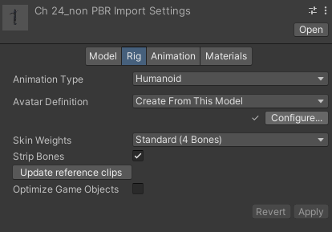
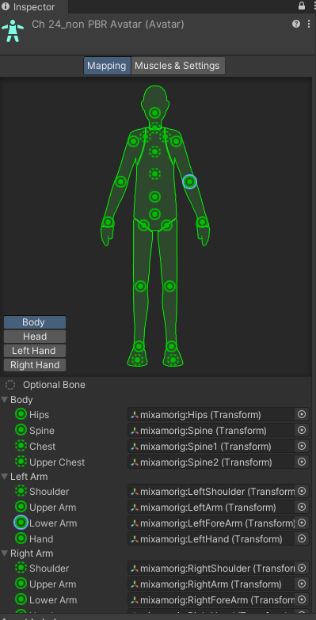

## Create Avatar

Since the Avatar is such an important aspect of the animation system, it is important to configure it properly for your Model.

For this reason, whether or not the automatic Avatar creation succeeds, you should always check that your Avatar is valid and properly set up.

When you create an Avatar in the **Rig** tab, you can configure the Avatar.

If the model does not yield a valid match, you can use a similar process to the one that Unity uses internally:
1. Choose Clear from the Mapping menu at the bottom of the Avatar window to reset any mapping that Unity attempted.
2. Choose Sample Bind-pose from the Pose menu at the bottom of the Avatar window to approximate the Model’s initial modeling pose.
3. Choose **Mapping > Automap** to create a bone-mapping from an initial pose.
4. Choose **Pose > Enforce** T-Pose to set the Model back to to required T-pose.

If automapping fails completely or partially, you can manually assign bones by either dragging them from the Scene
 view or from the Hierarchy view. If Unity thinks a bone fits, it appears in green in the Avatar Mapping tab; otherwise it appears in red.

The **T-pose** is the default pose required by Unity animation and is the recommended pose to model in your 3D modeling application. However, if you did not use the T-pose to model your character and the animation does not work as expected, you can select Reset from the Pose drop-down menu.

If the bone assignment is correct, but the character is not in the correct pose, you will see the message "**Character not in T-Pose**". You can try to fix that by choosing **Enforce T-Pose** from the Pose menu. If the pose is still not correct, you can manually rotate the remaining bones into a T-pose.

### Creating an Avatar Mask
Masking allows you to discard some of the animation data within a clip, allowing the clip to animate only parts of the object or character rather than the entire thing.

https://youtu.be/E8VJ7wm1mcA

https://docs.unity3d.com/Manual/ConfiguringtheAvatar.html
