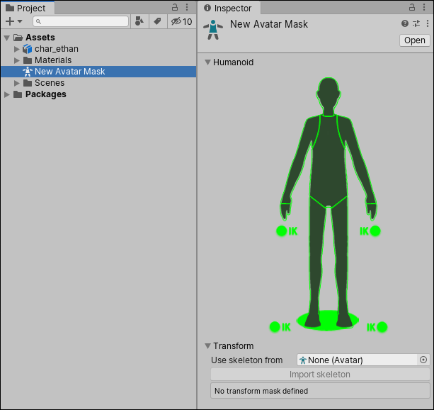

## Create Avatar

Since the Avatar is such an important aspect of the animation system, it is important to configure it properly for your Model.

For this reason, whether or not the automatic Avatar creation succeeds, you should always check that your Avatar is valid and properly set up.

When you create an Avatar in the **Rig** tab, you can configure the Avatar.

If the model does not yield a valid match, you can use a similar process to the one that Unity uses internally:
1. Choose Clear from the Mapping menu at the bottom of the Avatar window to reset any mapping that Unity attempted.
2. Choose Sample Bind-pose from the Pose menu at the bottom of the Avatar window to approximate the Model’s initial modeling pose.
3. Choose **Mapping > Automap** to create a bone-mapping from an initial pose.
4. Choose **Pose > Enforce** T-Pose to set the Model back to to required T-pose.

If automapping fails completely or partially, you can manually assign bones by either dragging them from the Scene
 view or from the Hierarchy view. If Unity thinks a bone fits, it appears in green in the Avatar Mapping tab; otherwise it appears in red.

The **T-pose** is the default pose required by Unity animation and is the recommended pose to model in your 3D modeling application. However, if you did not use the T-pose to model your character and the animation does not work as expected, you can select Reset from the Pose drop-down menu.

If the bone assignment is correct, but the character is not in the correct pose, you will see the message "**Character not in T-Pose**". You can try to fix that by choosing **Enforce T-Pose** from the Pose menu. If the pose is still not correct, you can manually rotate the remaining bones into a T-pose.

https://docs.unity3d.com/Manual/ConfiguringtheAvatar.html

### Creating an Avatar Mask
Masking allows you to discard some of the animation data within a clip, **allowing the clip to animate only parts of the object** or character rather than the entire thing.

Using avatar masks is to reduce memory overheads since body parts that are not active do not need their associated animation curves. Also, the unused curves need not be calculated during playback which will tend to reduce the CPU overhead of the animation.

You can apply masking to animation clips either during 
- **import time**, or 
- at **runtime**

Masking during **import time** is preferable, because it allows the discarded animation data to be omitted from your build, making the files smaller and therefore using less memory. It also makes for faster processing because there is less animation data to be blended at runtime.

In some cases, import masking may not be suitable for your purposes. In that case, you can apply a mask at runtime by creating an **Avatar Mask Asset**, and using it in the **layer** settings of your Animator Controller.

To create an empty Avatar Mask Asset, you can either:

- Choose **Create > Avatar Mask** from the **Assets** menu.
- Click the Model object you want to define the mask on in the **Project view**, and then right-click and choose **Create > Avatar Mask**.

https://youtu.be/1dMoRECcstQ

https://youtu.be/E8VJ7wm1mcA

https://www.youtube.com/watch?v=NiCcXaFaKoY

https://docs.unity3d.com/Manual/class-AvatarMask.html

> Mask assets can be used in Animator Controllers, when specifying Animation Layers to apply masking at runtime, or in the import settings of of your animation files to apply masking during to the import animation.

### Avatar Mask window
Two ways to define which parts of your animation should be masked:
1. By selecting from a **Humanoid body** map.
2. By choosing which bones to include or exclude from a **Transform hierarchy**.

#### Humanoid body 
If your animation uses a Humanoid Avatar, you can select or deselect portions of the simplified humanoid body diagram to indicate where to mask the animation

To allow the body parts to be animated in the clip(**Green color**). \
To exclude the body parts to be animated in the clip(**Red color**).

You can also toggle Inverse Kinematics__ (IK)__ for hands and feet, which determines whether or not to include IK curves in animation blending.

#### Transform hierarchy
If your animation does not use a Humanoid Avatar, or if you want more detailed control over which individual bones are masked, you can select or deselect portions of the Model’s transform hierarchy:

1. Assign a reference to the Avatar whose transform you would like to mask.
2. Click the Import Skeleton button. The hierarchy of the avatar appears in the inspector.
3. You can check each bone in the hierarchy to use as your mask

