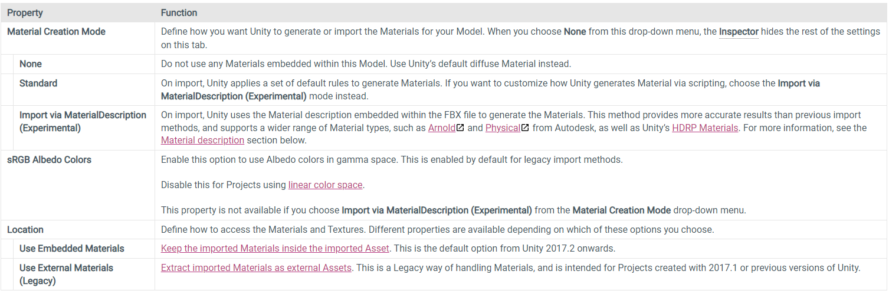

### Materials
The Materials tab defines how Unity imports Materials and Textures.
You can use this tab to change how Unity deals with Materials and Textures when importing your model.

When Unity imports a Model without any Material assigned, it uses the Unity diffuse Material. If the Model has Materials, Unity imports them as sub-Assets.

The Materials tab defines how Unity imports Materials and Textures

> Click the **Extract Materials** and **Extract Textures** buttons to extract all Materials and Textures that are embedded in your imported Asset. These are greyed out if there are no sub-Assets to extract. Below these buttons, Unity displays any messages about the import process.

> If your Model has Textures, you can also extract them into your Project using the Extract Textures button.

The On Demand Remap section provides the Naming and Search properties which allow you to customize how Unity maps imported Materials to the Model. Click the Search and Remap button to remap your imported Materials to existing Material Assets. Nothing changes if Unity can’t find any Materials with the correct name.

Unity displays all imported Materials found in the Asset in the Remapped Materials list. If Unity can’t automatically match each Material to an existing Material Asset in your Project, you can set references to the Materials yourself in this list.

### Remapped Materials
New imports or changes to the original Asset do not affect extracted Materials. If you want to re-import the Materials from the source Asset, you need to remove the references to the extracted Materials in the Remapped Materials list. To remove an item from the list, select it and press the Backspace key on your keyboard.

#### Naming 
Define a naming strategy for the Materials.
| Property | Function |
| --- | --- |
| By Base Texture Name | Use the name of the diffuse Texture of the imported Material to name the Material. When you don’t assign a diffuse Texture to the Material, Unity uses the name of the imported Material. |
| From Model’s Material | Use the name of the imported Material to name the Material. |
| Model Name + Model’s Material | Use the name of the Model file in combination with the name of the imported Material to name the Material. |

https://docs.unity3d.com/Manual/FBXImporter-Materials.html

