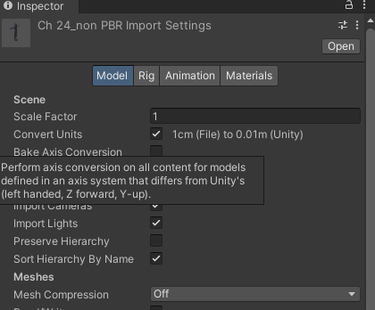

## Importing a model

Model files can contain a variety of data, such as meshes, animation rigs and clips, materials and textures.

### Tabs
- **Model** \
  A 3D Model can represent a character, a building, or a piece of furniture. In these cases, Unity creates multiple Assets from a single model file. In the Project window, the main imported object is a model Prefab. Usually there are also several Mesh objects that the model Prefab references.
  
- **Rig** \
  A Rig(sometimes called a skeleton) comprises a set of deformers arranged in a hierarchy that animate a Mesh (sometimes called skin) on one or more models created in a 3D modeling application such as as Autodesk® 3ds Max® or Autodesk® Maya®. For Humanoid and Generic (non-humanoid) Models, Unity creates an Avatar to reconcile the imported Rig with the Unity GameObject.
  
- **Animation** \
  You can define any series of different poses occurring over a set of frames, such as walking, running, or even idling (shifting from one foot to the other) as an Animation Clip. You can reuse clips for any Model that has an identical Rig. Often a single file contains several different actions, each of which you can define as a specific Animation Clip.
  
- **Materials** \
  You can extract Materials and Textures or leave them embedded within the model. You can also adjust how Material is mapped in the Model.

