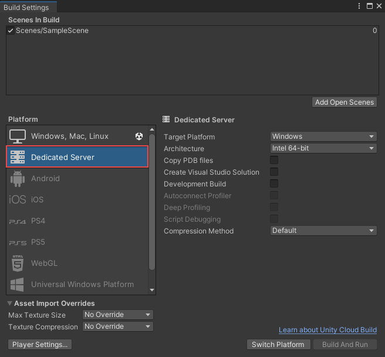

## Build & publish

### Reduce project complexity and size
- Only **store assets/code in your repository**
- **Split your assets/code into smaller units**, and put them in multiple Git or Nuget packages
- **Export the terrain and maps**, along with the necessary textures, to your final project.
- You have a huge library of textures and vegetation models and materials.
- you **only export those to your level builder project** (which may be separated from your prototype mechanics project, and so on).

In a large project, use AssetBundles and DLLs. Make one or more code projects that compile to DLL(s) in your main project. Similarly, make any number of art projects that generate AssetBundles in your main project.

This way you can make your main project as small as a single "boot" scene with some DLLs and AssetBundles.

https://forum.unity.com/threads/how-do-you-organize-your-project-to-reduce-its-complexity-and-size.526687/

### Reducing the file size of your build

#### Suggestions for reducing build size

**Textures** 
Textures usually take up the most space in the build. The first solution to this is to use compressed Texture formats. 

If that doesn’t reduce the file size enough, try to reduce the physical size (in pixels) of the Texture images. To do this without modifying the actual source content, select the Texture in the Project view, and in the Inspector window reduce the Max Size. 


 
**Meshes and Animations** 

You can compress Meshes and imported Animation Clips so that they take up less space in your game file. To enable Mesh compression, select the Mesh, then in the Inspector window set the Mesh Compression to Low, Medium or High. Mesh and Animation compression uses quantization, which means it takes less space, but the compression can introduce some inaccuracies. Experiment with what level of compression is acceptable for your models.

> Note that Mesh compression only produces smaller data files, and does not use less memory at run time. Animation keyframe reduction produces smaller data files and uses less memory at run time; generally you should always have it enabled. See documentation on Animation Clips for more information about this.


**Reducing .NET library size** 

Unity supports two .NET API compatibility levels.: .NET 4.x and .NET Standard 2.0. The .NET Standard 2.0 restricts you to a smaller subset of the .NET API, which can help keep size down.


https://docs.unity3d.com/Manual/ReducingFilesize.html

### Managing scenes in a build
When you build your application, Unity builds all selected scenes in the **Scenes In Build** pane. Unity builds scenes in the order in which they appear in the list.

You can add, exclude, remove, and reorder scenes in the list:

-   **To add all currently open scenes to the list**: Select **Add Open Scenes**. You can also drag scenes from your **Project** window into the list.
-   **To exclude a scene in the list from the build**: Clear the checkbox next to that scene. This removes the scene from the build, but not from the list.
-   **To remove a scene from the list**: Select the scene and press **Delete**.
-   **To adjust the scene order**: Drag and drop scenes in the list to reorder them.

Unity produces two build types:

-   A **release** build, which includes only what’s necessary to run the application. This is the default build type.
-   A **development** build, which includes scripting debug symbols and the **Profiler**. Selecting the development build option enables an additional set of options, such as **deep profiling support** and **script debugging**


### Change scene order
With the **smallest number**, the **scene will be defult display** during the game. You can **change the ordering of scenes** in your project:

-   Go to **`File > Build Settings`**
-   Find the `Scenes in Build` section - this will contain all of the scenes in your project that have been added to the build.
-   Next to each listed scene, you should see a number which indicates its build index which is the order in which the scene will appear in the build. 
    > Note that after 0 (the first scene), this **doesn't really matter** as you'll likely have a controller script in your game that handles scene **switching** for the lifespan of the process.
-   Find the scene you want to **move and drag and drop it to the desired index**.


### Excluding certain assets or objects from a Unity build

Excluding certain assets or objects from a Unity build can be done in several ways depending on your needs. Here are the methods to achieve it:

####  Mark Assets as **`Editor Only`**
For Objects in Scenes: \
    -   Add the **`EditorOnly`** **tag** to GameObjects you don't want included in the build.
        -   Select the GameObject in the hierarchy.
        -   Assign it the **EditorOnly** tag from the **Tag** dropdown.
    -   Unity automatically excludes GameObjects with this tag during the build process.
 
#### Use Asset Bundles

-   Asset bundles allow you to package and exclude specific assets from the initial build.
    -   Create and assign assets to an Asset Bundle using the **Asset Bundle Browser**.
    -   Build the Asset Bundles separately.
    -   Load them at runtime as needed, excluding them from the main build.

#### Use Addressable Assets

-   Unity's Addressable Asset System manages assets dynamically.
    -   Mark assets as Addressable in the **Inspector**.
    -   Addressable assets are not included in the build by default.
    -   They can be downloaded or loaded from a remote location or a local cache as needed.

#### Conditional Compilation

-   Use `#if UNITY_EDITOR` preprocessor directives to exclude code or references to specific assets during a build:

    ```cs
      #if UNITY_EDITOR
          Debug.Log("This code runs in the Editor only.");
      #endif
    ```
    
#### Exclude Resources Folder

-   Assets in the **Resources** folder are always included in the build.
    -   To exclude them:
        -   Move unnecessary assets out of the `Resources` folder into another directory.
        -   Dynamically load assets using `AssetBundles` or `Addressables`.
     
#### Use Build Exclusion Tools

-   Third-party tools like **Build Report Inspector** can show you what assets are included in your build.
-   You can manually remove unwanted assets based on the report.


#### Script-Driven Asset Exclusion

-   Create a custom build pipeline using Unity's `BuildPipeline.BuildPlayer`:
    -   Use scripts to programmatically exclude assets from a build:
        ```cs
          AssetDatabase.DeleteAsset("Assets/Path/To/UnwantedAsset.asset");
        ```

#### Disable Unnecessary Scenes
-   In **Build Settings**, only include the scenes you need in the build:
    -   Go to **File > Build Settings**.
    -   Uncheck scenes that you don’t want in the build.
 
#### Use Asset Stripping

-   Unity can strip unused assets during a build:
    -   Enable **Code Stripping** in **Project Settings > Player > Other Settings > Managed Stripping Level**.
    -   Use **Addressables** or code references to prevent accidental exclusion of needed assets.

#### Manually Remove Unwanted Assets

-   For assets that may still end up in the build (e.g., materials, textures, or audio files):
    -   Manually verify references using the **Editor Log**:
        -   After building, open the Editor Log to find a list of included assets.
        -   Remove unwanted assets or replace them with placeholders.

#### Build-Specific Assets (Using ScriptableObjects)

-   Create a **ScriptableObject** to manage assets that should be included in different builds:
    -   Define build profiles and load the appropriate assets dynamically.
 


### Platform list
Each build **must have a target platform**. The Platform pane lists all the platforms you can build for.

Each version of Unity installed on your computer has its own platform list.

If the platform you need is not on the list, do one of the following:

-   In the **Build Settings** window:
    
    1.  Select the platform you want to add.
    2.  Select **Install** or **Download**.
-   In **Unity Hub** > **Installs**:
    
    1.  Select the three dots on the version of Unity you’re using.
    2.  Select **Add Modules**.
    3.  Follow the instructions to install the platform module.

To change the build’s target platform:

1.  Select the platform you want to switch to.  
    **Tip**: The list displays the Unity icon next to the platform currently selected as the target platform.
2.  Select **Switch Platforms**.  
    If Unity needs to re-import your assets in formats that match your target platform, the switch process can take a long time.


### Build settings
When you select a platform, Unity displays a list of options that you can adjust for the build. Some settings apply to all platforms, and some are platform-specific.


The following settings apply to all platforms.

| Setting: | Function: |
| --- | --- |
| Development Build | Include scripting debug symbols and the Profiler in your build. You should use this setting when you want to test your application.When you select this option, Unity sets the DEVELOPMENT_BUILD scripting define. Your build then includes preprocessor directives that set DEVELOPMENT_BUILD as a condition (see Platform-dependent compilations). |
| Autoconnect Profiler | Automatically connect the Unity Profiler to your build.This option is only available if you selected Development Build. |
| Deep Profiling Support | Turn on Deep Profiling in the Profiler. This makes the Profiler instrument every function call in your application so it returns more detailed profiling data. This option might slow down script execution.This option is only available if you selected Development Build. |
| Script Debugging | Allow your script code to be debugged.This option is only available if you selected Development Build.This option is not available for WebGL. |
| Wait for Managed Debugger | Make the Player wait for a debugger to be attached before it executes any script code.This option is only available if you selected Script Debugging. |

https://docs.unity3d.com/Manual/BuildSettings.html

### Dedicated Server
Unity provides support for development of games and applications on the Dedicated Server platform. You can publish multiplayer games using Dedicated Server platform.

Dedicated Server refers to a computer that’s optimized to run server applications.

The Dedicated Server build target is a sub-target of the three Desktop Platforms (Linux, macOS, and Windows) that’s optimized for running as a dedicated server. Using Dedicated Server build target, you can cut back on your server builds’ CPU, memory, and disk space requirements.

Server builds often contain unnecessary assets and compiled code for headless server processes. The build data might include artifacts such as audio files, textures, meshes, and shaders
. In a multiplayer context, rendering and asset management processes occur unnecessarily when building and executing server runtimes.

The goal of the Dedicated Server build target is to reduce the resource demand of server builds, including the disk size, the size in memory, and the CPU usage. Most of the optimizations take place through stripping code and assets that aren’t necessary for a server build.



#### Build your application for Dedicated Server

To create a Dedicated Server build through the Unity Editor:

1.  From the Unity Editor, select **File** > **Build Settings**.
2.  Select **Dedicated Server**.


https://docs.unity3d.com/Manual/dedicated-server.html \
https://docs.unity3d.com/Manual/dedicated-server-get-started.html

### Build games for Nintendo Switch

https://unity.com/solutions/nintendo-switch 

https://developer.nintendo.com/register

### Remove Unity Splash Screen ("Made with Unity" logo)
https://moddingcommunity.com/topic/108-tutorial-a-complete-guide-to-remove-unity-splash-screen/

https://github.com/kiraio-moe/remove-unity-splash-screen

#### Customize and change your Unity splash screen in personal edition
https://www.youtube.com/watch?v=BY40xbA5qYQ

https://www.youtube.com/watch?v=05ymbWXdZ-8

### ref 
https://docs.unity3d.com/Manual/PublishingBuilds.html \
https://docs.unity3d.com/Manual/BuildSettings.html 

**Platform:** \
https://docs.unity3d.com/Manual/PlatformSpecific.html

**Publish Unity games on Steam:** \
https://medium.com/@yoonicode/publishing-unity-games-on-steam-the-ultimate-guide-5e09fc812c65 \
https://fungies.io/how-to-publish-your-game-on-steam/ \
https://www.youtube.com/watch?v=gwMPvEFFomE

**Publish your game on the Play Store:** \
https://wiki.gdevelop.io/gdevelop5/publishing/android/play-store/

**Publish Your Game on the Epic Games Store:** \
https://gdevelop.io/page/how-to-publish-game-on-epic-games-store-and-why-you-should \
https://dev.epicgames.com/docs/epic-games-store/publishing-tools/publishing-process/publishing-workflow \
https://store.epicgames.com/en-US/news/epic-games-store-launches-self-publishing-tools-for-game-developers-and-publishers \
https://www.unrealengine.com/en-US/blog/self-service-publishing-now-available-for-the-epic-games-store \
https://dev.epicgames.com/docs/epic-games-store/publishing-tools \
https://www.youtube.com/watch?v=dV8L5pto39k


