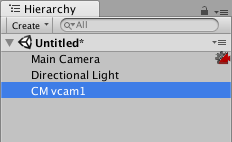

## Cinemachine

Cinemachine is a suite of modules for operating the Unity camera. Cinemachine solves the **complex mathematics and logic of tracking targets, composing, blending, and cutting between shots**.

Cinemachine enables you to create complex 3D camera setups, allowing movement and cuts between multiple cameras.

It allows you to iterate and prototype new ideas on the fly while saving settings in play mode. From first-person shooter to follow cam, from 2D to 3D, from real-time play to cutscene

> Use the Unity Package Manager (in the top menu: **Window > Package Manager**) to select Cinemachine for installation.


### Virtual Cameras

Cinemachine **does not create new cameras**. Instead, it **directs a single Unity camera for multiple shots**. You compose these shots with **Virtual Cameras**. Virtual Cameras move and rotate the Unity camera and control its settings.

The **Virtual Cameras are separate GameObjects from the Unity Camera, and behave independently**. They are not nested within each other.

The main tasks that the Virtual Camera does for you:

-   **Positions the Unity camera** in the Scene.
-   **Aims the Unity camera** at something.
-   **Adds procedural noise** to the Unity camera. Noise simulates things like handheld effects or vehicle shakes.

Cinemachine encourages you to create many Virtual Cameras. The Virtual Camera is designed to consume little processing power. If your Scene is performance-sensitive, deactivate all but the essential Virtual Cameras at any given moment for best performance.

It is recommended that you use a single Virtual Camera for a single shot. Take advantage of this to create dramatic or subtle cuts or blends. Examples:

-   For a cutscene where two characters exchange dialog, use three Virtual Cameras: one camera for a mid-shot of both characters, and separate Virtual Cameras for a close-up of each character. Use Timeline to synchronize audio with the Virtual Cameras.
    
-   Duplicate an existing Virtual Camera so that both Virtual Cameras are in the same position in the Scene. For the second Virtual Camera, change the FOV or composition. When a player enters a trigger volume, Cinemachine blends from the first to the second Virtual Camera to emphasize a change in action.
    

One Virtual Camera has control of the Unity camera at any point in time. This is the **live** Virtual Camera. The exception to this rule is when a blend occurs from one Virtual Camera to the next. During the blend, both Virtual Cameras are live.


### Cinemachine Brain

The Cinemachine Brain is a component in the Unity Camera itself. The Cinemachine Brain **monitors all active Virtual Cameras** in the Scene. 

To specify the next live Virtual Camera, you **activate or deactivate the desired Virtual Camera's game object**. Cinemachine Brain then **chooses the most recently activated Virtual Camera with the same or higher priority as the live Virtual Camera**.
我們可以藉由改變虛擬攝影機的優先順序以決定要使用哪個鏡頭.

It **chooses the next Virtual Camera to control the Unity camera**. It also **controls the cut** or **blend from the current Virtual Camera to the next**.

> **Tip**: Use Cinemachine Brain to respond to dynamic game events in real time. It allows your game logic to control the camera by manipulating priorities. This is particularly useful for live gameplay, where action isn’t always predictable. Use Timeline to choreograph cameras in predictable situations, like cutscenes. Timeline overrides the Cinemachine Brain priority system to give you precise, to-the-frame camera control.


### Moving and aiming
> Use the **Body properties** in a Virtual Camera to specify **how to move** it in the Scene. Use the **Aim properties** to specify **how to rotate** it.

A Virtual Camera has two targets:

- The **Follow** target specifies a GameObject for the Virtual Camera to move with.
- The **Look At** target specifies the GameObject to aim at.

Cinemachine includes a variety of procedural algorithms to control moving and aiming. Each algorithm solves a specific problem, and has properties to customize the algorithm for your specific needs. Cinemachine implements these algorithms as **`CinemachineComponent`** objects. Use the **`CinemachineComponent`** class to implement a custom moving or aiming behavior.

The **Body** properties offer the following procedural algorithms for moving the Virtual Camera in a Scene:

-   **Transposer**: Move in a fixed relationship to the **Follow** target, with optional damping.
-   **Do Nothing**: Do not move the Virtual Camera.
-   **Framing Transposer**: Move in a fixed screen-space relationship to the **Follow** target, with optional damping.
-   **Orbital Transposer**: Move in a variable relationship to the **Follow** target, optionally accepting player input.
-   **Tracked Dolly**: Move along a predefined path.
-   **Hard Lock to Target**: Use the same position at the **Follow** target.

The **Aim** properties offer the following procedural algorithms for rotating a Virtual Camera to face the **Look At** target:

-   **Composer**: Keep the **Look At** target in the camera frame, with compositional constraints.
-   **Group Composer**: Keep multiple **Look At** targets in the camera frame.
-   **Do Nothing**: Do not rotate the Virtual Camera.
-   **POV**: Rotate the Virtual Camera based on the user’s input.
-   **Same As Follow Target**: Set the camera’s rotation to the rotation of the **Follow** target.
-   **Hard Look At**: Keep the **Look At** target in the center of the camera frame.


### Setting up Virtual Cameras
In your project, organize your Scene Hierarchy to have a **single Unity camera** with a **CinemachineBrain component** and **many Virtual Cameras**.

To add a Virtual Camera to a Scene:

1.  In the Unity menu, choose **Cinemachine > Create Virtual Camera**.  
    Unity adds a new GameObject with a Cinemachine Virtual Camera component. If necessary, Unity also adds a Cinemachine Brain component to the Unity camera GameObject for you.
    
2.  Use the **Follow** property to specify a GameObject to follow.  
    
    The Virtual Camera automatically positions the Unity camera relative to this GameObject at all times, even as you move it in the Scene.
    
3.  Use the **Look At** property to specify the GameObject that the Virtual Camera should aim at.  
    
    The Virtual Camera automatically rotates the Unity camera to face this GameObject at all times, even as you move it in the Scene.
    
4.  Customize the Virtual Camera as needed.  
    
    Choose the algorithm for following and looking at, and adjust settings such as the follow offset, the follow damping, the screen composition, and the damping used when re-aiming the camera.


    

Use the **Aim**, **Body**, and **Noise** properties to specify how the Virtual Camera animates position, rotation, and other properties. The Virtual Camera applies these settings to the Unity Camera when **Cinemachine Brain** or **Timeline** transfers control of the Unity camera to the Virtual Camera.

At any time, each Virtual Camera may be in one of these states:

-   **Live**: The Virtual Camera actively controls a Unity camera that has a Cinemachine Brain. When a Cinemachine Brain blends from one Virtual Camera to the next, both Virtual Cameras are live. When the blend is complete, there is only one live Virtual Camera.
    
-   **Standby**: The Virtual Camera doesn’t control the Unity camera. However, it still follows and aims at its targets, and updates at every frame. A Virtual Camera in this state is activated and has a priority that is the same as or lower than the live Virtual Camera.
    
-   **Disabled**: The Virtual Camera doesn’t control the Unity camera and doesn’t actively follow or aim at its targets. A Virtual Camera in this state doesn’t consume processing power. To disable a Virtual Camera, deactivate its game object. The Virtual Camera is present but disabled in the Scene. However, even though the game object is deactivated, the virtual camera can still control the Unity camera if the virtual camera is participating in a blend, or if it is invoked by Timeline.


### Switching virtual camera

Setting priority value in virtual camera determine which virtual camera to be used. Therefore, to switch between these virtual cameras we can **adjust the priority value in these virtual cameras**. Another method is to **active or deactive the virtual cameras**. 


#### Adjust priority value

Eg:

```cs
using System.Collections;

using System.Collections.Generic;

using UnityEngine;

using Cinemachine;

public class CamSwitcher_SetPriority : MonoBehaviour

{

    public CinemachineVirtualCamera cam1, cam2;

    void Start()

    {

        cam1.m_Priority = 10;

        cam2.m_Priority = 0;

    }

    void Update()

    {

        if (Input.GetMouseButtonDown(0))

        {

            cam1.m_Priority = 10;

            cam2.m_Priority = 0;

        }

        else if (Input.GetMouseButtonDown(1))

        {

            cam1.m_Priority = 0;

            cam2.m_Priority = 10;

        }

    }

}

```

#### Active or deactive virtual cameras
You can either manually active/deactive the virtual camera in hierarchy or through script using **`setActive()`** method.


Eg:

```cs
using System.Collections;

using System.Collections.Generic;

using UnityEngine;

public class CamSwitcher_SetActive : MonoBehaviour

{

    public GameObject cam1, cam2;

    void Start()

    {

        cam1.SetActive(true);

        cam2.SetActive(false);

    }

    void Update()

    {

        if (Input.GetMouseButtonDown(0))

        {

            cam1.SetActive(true);

            cam2.SetActive(false);

        }

        else if (Input.GetMouseButtonDown(1))

        {

            cam1.SetActive(false);

            cam2.SetActive(true);

        }

    }

}
```

  
### Usage and tutorial
https://delightcollab.com/programming-tpl-cinemachine-tutorial-2022/


### ref
https://unity.com/unity/features/editor/art-and-design/cinemachine

https://docs.unity3d.com/Packages/com.unity.cinemachine@2.4/manual/index.html

https://docs.unity3d.com/Packages/com.unity.cinemachine@2.4/manual/CinemachineUsing.html

