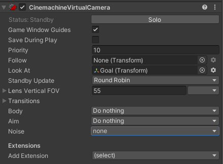
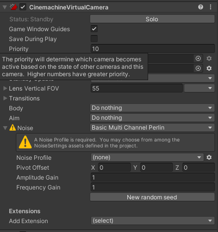
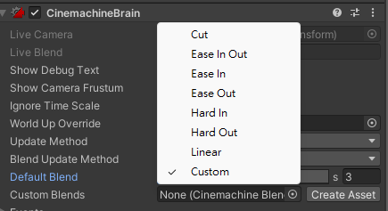
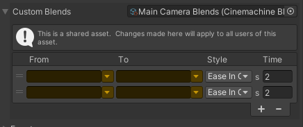
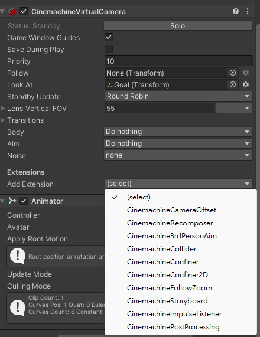

## Cinemachine

Cinemachine is **a suite of modules** for **operating & contorl the Unity camera**. 

Cinemachine solves the **complex mathematics and logic of tracking targets, composing, blending, and cutting between shots**.

Cinemachine enables you to create complex 3D camera setups, **allowing movem**ent and **cuts between multiple cameras**.

It allows you to iterate and prototype new ideas on the fly while saving settings in play mode. From first-person shooter to follow cam, from 2D to 3D, from real-time play to cutscene

> Use the Unity Package Manager (in the top menu: **Window > Package Manager**) to select Cinemachine for installation.


### Cinemachine Brain

The **Cinemachine Brain is a component** in the Unity Camera itself. The Cinemachine Brain **monitors all active Virtual Cameras** in the Scene. 

To specify the next live Virtual Camera, you **activate or deactivate the desired Virtual Camera's game object**. Cinemachine Brain then **chooses the most recently activated Virtual Camera with the same or higher priority as the live Virtual Camera**.
我們可以藉由改變虛擬攝影機的優先順序以決定要使用哪個鏡頭.

It **chooses the next Virtual Camera to control the Unity camera**. It also **controls the cut** or **blend from the current Virtual Camera to the next**.

> **Tip**: Use Cinemachine Brain to respond to dynamic game events in real time. It allows your game logic to control the camera by manipulating priorities. This is particularly useful for live gameplay, where action isn’t always predictable. Use Timeline to choreograph cameras in predictable situations, like cutscenes. Timeline overrides the Cinemachine Brain priority system to give you precise, to-the-frame camera control.

> Attach this **Cinemachine Brain Component to the Unity camera**.


| **Property:** |  | **Function:** |
| --- | --- | --- |
| **Show Debug Text** |  | Check to display a textual summary of the live CinemachineCamera and blend in the view. |
| **Show Camera Frustum** |  | Check to display the frustum of the camera in the Scene view. |
| **Ignore Time Scale** |  | Check to make the CinemachineCameras respond in real time to user input and damping, even if the game is running in slow motion. |
| **World Up Override** |  | The Y axis of the specified GameObject defines the worldspace up vector for CinemachineCameras. Use this property in top-down game environments. Set to None to use the worldspace Y axis. Setting this appropriately is important to avoid gimbal-lock in extreme up/down conditions. |
| **Channel Mask** |  | The CinemachineBrain will find the highest-priority CinemachineCamera that outputs to any of the channels selected. CinemachineCameras that do not output to one of these channels will be ignored. Normally, this value should be left at Default. Change it in situations where multiple CinemachineBrains are needed (for example, when implementing Split-screen). |
| **Update Method** |  | When to update the position and rotation of the CinemachineCameras. |
|  | _Fixed Update_ | Synchronize CinemachineCamera update with the Physics module, in FixedUpdate. |
|  | _Late Update_ | In MonoBehaviour LateUpdate. |
|  | _Smart Update_ | Update each CinemachineCamera according to how its target is updated. This is the recommended setting. |
|  | _Manual Update_ | CinemachineCameras do not update automatically. You must explicitly call `brain.ManualUpdate()` at an appropriate time in your game loop. This should be after any camera LookAt or Follow targets have moved. This is an advanced feature. |
| **Blend Update Method** |  | When to resolve the blends and update the main camera. |
|  | _Late Update_ | In MonoBehaviour LateUpdate. This is the recommended setting. |
|  | _Fixed Update_ | Use this setting only if your Update Method is FixedUpdate and you see judder when blending. |
| **Lens Mode Override** |  | When enabled, CM camras are permitted to override the camera's lens mode (Perspective vs Orthographic vs Physical). |
| **Default Mode** |  | When Lens Mode Override is enabled and there is no CinemachineCamera actively overriding the lens mode, this lens mode will be pushed to the camera. |
|  | _None_ | If Lens Override Mode is enabled and Default Mode is set to _None_, there will be no default mode pushed to the Camera when the CinemachineCamera is not overriding the lens mode. This setting is not recommended, because it can produce unpredictable results. It's always best to have a default mode. |
|  | _Orthographic_ | Sets the **Projection** property to **Orthographic**. |
|  | _Perspective_ | Sets the **Projection** property to **Perspective** and _disables_ the **Physical Camera** feature and properties. |
|  | _Physical_ | Sets the **Projection** property to **Perspective** and _enables_ the **Physical Camera** feature and properties. |
| **Default Blend** |  | The blend to use when you haven’t explicitly defined a blend between two CinemachineCameras. |
|  | _Cut_ | Zero-length blend. |
|  | _Ease In Out_ | S-shaped curve, giving a gentle and smooth transition. |
|  | _Ease In_ | Linear out of the outgoing shot, and easy into the incoming. |
|  | _Ease Out_ | Easy out of the outgoing shot, and linear into the incoming. |
|  | _Hard In_ | Easy out of the outgoing, and hard into the incoming. |
|  | _Hard Out_ | Hard out of the outgoing, and easy into the incoming. |
|  | _Linear_ | Linear blend. Mechanical-looking. |
|  | _Custom_ | Custom blend curve. Draw the curve you want. |
| **Custom Blends** |  | The asset that contains custom settings for blends between specific CinemachineCameras in your Scene. |
| **Create Asset** |  | Create an asset containing a list of custom blends between CinemachineCameras. |
| **Camera Cut Event** |  | This event fires when a CinemachineCamera goes live and there is no blend. |
| **Camera Activated Event** |  | This event fires when a CinemachineCamera goes live. If a blend is involved, then the event fires on the first frame of the blend. |

https://docs.unity3d.com/Packages/com.unity.cinemachine@3.0/manual/CinemachineBrain.html


### Virtual Cameras

Cinemachine **does not create new cameras**. Instead, it **directs a single Unity camera for multiple shots**. You compose these shots with **Virtual Cameras**. Virtual Cameras **move and rotate the Unity camera** and **control its settings**.

The **Virtual Cameras are separate GameObjects from the Unity Camera, and behave independently**. They are not nested within each other.

The main tasks that the Virtual Camera does for you:

-   **Positions the Unity camera** in the Scene.
-   **Aims the Unity camera** at something.
-   **Adds procedural noise** to the Unity camera. Noise simulates things like handheld effects or vehicle shakes.

Cinemachine encourages you to **create many Virtual Cameras**. The Virtual Camera is designed to consume little processing power. If your Scene is performance-sensitive, deactivate all but the essential Virtual Cameras at any given moment for best performance.

It is recommended that you use a **single Virtual Camera for a single shot**. Take advantage of this to **create dramatic or subtle cuts or blen**ds. Examples:

-   For a cutscene where two characters exchange dialog, use three Virtual Cameras: one camera for a mid-shot of both characters, and s**eparate Virtual Cameras for a close-up of each character**. Use **Timeline to synchronize audio with the Virtual Cameras**.
    
-   Duplicate an existing Virtual Camera so that both Virtual Cameras are in the same position in the Scene. For the second Virtual Camera, change the FOV or composition. When a player enters a trigger volume, Cinemachine blends from the first to the second Virtual Camera to emphasize a change in action.
    

**One Virtual Camera has control of the Unity camera at any point in time**. This is the **live** Virtual Camera. The exception to this rule is when a **blend occurs from one Virtual Camera to the next**. During the **blend**, **both Virtual Cameras are live**.




#### Moving and aiming
> Use the **Body properties** in a Virtual Camera to specify **how to move** it in the Scene. Use the **Aim properties** to specify **how to rotate** it.

A Virtual Camera has two targets:

- The **Follow** target specifies a GameObject for the Virtual Camera to move with.
- The **Look At** target specifies the GameObject to aim at.

> **Cinemachine** includes a **variety of procedural algorithms** to **control moving and aiming**. Each algorithm solves a specific problem, and has properties to **customize the algorithm** for your specific needs. Cinemachine implements these algorithms as **`CinemachineComponent`** objects. Use the **`CinemachineComponent`** class to implement a **custom moving or aiming behavior**.

The **Body** properties offer the following **procedural algorithms** for **moving the Virtual Camera** in a Scene:

-   **Transposer**: Move in a fixed relationship to the **Follow** target, with optional damping.
-   **Do Nothing**: Do not move the Virtual Camera.
-   **Framing Transposer**: Move in a fixed screen-space relationship to the **Follow** target, with optional damping.
-   **Orbital Transposer**: Move in a variable relationship to the **Follow** target, optionally accepting player input.
-   **Tracked Dolly**: Move along a predefined path.
-   **Hard Lock to Target**: Use the same position at the **Follow** target.

The **Aim** properties offer the following **procedural algorithms** for **rotating a Virtual Camera** to face the **Look At** target:

-   **Composer**: Keep the **Look At** target in the camera frame, with compositional constraints.
-   **Group Composer**: Keep multiple **Look At** targets in the camera frame.
-   **Do Nothing**: Do not rotate the Virtual Camera.
-   **POV**: Rotate the Virtual Camera based on the user’s input.
-   **Same As Follow Target**: Set the camera’s rotation to the rotation of the **Follow** target.
-   **Hard Look At**: Keep the **Look At** target in the center of the camera frame.

The **Noise** properties in a Virtual Camera to simulate **camera shake**.

Cinemachine includes a **Basic Multi Channel Perlin** component, which **adds Perlin noise to the movement of the Virtual Camera**. 

> **Perlin noise** is a **technique to compute random movement** with a **natural behavio**r.

The **Basic Multi Channel Perlin component** applies a **noise profile**. A **noise profile is an Asset that defines the behavior of noise over time**. 

**Cinemachine includes a few noise profile assets**. You can **edit these** and **create your own**.

To apply noise:

1.  **Select your Virtual Camera** in the Scene window.
    
2.  In the Inspector, use the **Noise** drop-down menu to choose **Basic Multi Channel Perlin**.
    
3.  In **Noise Profile**, choose an existing profile asset or create your own profile.
    
4.  Use **Amplitude Gain** and **Frequency Gain** to fine-tune the noise.




| **Property:** |  | **Function:** |
| --- | --- | --- |
| **Solo** |  | **Toggles whether or not the Virtual Camera is temporarily live**. Use this property to get immediate visual feedback in the Game view to adjust the Virtual Camera. |
| **Game Window Guides** |  | Toggles the visibility of compositional guides in the Game view. These guides are available when Look At specifies a GameObject and the Aim section uses Composer or Group Composer, or when Follow specifies a target and the Body section uses Framing Composer. This property applies to all Virtual Cameras. |
| **Save During Play** |  | Check to apply the changes while in Play mode. Use this feature to fine-tune a Virtual Camera without having to remember which properties to copy and paste. This property applies to all Virtual Cameras. |
| **Priority** |  | The importance of this Virtual Camera for choosing the next shot. A higher value indicates a higher priority. Cinemachine Brain chooses the next live Virtual Camera from all Virtual Cameras that are activated and have the same or higher priority as the current live Virtual Camera. This property has no effect when using a Virtual Camera with Timeline. |
| **Follow** |  | The target GameObject that the Virtual Camera moves with. The Body properties use this target to update the position of the Unity camera. Keep this property empty to make the Unity camera use the position of the Virtual Camera’ transform. For example, you might choose to animate the Virtual Camera in Timeline. |
| **Look At** |  | The target GameObject to aim the Unity camera at. The Aim properties use this target to update the rotation of the Unity camera. Keep this property empty to make the Unity camera use the orientation of the Virtual Camera. |
| **Standby Update** |  | Controls how often the virtual camera is updated when the virtual camera is not live. |
| **Position Blending** |  | Style for blending positions to and from this Virtual Camera. |
|  | _Linear_ | Standard linear position blend. |
|  | _Spherical_ | Spherical blend about the Look At position, if there is a Look At target. |
|  | _Cylindrical_ | Cylindrical blend about the Look At position, if there is a Look At target. Vertical coordinate is linearly interpolated. |
| **Lens** |  | These properties mirror their counterparts in the properties for the Unity camera. |
|  | _Field Of View_ | The camera view in vertical degrees. For example, to specify the equivalent of a 50mm lens on a Super 35 sensor, enter a Field of View of 19.6 degrees. This property is available when the Unity camera with the Cinemachine Brain component uses a Projection of Perspective. You can also use Scene Handles to modify this property. |
|  | _Presets_ | A drop-down menu of settings for commonly-used lenses. Choose **Edit Presets** to add or edit the asset that contains a default list of lenses. |
|  | _Orthographic Size_ | When using an orthographic camera, defines the half-height of the camera view, in world coordinates. Available when the Unity camera with the Cinemachine Brain component uses a Projection of Orthographic. |
|  | _Near Clip Plane_ | The closest point relative to the camera where drawing occurs. You can also use Scene Handles to modify this property. |
|  | _Far Clip Plane_ | The furthest point relative to the camera where drawing occurs. You can also use Scene Handles to modify this property. |
|  | _Dutch_ | Dutch angle. Tilts the Unity camera on the z-axis, in degrees. This property is unique to the Virtual Camera; there is no counterpart property in the Unity camera. |
| **Mode Override** |  | Allows you to select a different camera mode to apply to the Unity camera component when Cinemachine activates this Virtual Camera.  
**Important:** All the changes applied to the Camera component through this setting will remain after the Virtual Camera deactivation. If you set a mode override in any Virtual Camera, you should set one in all Virtual Cameras. |
|  | _None_ | Leaves the **Projection** and **Physical Camera** properties unchanged in the Camera. |
|  | _Orthographic_ | Sets the **Projection** property to **Orthographic**. |
|  | _Perspective_ | Sets the **Projection** property to **Perspective** and _disables_ the **Physical Camera** feature and properties. |
|  | _Physical_ | Sets the **Projection** property to **Perspective** and _enables_ the **Physical Camera** feature and properties. |
| **Blend Hint** |  | Provides hints for blending positions to and from the virtual camera. |
| **Inherit Position** |  | When enabled, whenever this virtual camera goes live, forces the initial position to be the same as the current position of the Unity Camera, if possible. |
| **Extensions** |  | Components that add extra behaviors to the Virtual Camera. |
|  | _Add Extension_ | Choose a new extension to add to the Virtual Camera. |


### Setting up Virtual Cameras
In your project, organize your Scene Hierarchy to have a **single Unity camera** with a **CinemachineBrain component** and **many Virtual Cameras**.

To add a Virtual Camera to a Scene:

1.  In the Unity menu, choose **Cinemachine > Create Virtual Camera**.  
    Unity **adds a new GameObject with a Cinemachine Virtual Camera component**. If necessary, Unity **also adds a Cinemachine Brain component to the Unity camera GameObject** for you.
    
2.  Use the **Follow** property to specify a GameObject to follow.  
    
    The Virtual Camera automatically positions the Unity camera relative to this GameObject at all times, even as you move it in the Scene.
    
3.  Use the **Look At** property to specify the GameObject that the Virtual Camera should aim at.  
    
    The Virtual Camera automatically rotates the Unity camera to face this GameObject at all times, even as you move it in the Scene.
    
4.  Customize the Virtual Camera as needed.  
    
    Choose the algorithm for following and looking at, and adjust settings such as the follow offset, the follow damping, the screen composition, and the damping used when re-aiming the camera.


    

> Use the **Aim**, **Body**, and **Noise** properties to specify how the Virtual Camera animates position, rotation, and other properties. The Virtual Camera applies these settings to the Unity Camera when **Cinemachine Brain** or **Timeline** transfers control of the Unity camera to the Virtual Camera.

At any time, each Virtual Camera may be in **one of these states**:

-   **Live**: \
    The Virtual Camera **actively controls a Unity camera that has a Cinemachine Brain**. When a **Cinemachine Brain blends from one Virtual Camera to the next**, **both Virtual Cameras are live**. When the **blend is complete**, there is **only one live Virtual Camera**.
    
-   **Standby**: \
    The Virtual Camera **doesn’t control the Unity camera**. However, it **still follows and aims at its targets**, and **updates at every frame**. A Virtual Camera in this state is **activated** and **has a priority that is the same as or lower than the live Virtual Camera**.
    
-   **Disabled**: \
    The Virtual Camera **doesn’t control the Unity camera** and **doesn’t actively follow** or **aim at its targets**. A Virtual Camera in this state **doesn’t consume processing power**. \
    To disable a Virtual Camera, **deactivate its game object**. The **Virtual Camera is present but disabled** in the Scene. However, even though the game object is **deactivated**, the virtual camera **can still control the Unity camera if the virtual camera is participating in a blend**, or if it is **invoked by Timeline**.


### Switching virtual camera

**Setting priority value in virtual camera** determine which virtual camera **to be used**. \
Therefore, to switch between these virtual cameras we can **adjust the priority value in these virtual cameras**. 

> Another method is to **active or deactive the virtual cameras**. 


#### Adjust priority value

Using **`Unity.Cinemachine.CinemachineVirtualCameraBase`** class, setting the **priority value**.

Eg:

```cs
using System.Collections;

using System.Collections.Generic;

using UnityEngine;

using Cinemachine;

public class CamSwitcher_SetPriority : MonoBehaviour

{

    public CinemachineVirtualCamera cam1, cam2;

    void Start()

    {

        cam1.Priority = 10;

        cam2.Priority = 0;

    }

    void Update()

    {

        if (Input.GetMouseButtonDown(0))

        {

            cam1.Priority = 10;

            cam2.Priority = 0;

        }

        else if (Input.GetMouseButtonDown(1))

        {

            cam1.Priority = 0;

            cam2.Priority = 10;

        }

    }

}

```

#### Active or deactive virtual cameras
You can either manually active/deactive the virtual camera in hierarchy or through script using **`setActive()`** method.


Eg:

```cs
using System.Collections;

using System.Collections.Generic;

using UnityEngine;

public class CamSwitcher_SetActive : MonoBehaviour

{

    public GameObject cam1, cam2;

    void Start()

    {

        cam1.SetActive(true);

        cam2.SetActive(false);

    }

    void Update()

    {

        if (Input.GetMouseButtonDown(0))

        {

            cam1.SetActive(true);

            cam2.SetActive(false);

        }

        else if (Input.GetMouseButtonDown(1))

        {

            cam1.SetActive(false);

            cam2.SetActive(true);

        }

    }

}
```

### Blending between Virtual Cameras
Use blending properties to specify **how the Cinemachine Brain component performs a blend between virtual cameras**.

A Cinemachine blend is not a fade, wipe, or dissolve. Rather, Cinemachine Brain **performs a smooth animation of the position, rotation, and other settings of the Unity camera from one Virtual Camera to the next**.

For blends between specific Virtual Cameras, use the **Custom Blends** list in the Cinemachine Brain component. Use the **Default Blend** property in Cinemachine Brain to specify blends between Virtual Cameras that do not have custom blends.

The **From** and **To** settings are name-based, not references. This means that Cinemachine finds cameras by matching their names to the settings. They are not linked to specific GameObjects. The built-in dropdowns can be used to select a CinemachineCamera from the current scene, or the name can be typed directly into the text boxes. If a name does not match any CinemachineCamera in the current scene, the field will be highlighted in yellow.

Use the reserved name **\*\*ANY CAMERA\*\*** to blend from or to any CinemachineCamera.

When Cinemachine begins a transition from one CinemachineCamera to another, it will look in this asset for an entry that matches the upcoming transition, and apply that blend definition.

-   If none is found, then the CinemachineBrain's DefaultBlend setting will apply.
-   If multiple entries in the Custom Blends asset match the upcoming transition, Cinemachine will choose the one with the strongest specificity. For example, if blending from vcam1 to vcam2, and the custom blends asset contains an entry for _vcam1-to-AnyCamera_, and another entry for _vcam1-to-vcam2_, then the _vcam1-to-vcam2_ entry will apply.
-   If multiple entries in the Custom Blends asset match the upcoming transition with equally-strong specificity, then the first one found will apply.
  

**Default blend:** 



**Custom Blend:** 





| **Property:** |  | **Function:** |
| --- | --- | --- |
| **From** |  | The name of the CinemachineCamera to blend from. Use the name \*\*ANY CAMERA\*\* to blend from any CinemachineCamera. This property is available only for custom blends. |
| **To** |  | The name of the CinemachineCamera to blend to. Use the name \*\*ANY CAMERA\*\* to blend to any CinemachineCamera. This property is available only for custom blends. |
| **Style Default Blend** |  | Shape of the blend curve. |
|  | _Cut_ | Zero-length blend. |
|  | _Ease In Out_ | S-shaped curve, giving a gentle and smooth transition. |
|  | _Ease In_ | Linear out of the outgoing CinemachineCamera, and ease into the incoming CinemachineCamera. |
|  | _Ease Out_ | Ease out of the outgoing CinemachineCamera, and blend linearly into the incoming CinemachineCamera. |
|  | _Hard In_ | Ease out of the outgoing CinemachineCamera, and accelerate into the incoming CinemachineCamera. |
|  | _Hard Out_ | Accelerate out of the outgoing CinemachineCamera, and ease into the incoming CinemachineCamera. |
|  | _Linear_ | Linear blend. mechanical-looking. |
|  | _Custom_ | Custom blend curve. Allows you to draw a custom blend curve. |
| **Time** |  | Duration (in seconds) of the blend. |


https://docs.unity3d.com/Packages/com.unity.cinemachine@3.0/manual/CinemachineBlending.html


### Virtual camera extension
**Extensions are components** that **augment the behavior of a Virtual Camera**. 

For example, the **Collider extension** moves a camera out of the way of GameObjects that **obstruct the camera’s view of its target**.

Cinemachine includes a **variety of extensions**. Create your **own custom extensions** by deriving from the **`CinemachineExtension`** class.

To add an extension to a Virtual Camera:

- Select your **Virtual Camera** in the Scene view or Hierarchy window.

- In the Inspector, use the **Add Extension drop-down menu** to choose the extension.




https://docs.unity3d.com/Packages/com.unity.cinemachine@3.0/manual/CinemachineVirtualCameraExtensions.html

### Moving camera in the scene
Create animation clips for transform position of virtual camera and set up animator controller to control all the animation clips


### Usage and tutorial
https://delightcollab.com/programming-tpl-cinemachine-tutorial-2022/


### ref
https://unity.com/unity/features/editor/art-and-design/cinemachine

https://docs.unity3d.com/Packages/com.unity.cinemachine@2.9/manual/index.html

https://docs.unity3d.com/Packages/com.unity.cinemachine@3.0/manual/index.html

https://docs.unity3d.com/Packages/com.unity.cinemachine@2.9/manual/handles.html

**Scripting API** \
https://docs.unity3d.com/Packages/com.unity.cinemachine@3.0/api/index.html

