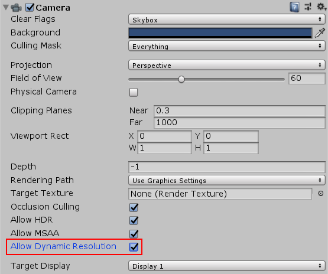

## Dynamic resolution

**Dynamic resolution is a Camera setting that allows you to dynamically scale individual render targets, to reduce workload on the GPU**. In cases where the **application’s frame rate reduces**, you can **gradually scale down the resolution to maintain a consistent frame rate instead**. 

Unity **triggers this scaling if performance data suggests that the frame rate is about to decrease as a result of the application being GPU-bound**. You can also **trigger the scaling manually by preempting a particularly GPU-intensive section of the application and controlling the scaling via a script**. If scaled gradually, dynamic resolution can be **almost unnoticeable**.
 
 
**Note:** 
- The **Built-in Render Pipeline**, and the **Universal Render Pipeline (URP)** both support dynamic resolution as described in this document.
- The **High Definition Render Pipeline (HDRP)** supports dynamic resolution, but you **enable and use it in a different way**. For information on dynamic resolution in HDRP, see Dynamic resoluton in HDRP.

### Scaling render targets
With dynamic resolution, render targets have the DynamicallyScalable flag. You can set this to state whether Unity should scale this render texture as part of the dynamic resolution process or not. Cameras also have the allowDynamicResolution flag, which you can use to set up dynamic resolution so that there is no need to override the render target if you just want to apply dynamic resolution to a less complex Scene.

> When you enable Allow Dynamic Resolution on the Camera, Unity scales all of that Camera’s targets.

### Controlling scalling
You can control the scale through the `ScalableBufferManager`. The `ScalableBufferManager` gives you control of the dynamic width and height scale for all render targets you have marked for the dynamic resolution system to scale.

As an example, assume your application is running at a desirable frame rate, but under some circumstances the GPU performance decreases, due to a combination of increased particles, post-effects and screen complexity. The Unity `FrameTimingManager` allows you to detect when the CPU or GPU performance start to decrease. So you can use the `FrameTimingManager` to calculate a new desired width and height scale to keep the frame rate within your desired range, and bring the scale down to that value to keep performance stable (either instantly or gradually over a set amount of frames).

### ref
https://docs.unity3d.com/Manual/DynamicResolution.html

https://docs.unity3d.com/Packages/com.unity.render-pipelines.high-definition@16.0/manual/Dynamic-Resolution.html

