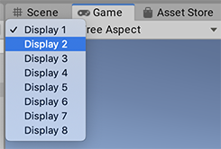

## Multi-display
You can use multi-display to **display up to eight different Camera views of your application** on up to eight different monitors at the same time. 

Unity’s default display mode is one monitor only. When you run your application, you need use **`Display.Activate()`** to explicitly activate additional displays. Once you activate a display, you can’t deactivate it.

Unity supports multi-display rendering on:

-   Desktop platforms (Windows, macOS X, and Linux)
-   Android (OpenGL ES and Vulkan)
-   iOS

Some features in the Display class only work on some of the supported platforms. See the properties and methods for more information about platform compatibility.

Use the Display class to operate on the displays themselves, and **`Camera.targetDisplay`** to **set up cameras for rendering to individual display**s.

> The best time to activate additional displays is when your application creates a **new Scene**. A good way to do this is to **attach a script component to the default Camera**. Make sure you call **`Display.Activate()`** only once during startup. As a best practice, you might find it helpful to **create a small initial Scene to test your script**.

Eg:
```cs
using UnityEngine;
using System.Collections;

public class ActivateAllDisplays : MonoBehaviour
{
    void Start ()
    {
        Debug.Log ("displays connected: " + Display.displays.Length);
            // Display.displays[0] is the primary, default display and is always ON, so start at index 1.
            // Check if additional displays are available and activate each.
    
        for (int i = 1; i < Display.displays.Length; i++)
            {
                Display.displays[i].Activate();
            }
    }
    
    void Update()
    {

    }
}
```

To preview different Camera views: \
In the Camera’s Inspector, select a **Target Display** for that Camera.

From the Display menu in the top-left corner, select the Display to Preview.




### ref

https://docs.unity3d.com/Manual/MultiDisplay.html

Scripting API \
https://docs.unity3d.com/ScriptReference/Display.html

