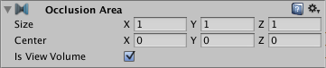

## Occlusion Areas
An **Occlusion Area component** lets you define a **View Volume**, which is an **area where the Camera is most likely to be at runtime**. \
Within **View Volumes**, Unity **generates higher fidelity occlusion culling data** and **performs more performance-intensive calculations**.

Use the Occlusion Area component to define View Volumes in the occlusion culling
 system. View Volumes are areas of the Scene
 where the Camera
 is likely to be located at runtime. At bake time, Unity generates higher precision data within View Volumes. At runtime, Unity performs higher precision calculations when the Camera’s position is within a View Volume.

If you have not defined any View Volumes in your Scene, **Unity creates a View Volume at bake time that contains all Scene geometry that is marked as Occluder Static or Occludee Static**. This can lead to unnecessarily large data size, slow bake times and resource-intensive runtime calculations in large or complex Scenes. To avoid this, place Occlusion Areas in your Scene to define View Volumes for the areas where the Camera is likely to be.

### Using an Occlusion Area component to define a View Volume
1. Add an Occlusion Area component to an empty GameObject in your Scene
2. In the Inspector window, configure the Size property so that the bounding volume covers the desired area
3. In the Inspector window, enable Is View Volume

| Property: | Function: |
| --- | --- |
| Size | Set the size of the Occlusion Area. |
| Center | Set the center of the Occlusion Area. By default this is 0,0,0 and is located in the center of the box. |
| Is View Volume | If enabled, the Occlusion Area defines a View Volume. If disabled, the Occlusion Area does not define a View Volume. This must be enabled for an Occlusion Area to work. |

### ref
https://docs.unity3d.com/Manual/class-OcclusionArea.html

**5:50** \
https://www.youtube.com/watch?v=20UTQMMZhjI&t=38s
