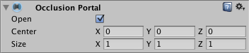

## Occlusion Portals
An **Occlusion Portal** can **either be open or closed**. When an **Occlusion Portal is closed**, it **occludes other GameObjects**. When an **Occlusion Portal is ope**n, it **does not occlude other GameObjects**.

If you have a GameObject in your Scene that has an **open and a closed state** (such as a **door**), you can **create an Occlusion Portal** that represents it in the occlusion culling
 system. You can then **set the open state** of the Occlusion Portal according to the state of that GameObject. An **Occlusion Portal component** does **not need to be placed on the GameObject** it represents.



### Setting up an Occlusion Portal
1. Choose a suitable GameObject in your Scene to **act as an Occlusion Portal**. Good candidates for Occlusion Portals are **medium to large solid GameObjects**, such as a **doo**r.
2. Ensure that the GameObject is **not marked** as **Occluder Static** or **Occludee Static**.
3. Add an **Occlusion Portal component** to the GameObject.
4. **Bake the occlusion data** for your Scene. 
5. Ensure that the **Occlusion Culling window**, the Inspector panel and the **Scene view are all visible**.
6. In the Scene view, **move the Camera to a position where it is directly in front of the Occlusion Portal**.
7. Select the GameObject with the **Occlusion Portal component**.
8. In the Inspector window, **toggle the Occlusion Portal component’s Open property on and off**. In the Scene view, observe the difference in occlusion culling.

### Opening and closing an Occlusion Portal using script
```cs
void OpenDoor() {
     // Toggle the Occlusion Portal's open state, so that Unity renders the GameObjects behind it
    myOcclusionPortal.open = true;
    
    // Call a function that plays a door opening animation, or otherwise hides the GameObject
    …
}
```
| Property: | Function: |
| --- | --- |
| Open | If enabled, the Occlusion Portal is open, and does not occlude Renderers. If disabled, the Occlusion Portal is closed, and occludes Renderers. |
| Center | Set the center of the Occlusion Portal. The default value is 0,0,0. |
| Size | Define the size of the Occlusion Portal. |


https://docs.unity3d.com/Manual/class-OcclusionPortal.html
