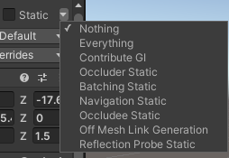

## Occlusion window

Before you begin, identify all of the GameObjects in your Scene that you would like to be Static Occluders (GameObjects that do not move, and that block the view of GameObjects that are behind them) and Static Occludees (GameObjects that do not move, and are occluded by Static Occluders). A GameObject can be both a Static Occluder and a Static Occludee.

Good candidates for Static Occluders are medium to large solid GameObjects, such as a wall or a building. To be a Static Occluder, a GameObject must:

- Have a Terrain or Mesh Renderercomponent
- Be opaque
- Not move at runtime

Any GameObject that is likely to be occluded at runtime is a good candidate to be a Static Occludee, including small or transparent GameObjects. To be a Static Occludee, a GameObject must:

- Have any type of Renderer component
- Not move at runtime

When you have identified the GameObjects that you would like to be Static Occluders and Static Occludees, you can set up your Scene.

1. Select all of the GameObjects that you would like to be **Static Occluders**.
2. In the Inspector window, open the **Static Editor Flags** drop-down menu and select **Occluder Static**.
3. Select all of the GameObjects that you would like to be **Static Occludees**.
4. In the Inspector window, open the **Static Editor Flags** drop-down menu and select **Occludee Static**.
5. Add a Camera to your Scene and select it, or select an existing Camera.
6. In the Inspector window, ensure that the **Camera’s Occlusion Culling property is enabled**.

**Static editor flags**: \

### Bake data

Occlusion culling inspector bake tab. 
- In the top menu, select **Window > Rendering > Occlusion Culling** to open the Occlusion Culling window.
- Select the **Bake** tab.
- In the bottom right hand corner of the Inspector window, press the Bake button. Unity generates the occlusion culling data, saves the data as an asset in your Project, and links the asset with the current Scene(s).
