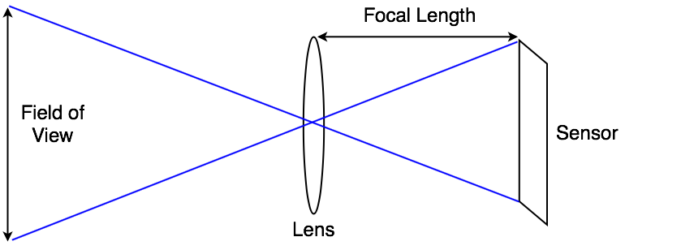

## Using Physical Cameras

The camera component’s Physical Camera properties simulate real-world camera formats on a Unity camera. 
> **Note**: Physical camera option only under perspective mode

Unity provides the same settings as those in most 3D modeling application’s physical camera settings. The two main properties that control what the camera sees are Focal Length and Sensor Size.

- Focal Length: The distance between the sensor and the camera lens. This determines the vertical field of view. When a Unity camera is in Physical Camera mode, changing the Focal Length also changes the field of view accordingly. Smaller focal lengths result in a larger field of view, and vice versa.

- Sensor Size: The width and height of the sensor that captures the image. These determine the physical camera’s aspect ratio
. You can choose from several preset sensor sizes that correspond to real-world camera formats, or set a custom size. When the sensor aspect ratio is different to the rendered aspect ratio, as set in the Game view, you can control how Unity fits the camera image to the rendered image.

### Lens Shifts
Lens Shift offsets the camera’s lens from its sensor horizontally and vertically. This allows you to change the focal center, and reposition a subject in the rendered frame, with little or no distortion.

For example, if you want to capture a tall building, you could rotate the camera. But that distorts the image, making parallel lines appear to converge. If you shift the lens up instead of rotating the camera, you can change the composition of the image to include the top of the building, but parallel lines stay straight.

Shifting the lens along the Y axis moves the focal center, but keeps vertical lines straight.

Similarly, you can use a horizontal lens shift to capture wide objects without the distortion you might get by rotating the camera.

For example, in a racing game, you might want to keep the perspective low to the ground. A lens shift is a way of achieving an oblique frustum without scripting.

### Gate Fit
The Camera component’s Gate Fit property determines what happens when the Game view and the physical camera sensor have different aspect ratios.

In Physical Camera mode, a camera has two **"gates"**.

- The area rendered in the Game view, according to the resolution you set in the Aspect drop-down menu, is called the “resolution gate”.

- The area that the camera actually sees, as defined by the Sensor Size properties, is called the “film gate”.

### ref
https://docs.unity3d.com/Manual/PhysicalCameras.html

