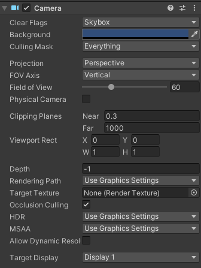
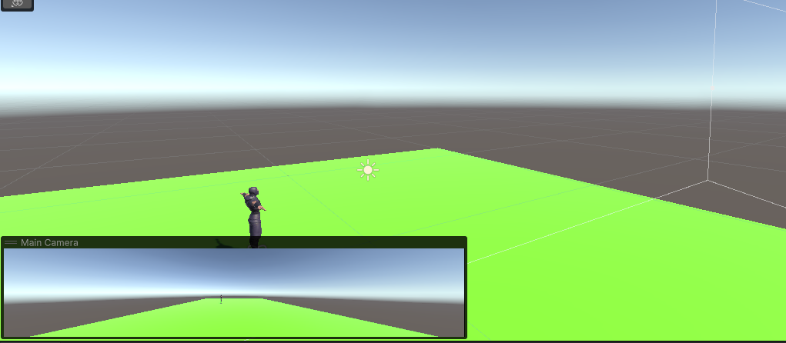
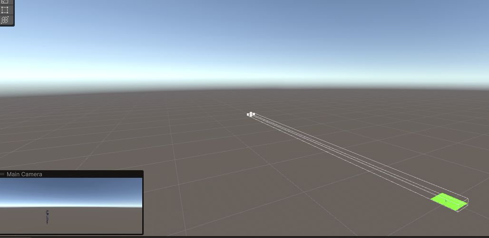
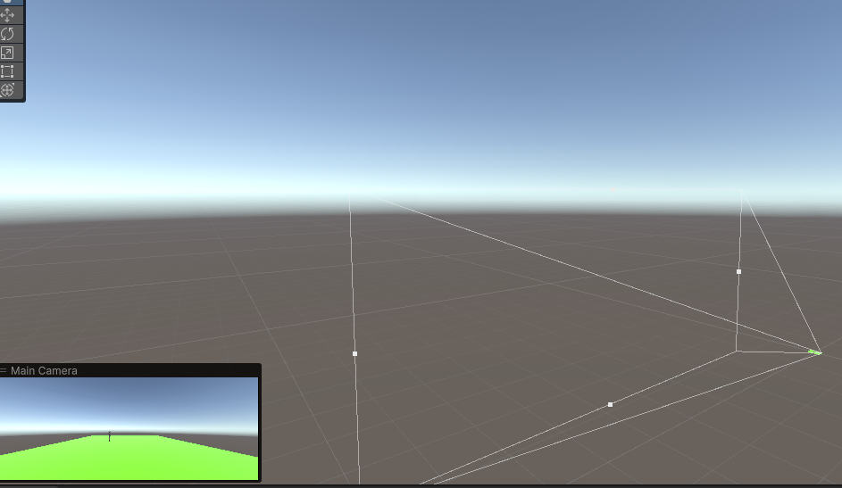

## Camera

Cameras are the devices that capture and display the world to the player

Camera Inspector reference
Unity displays different properties in the Camera Inspector depending on the **render pipeline** that your Project uses.

- If your Project uses the Universal Render Pipeline (URP), see the URP package documentation microsite. https://docs.unity3d.com/Packages/com.unity.render-pipelines.universal@16.0/manual/index.html
- If your Project uses the High Definition Render Pipeline (HDRP), see the HDRP package documentation microsite. https://docs.unity3d.com/Packages/com.unity.render-pipelines.high-definition@16.0/manual/index.html
- If your Project uses the Built-in Render Pipeline, Unity displays the following properties:

| Property: | Function: |
| --- | --- |
| Clear Flags | Determines which parts of the screen will be cleared. This is handy when using multiple Cameras to draw different game elements. |
| Background | The color applied to the remaining screen after all elements in view have been drawn and there is no skybox. |
| Culling Mask | Includes or omits layers of objects to be rendered by the Camera. Assigns layers to your objects in the Inspector. |
| Projection | Toggles the camera’s capability to simulate perspective. |
|         Perspective | Camera will render objects with perspective intact. |
|         Orthographic | Camera will render objects uniformly, with no sense of perspective. NOTE: Deferred rendering is not supported in Orthographic mode. Forward rendering is always used. |
| Size (when Orthographic is selected) | The viewport size of the Camera when set to Orthographic. |
| FOV Axis (when Perspective is selected) | Field of view axis. |
|         Horizontal | The Camera uses a horizontal field of view axis. |
|         Vertical | The Camera uses a vertical field of view axis. |
| Field of view (when Perspective is selected) | The Camera’s view angle, measured in degrees along the axis specified in the FOV Axis drop-down. |
| Physical Camera | Tick this box to enable the Physical Camera properties for this camera.When the Physical Camera properties are enabled, Unity calculates the Field of View using the properties that simulate real-world camera attributes: Focal Length, Sensor Size, and Lens Shift.Physical Camera properties are not visible in the Inspector until you tick this box. |
|         Focal Length | Set the distance, in millimeters, between the camera sensor and the camera lens.Lower values result in a wider Field of View, and vice versa.When you change this value, Unity automatically updates the Field of View property accordingly. |
|         Sensor Type | Specify the real-world camera format you want the camera to simulate. Choose the desired format from the list.When you choose a camera format, Unity sets the the Sensor Size > X and Y properties to the correct values automatically.If you change the Sensor Size values manually, Unity automatically sets this property to Custom. |
|         Sensor Size | Set the size, in millimeters, of the camera sensor.Unity sets the X and Y values automatically when you choose the Sensor Type. You can enter custom values if needed. |
|                 X | The width of the sensor. |
|                 Y | The height of the sensor. |
|         Lens Shift | Shift the lens horizontally or vertically from center. Values are multiples of the sensor size; for example, a shift of 0.5 along the X axis offsets the sensor by half its horizontal size.You can use lens shifts to correct distortion that occurs when the camera is at an angle to the subject (for example, converging parallel lines).Shift the lens along either axis to make the camera frustum oblique. |
|                 X | The horizontal sensor offset. |
|                 Y | The vertical sensor offset. |
|         Gate Fit | Options for changing the size of the resolution gate (size/aspect ratio of the game view) relative to the film gate (size/aspect ratio of the Physical Camera sensor).For further information about resolution gate and film gate, see documentation on Physical Cameras. |
|                 Vertical | Fits the resolution gate to the height of the film gate.If the sensor aspect ratio is larger than the game view aspect ratio, Unity crops the rendered image at the sides.If the sensor aspect ratio is smaller than the game view aspect ratio, Unity overscans the rendered image at the sides.When you choose this setting, changing the sensor width (Sensor Size > X property) has no effect on the rendered image. |
|                 Horizontal | Fits the resolution gate to the width of the film gate.If the sensor aspect ratio is larger than the game view aspect ratio, Unity overscans the rendered image on the top and bottom.If the sensor aspect ratio is smaller than the game view aspect ratio, Unity crops the rendered image on the top and bottom.When you choose this setting, changing the sensor height (Sensor Size > Y property) has no effect on the rendered image. |
|                 Fill | Fits the resolution gate to either the width or height of the film gate, whichever is smaller. This crops the rendered image. |
|                 Overscan | Fits the resolution gate to either the width or height of the film gate, whichever is larger. This overscans the rendered image. |
|                 None | Ignores the resolution gate and uses the film gate only. This stretches the rendered image to fit the game view aspect ratio. |
| Clipping Planes | Distances from the camera to start and stop rendering. |
|         Near | The closest point relative to the camera that drawing will occur. |
|         Far | The furthest point relative to the camera that drawing will occur. |
| Viewport Rect | Four values that indicate where on the screen this camera view will be drawn. Measured in Viewport Coordinates (values 0–1). |
|         X | The beginning horizontal position that the camera view will be drawn. |
|         Y | The beginning vertical position that the camera view will be drawn. |
|         W (Width) | Width of the camera output on the screen. |
|         H (Height) | Height of the camera output on the screen. |
| Depth | The camera’s position in the draw order. Cameras with a larger value will be drawn on top of cameras with a smaller value. |
| Rendering Path | Options for defining what rendering methods will be used by the camera. |
|         Use Player Settings | This camera will use whichever Rendering Path is set in the Player Settings. |
|         Vertex Lit | All objects rendered by this camera will be rendered as Vertex-Lit objects. |
|         Forward | All objects will be rendered with one pass per material. |
|         Deferred Lighting | All objects will be drawn once without lighting, then lighting of all objects will be rendered together at the end of the render queue. NOTE: If the camera’s projection mode is set to Orthographic, this value is overridden, and the camera will always use Forward rendering. |
| Target Texture | Reference to a Render Texture that will contain the output of the Camera view. Setting this reference will disable this Camera’s capability to render to the screen. |
| Occlusion Culling | Enables Occlusion Culling for this camera. Occlusion Culling means that objects that are hidden behind other objects are not rendered, for example if they are behind walls. See Occlusion Culling for details. |
| Allow HDR | Enables High Dynamic Range rendering for this camera. See High Dynamic Range Rendering for details. |
| Allow MSAA | Enables multi sample antialiasing for this camera. |
| Allow Dynamic Resolution | Enables Dynamic Resolution rendering for this camera. See Dynamic Resolution for details. |
| Target Display | Defines which external device to render to. Between 1 and 8. |

### Render path
Unity supports different rendering paths. You should choose which one you use depending on your game content and target platform / hardware. Different rendering paths have different features and performance characteristics that mostly affect lights and shadows. The rendering path used by your Project is chosen in the Player settings. Additionally, you can override it for each Camera.

### Clear Flags

Each Camera stores color and depth information when it renders its view. The portions of the screen that are not drawn in are empty, and will display the skybox by default. When you are using multiple Cameras, each one stores its own color and depth information in buffers, accumulating more data as each Camera renders. As any particular Camera in your scene renders its view, you can set the Clear Flags to clear different collections of the buffer information. To do this, choose one of the following four options:

#### Skybox
This is the default setting. Any empty portions of the screen will display the current Camera’s skybox. If the current Camera has no skybox set, it will default to the skybox chosen in the Lighting Window (menu: Window > Rendering > Lighting). It will then fall back to the Background Color. Alternatively a Skybox component can be added to the camera

#### Solid color
Any empty portions of the screen will display the current Camera’s Background Color.

#### Depth only
If you want to draw a player’s gun without letting it get clipped inside the environment, set one Camera at Depth 0 to draw the environment, and another Camera at Depth 1 to draw the weapon alone. Set the weapon Camera’s Clear Flags to depth only. This will keep the graphical display of the environment on the screen, but discard all information about where each object exists in 3-D space. When the gun is drawn, the opaque parts will completely cover anything drawn, regardless of how close the gun is to the wall.

#### Don’t clear
This mode does not clear either the color or the depth buffer
. The result is that each frame is drawn over the next, resulting in a smear-looking effect. This isn’t typically used in games, and would more likely be used with a custom shader.

> Note that on some GPUs (mostly mobile GPUs), not clearing the screen might result in the contents of it being undefined in the next frame. On some systems, the screen may contain the previous frame image, a solid black screen, or random colored pixels.

### Clip Planes
The **Near** and **Far Clip Plane** properties determine where the Camera’s view begins and ends. The planes are laid out perpendicular to the Camera’s direction and are measured from its position. The **Near plane** is the closest location that will be rendered, and the **Far plane** is the furthest.

The clipping planes also determine how depth buffer precision is distributed over the scene. In general, to get better precision you should move the **Near plane** as far as possible.

Note that the near and far clip planes together with the planes defined by the field of view of the camera describe what is popularly known as the camera frustum. Unity ensures that when rendering your objects those which are completely outside of this frustum are not displayed. This is called Frustum Culling. Frustum Culling happens irrespective of whether you use Occlusion Culling in your game.

For performance reasons, you might want to cull small objects earlier. For example, small rocks and debris could be made invisible at much smaller distance than large buildings. To do that, put small objects into a separate layer and set up per-layer cull distances using Camera.layerCullDistances script function.

### Culling Mask
> The Culling Mask is used for selectively rendering groups of objects using Layers.

### Normalized Viewport Rectangles
Normalized Viewport Rectangle is specifically for defining a certain portion of the screen that the current camera view will be drawn upon. 

#### Create a two-player split screen effect
By using Normalized Viewport Rectangle. \
After you have created your two cameras, change both camera’s H values to be 0.5 then set player one’s Y value to 0.5, and player two’s Y value to 0. This will make player one’s camera display from halfway up the screen to the top, and player two’s camera start at the bottom and stop halfway up the screen.

### projection
The **perspective** and **orthographic** modes of viewing a scene are known as camera projections.
#### Orthographic
Orthographic camera mode removes all perspective from the Camera’s view. This is mostly useful for making isometric or 2D games. 

#### Perspective
Perspective effect is widely used in art and computer graphics and is important for creating a realistic scene.
For example, you might want to create a map or information display that is not supposed to appear exactly like a real-world object. A camera that does not diminish the size of objects with distance is referred to as orthographic and Unity cameras also have an option for this.

### Target display
A camera has up to 8 target display settings. The camera can be controlled to render to one of up to 8 monitors. This is supported only on PC, Mac and Linux. In Game View the chosen display in the Camera Inspector will be shown.

### Render Texture
This will place the camera’s view onto a Texture
 that can then be applied to another object. This makes it easy to create sports arena video monitors, surveillance cameras, reflections etc.

### Camera's depth
Camera's depth in the camera rendering order. \
Cameras with lower depth are rendered before cameras with higher depth. \
Use this to control the order in which cameras are drawn if you have multiple cameras and some of them don't cover the full screen.

> The depth is considered the rendering order. The lower the depth value, the earlier it will be in the rendering stack. 

If you have more than one camera, all you need to do is set the depth value of each camera in ascending order for which they will draw. 

> **Note**: If you have two cameras with the same depth, they will render in the order they were added to the scene. We don't recommend leaving cameras on the same depth, and you should always explicitly order them. The depth value can be edited via script using the `camera.depth` property.

https://support.unity.com/hc/en-us/articles/214371766-How-do-I-force-my-cameras-to-render-in-a-certain-order-

