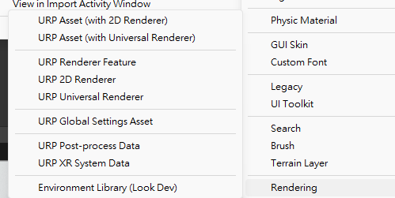
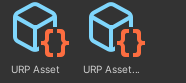

## Universal Render Pipeline(URP) 
The **Universal Render Pipeline (URP)** is a **prebuilt Scriptable Render Pipeline**, made by Unity. **URP** provides artist-friendly workflows that let you quickly and easily create optimized graphics across a range of platforms, from mobile to high-end consoles and PCs.

### Installing URP

1.  In Unity, open your Project.
2.  In the top navigation bar, select **Window** > **Package Manager** to open the **Package Manager** window.
3.  In the **Packages** menu, select **Unity Registry**. This shows the list of available packages for the version of Unity that you are currently running.
4.  Select **Universal RP** from the list of packages.
5.  In the bottom right corner of the Package Manager window, select **Install**. Unity installs URP directly into your Project.

### Creating the Universal Render Pipeline Asset

The **Universal Render Pipeline Asset (URP Asset)** contains the **global rendering** and **quality settings** of your project, and **creates the rendering pipeline instance**. The rendering pipeline instance contains **intermediate resources and the render pipeline implementation**.

To create a Universal Render Pipeline Asset:

1.  In the Editor, go to the Project window.
2.  Right-click in the Project window, and select **Create** > **Rendering** > **URP Asset**. Alternatively, navigate to the menu bar at the top, and select **Assets** > **Create** > **Rendering** > **URP Asset**.

You can either leave the default name for the new Universal Render Pipeline Asset, or type a new one.

### Set URP as the active render pipeline

To set URP as the **active render pipeline**:

1.  In your project, locate the **Render Pipeline Asset** that you want to use.  
    **Tip**: to find all URP Assets in a project, use the following query in the search field: **`t:universalrenderpipelineasset`**.
    
2.  Select **Edit** > **Project Settings** > **Graphics**.
    
3.  In the **Scriptable Render Pipeline Settings** field, **select the URP Asset**. When you select the URP Asset, the **available Graphics settings change immediately**.

### Update existing materials to URP
If your project is using the old **Built-in Render Pipeline**, you may need to upgrade materials and shaders to be compatible with URP.

**Go to**: \
**`Edit → Render Pipeline → Universal Render Pipeline → Upgrade Project Materials to URP`**.

#### Enable depth texture and Opaque texture in URP asset setting in inspector for using **URP/particles shader**

#### **Method 2: Manual Upgrade (Best for Custom Shaders)**
​
If your materials **did not upgrade correctly** or are using **custom shaders**, you need to manually convert them.
​
**✅ Steps:**
​
1️⃣ **Select the Material** in the **Inspector**.  
2️⃣ **Change the Shader Type**:
​
-   If using **Standard Shader**, change it to **URP/Lit**.
-   If using **Custom Shader**, rewrite it to be compatible with URP (URP uses Shader Graph or HLSL-based shaders).
​
3️⃣ **Fix Missing Texture Slots**:
​
-   Reassign **Albedo, Normal Map, Metallic, etc.**
​
4️⃣ **Check Transparency & Rendering Mode**:
​
-   If your material is **transparent**, set **Surface Type** to **Transparent**.
-   Adjust **Render Queue** (e.g., for transparent objects, use **3000**).

### ref
https://docs.unity3d.com/Packages/com.unity.render-pipelines.universal@16.0/manual/index.html

https://www.youtube.com/watch?v=aJ1OpirisGM

https://www.youtube.com/watch?v=m6YqTrwjpP0

