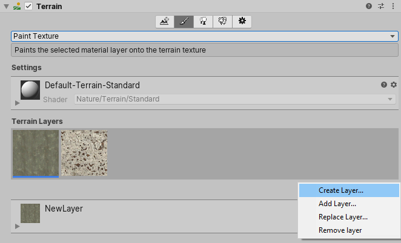
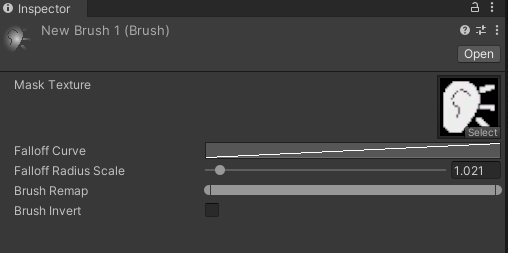

## Terrain

The Unity Editor includes a built-in set of Terrain features that allow you to add landscapes to your game. In the Editor, you can create multiple Terrain tiles, adjust the height or appearance of your landscape, and add trees or grass to it

 
To add a Terrain GameObject to your Scene, **select GameObject** > **3D Object** > **Terrain from the menu**. 
 
This also adds a corresponding Terrain Asset to the Project view. When you do this, the landscape is initially a large, flat plane. The Terrain’s Inspector window provides a number of tools to create detailed landscape features.
 
 
### Creating and editing Terrains

To add a Terrain GameObject to your Scene, select **GameObject > 3D Object > Terrain** from the menu. This also adds a corresponding Terrain Asset to the Project view. When you do this, the landscape is initially a large, flat plane. The Terrain’s Inspector window provides a number of tools to create detailed landscape features.

The **toolbar** provides five options to adjust your Terrain:

-   Create adjacent Terrain tiles.
-   Sculpt and paint your Terrain.
-   Add trees.
-   Add details such as grass, flowers, and rocks.
-   Change general settings for the selected Terrain.

### Keyboard shortcuts
The Terrain Inspector has the following keyboard shortcuts enabled by default.
 
 
| Keys | Function |
| --- | --- |
| Comma ( , ) and Period ( . ) | Cycle through the available Brushes |
| Shift-Comma ( < ) and Shift-Period ( > ) | Cycle through the available objects for trees, textures, and details |
| Open Bracket ( [ ) and Close Bracket ( ] ) | Decrease and increase the Brush Size |
| Minus ( - ) and Equal ( = ) | Decrease and increase Brush Opacity |

To set your own custom shortcuts, use the **Shortcuts Manager**.

- On Windows and Linux, select **Edit > Shortcuts**.
- On macOS, select **Unity > Shortcuts**.

### Terrain tools
To access the **Terrain painting tools**, click on a Terrain object in the **Hierarchy** window and open an Inspector window. In the Inspector, click the **Paint Terrain (paintbrush)** icon to reveal the list of Terrain tools.

Terrain component provides six distinct tools:

-   **Raise or Lower Terrain**: paint the **heightmap** with a paintbrush tool.
-   **Paint Holes**: hide portions of the Terrain.
-   **Paint Texture**: apply surface textures, 山se the Paint Texture tool to add textures, such as grass, snow, or sand, to your Terrain.
. It allows you to draw areas of tiled texture directly onto the Terrain. 
-   **Set Height**: adjust the heightmap toward a specific value.
-   **Smooth Height**: smooth the heightmap to soften Terrain features.
-   **Stamp Terrain**: stamp a brush shape on top of the current heightmap.

> **Note**: You can also create your own custom Terrain tools.
> - Using scripting API : **`TerrainAPI.TerrainPaintTool`** \
>   https://docs.unity3d.com/ScriptReference/TerrainTools.TerrainPaintTool_1.html
> - Using Terrin Tools package \
>   https://docs.unity3d.com/Packages/com.unity.terrain-tools@5.1/manual/index.html

### Terrain layers
A **Terrain Layer** is an **Asset** that defines a Terrain’s surface qualities. A Terrain Layer **holds Textures
 and other properties that the Terrain’s Material uses to render the Terrain surfaces**. Because Terrain Layers are Assets, you can easily reuse them on multiple Terrain tiles.

You can add Textures to the surface of a Terrain to create coloration and fine detail. Terrain GameObjects are usually large, so it is best to use a base Terrain Layer with Textures that tile over the surface and repeat seamlessly. 
 
You can use multiple Terrain Layers, each with different Textures, to build up interesting, varied Terrain surfaces. 
 
#### Creating Terrain Layers
To create a **Terrain Layer** directly in the Terrain Inspector, click the **paintbrush** icon in the toolbar
 at the top of the Terrain Inspector, and select **Paint Texture** from the drop-down menu. At the bottom of the **Terrain Layers** section, click the **Edit Terrain Layers** button, and choose **Create Layer**.

When you select **Create Layer**, Unity opens the **Select Texture2D** window. Here, choose the image to use as the Diffuse channel of the Terrain Layer. To assign a Normal Map
 or Mask Map Texture to your Terrain Layer, select the corresponding Terrain Layer in the Project view, and use its Inspector window.

Alternatively, to create a Terrain Layer Asset that isn’t automatically associated with a Terrain, right-click the Project window, and select Create > Terrain Layer from the context menu. Then, configure the various properties in the Inspector window for your new Terrain Layer.

### Adding Terrain Layers
Initially, a Terrain has no Terrain Layers assigned to it. By default, it uses a checkerboard Texture until you add a Terrain Layer.

After you create a Terrain Layer in your Project, click the **Edit Terrain Layers** button and select **Add Layer** to open the **Select TerrainLayer** window. Double-click on a Terrain Layer in this window to add it to your Terrain.

### Terrain Layer properties
> Depending on the Material that is set in the Terrain Settings, as well as the Render Pipeline that is currently in use, you might see different options and properties in the Inspector.

### Texture painting
Unity **applies the first Terrain Layer you add to the entire landscape**. If you add **multiple Terrain Layers**, use the **Paint Texture tool** to apply **subsequent Textures** to your Terrain.

If you add a new Terrain tile without any Terrain Layers, and paint on it, the system automatically adds the selected Terrain Layer to that new Terrain tile. Because this is the first Terrain Layer, that Texture becomes the base layer, and fills the entire Terrain tile.

In the Terrain Inspector, under Brushes, there is a box that displays the available Brushes, along with the Brush Size and Opacity options underneath.

### Rendering performance
The number of Terrain Layers you assign to a Terrain tile might impact the performance of the renderer. The maximum recommended number of Terrain Layers depends on which render pipeline your Project uses.
 
 
- If your Project uses the **Universal Render Pipeline (URP)** or **Built-in Render Pipeline**, you can use **four Terrain Layers per Texture pass**, with no limit on the number of passes. This means that although you are allowed to use as many Terrain Layers as you want, each pass increases the time spent rendering the Terrain. For maximum performance, limit each of your Terrain tiles to four Terrain Layers.

- If your Project uses the **High Definition Render Pipeline (HDRP)**, you can add **up to eight Terrain Layers per Terrain tile**, and the system renders them in a single pass. No additional passes are possible. If you add more than eight Terrain Layers, they appear in the Unity Editor, but are ignored at run time.

### Brushes
When you apply a tool such as Paint Texture or Smooth Height to the Terrain, Unity uses a Brush, which is a ScriptableObject in the Terrain system. 

The Brush defines the tool’s shape and strength of influence.

You can use Unity's **build-in brushes** or **custom brushes**. 

You can create your own custom Brushes with unique shapes or specific parameters for your needs. For example, use the heightmap Texture of a specific geological feature to define a Brush, then use the Stamp Terrain tool to place that feature on your Terrain.

To create a new Brush, click the **New Brush button** in the Terrain Inspector window.

After you click **New Brush**, the **Select Texture2D** window appears. Choose a Texture to define the shape of your new Brush, then click **"open"** button  to use the **Brush Inspector** to adjust the **Falloff** and **Radius Scale values**.

Alternatively, right-click in the **Project window**, and choose **Create > Brush** to create a new Brush. The default Brush shows a simple circle defined by a white **Mask Texture**, a **Falloff** curve, and a **Radius Scale** of 1. Use the Brush Inspector to change these values, or set a Texture to define the shape of the Brush. You can also use the **Remap** slider and the **Invert Remap Range** option to further modify the grayscale values of the **Brush** Texture.

### Painting Trees
The **Paint Trees** button on the toolbar enables Tree painting:

Initially, the Terrain has no tree prototypes available. To start painting onto the Terrain, you need to add a tree prototype. Click the **Edit Trees** button, and select **Add Tree**. From here, you can select a Tree Asset from your Project, and add it as a **Tree Prefab** for use with the Brush

To help prototyping, SpeedTree provides six SpeedTree models in the free Unity Terrain - HDRP Demo Scene on the Asset Store. Alternatively, you can create your own Trees.

### ref
https://docs.unity3d.com/Manual/terrain-UsingTerrains.html

https://docs.unity3d.com/Manual/terrain-Tools.html

https://docs.unity3d.com/Manual/class-TerrainLayer.html#Performance

https://docs.unity3d.com/Manual/terrain-Trees.html

